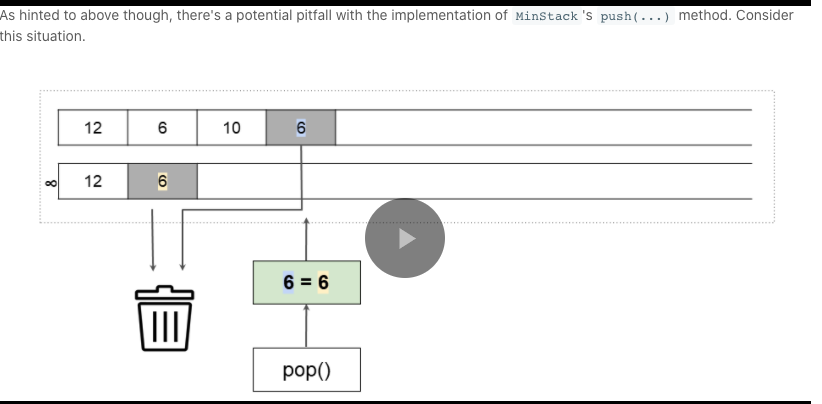
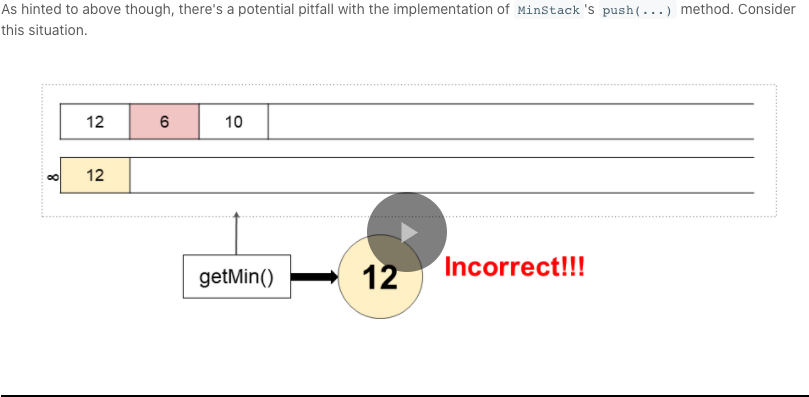
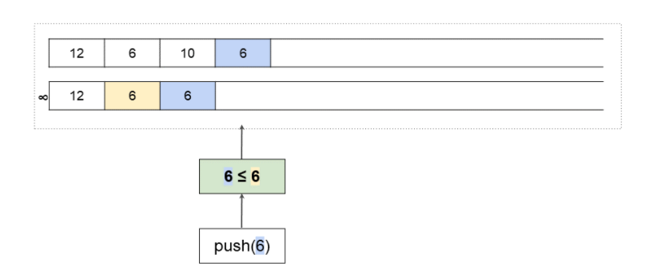

## 155 Min Stack

Easy

https://leetcode.com/problems/min-stack/

Design a stack that supports push, pop, top, and retrieving the minimum element in constant time.

- push(x) -- Push element x onto stack.
- pop() -- Removes the element on top of the stack.
- top() -- Get the top element.
- getMin() -- Retrieve the minimum element in the stack.

 

**Example 1:**

```
Input
["MinStack","push","push","push","getMin","pop","top","getMin"]
[[],[-2],[0],[-3],[],[],[],[]]

Output
[null,null,null,null,-3,null,0,-2]

Explanation
MinStack minStack = new MinStack();
minStack.push(-2);
minStack.push(0);
minStack.push(-3);
minStack.getMin(); // return -3
minStack.pop();
minStack.top();    // return 0
minStack.getMin(); // return -2
```

 

**Constraints:**

- Methods `pop`, `top` and `getMin` operations will always be called on **non-empty** stacks.


## 第一次

完全抄的，每次把当前min和value作为一个数组压进栈中，来新的值就把栈顶的最小值和当前值比较一下，判断出新的最小值再压进栈中

```java
class MinStack {
    
    private Stack<int[]> stack = new Stack<>();
    
    public MinStack() { }
    
    
    public void push(int x) {
        
        /* If the stack is empty, then the min value
         * must just be the first value we add. */
        if (stack.isEmpty()) {
            stack.push(new int[]{x, x});
            return;
        }
        
        int currentMin = stack.peek()[1];
        stack.push(new int[]{x, Math.min(x, currentMin)});
    }
    
    
    public void pop() {
        stack.pop();
    }
    
    
    public int top() {
        return stack.peek()[0];
    }
    
    
    public int getMin() {
        return stack.peek()[1];
    }
}
```

复杂度见solution 的approach 1


## Solution

#### Overview

Firstly, don't feel bad if you find this question a bit tricky! While it's one of the easier data structure design questions, it's still one of Leetcode's more difficult "easy" questions, requiring some clever observations and problem-solving techniques.

Now, here's a few things to keep in mind before we get started.

- **Make sure that you read the question carefully**. The `getMin(...)` operation only needs to return the value of the minimum, it *does not remove items from the `MinStack`*.
- We're told that **all the `MinStack` operations must run in constant time**, i.e. O(1)*O*(1) time. For this reason, we can immediately rule out the use of a `Binary Search Tree` or `Heap`. While these data structures are often great for keeping track of a minimum, their core operations (`find`, `add`, and `remove`) are O(\log \, n)*O*(log*n*), which isn't good enough here! We will need to explore better ways.
- Some people have mentioned on the discussion forums that **the question doesn't say what to do in invalid cases**. For example, what if you are told to `pop(...)`, `getMin(...)`, or `top(...)` while there are no values on your `MinStack`? Because the question doesn't say, here on Leetcode that means **you can safely assume the test cases will always be \*valid\***. In a real interview though, *you should always ask the interviewer before making assumptions*. They will probably either say you can assume these cases won't happen, or that you should return `-1` or throw an exception if they do.
- **Finally, there is the issue of whether or not it is "fair" to use a built-in `Stack`** data structure as the basis of your `MinStack` implementation, or whether you should only use `List`s or even `Array`s. Because I don't think there is much advantage to using a built-in `Stack` here—you still need to figure out how to use it to achieve the minimum functionality—this solution article uses `Stack`'s. *Implementing an underlying `Stack` yourself shouldn't be too difficult, and is ideally something you already know how to do if you're working on this question.*

**Suggestion for further study**: Once you've read through this guide and understood how to implement the `MinStack` class, have a go at writing a `MaxStack` class on your own to test your understanding! Don't simply copy-paste the `MinStack` code and attempt to modify it into the new role, instead write the `MaxStack` code *without looking at the `MinStack` code again*.


------

#### Approach 1: Stack of Value/ Minimum Pairs

**Intuition**

An **invariant** is something that is always true or consistent. You should always be on the lookout for useful invariants when problem-solving in math and computer science.

Recall that with a `Stack`, we only ever add (`push`) and remove (`pop`) numbers from the *top*. Therefore, an important **invariant** of a `Stack` is that when a new number, which we'll call `x`, is placed on a `Stack`, the numbers below it *will not change* for as long as number `x` remains on the `Stack`. Numbers could come and go *above* `x` for the duration of `x`'s presence, but *never* below.

So, whenever number `x` **is** the *top of the `Stack`*, the minimum will always be the same, as it's simply the minimum out of `x` and all the numbers *below* it.

Therefore, in addition to putting a number on an underlying `Stack` inside our `MinStack`, we could also put its corresponding minimum value alongside it. Then whenever that particular number is at the top of the underlying `Stack`, the `getTop(...)` operation of `MinStack` is as simple as retrieving its corresponding minimum value.


So, how can we actually determine what the corresponding minimum for our new number is? (in (O(1)(*O*(1) time). Have a look at the diagram above. All the minimum values are equal to either the minimum value immediately before, or the actual stack value alongside.


Therefore, when we put a new number on the underlying `Stack`, we need to decide whether the minimum at that point is the new number itself, or whether it's the minimum before. It makes sense that it would always be the smallest of these two values.

Note for Python: Recall that index `-1` refers to the *last* item in in a list. i.e. `self.stack[-1]` in Python is equivalent to `stack.peek()` in Java and other languages.


**Complexity Analysis**

Let n*n* be the total number of operations performed.

- Time Complexity : O(1)*O*(1) for all operations.

  `push(...)`: Checking the top of a `Stack`, comparing numbers, and pushing to the top of a `Stack` (or adding to the *end* of an Array or List) are all O(1)*O*(1) operations. Therefore, this overall is an O(1)*O*(1) operation.

  `pop(...)`: Popping from a `Stack` (or removing from the *end* of an Array, or List) is an O(1)*O*(1) operation.

  `top(...)`: Looking at the top of a `Stack` is an O(1)*O*(1) operation.

  `getMin(...)`: Same as above. This operation is O(1)*O*(1) because we do *not* need to compare values to find it. If we had not kept track of it on the `Stack`, and instead had to search for it each time, the overall time complexity would have been O(n)*O*(*n*).

- Space Complexity : O(n)*O*(*n*).

  Worst case is that all the operations are `push`. In this case, there will be O(2 \cdot n) = O(n)*O*(2⋅*n*)=*O*(*n*) space used.

#### Approach 2: Two Stacks

**Intuition**

There's another, somewhat different approach to implementing a `MinStack`. Approach 1 required storing two values in each slot of the underlying `Stack`. Sometimes though, the minimum values are very repetitive. Do we actually need to store the same minimum value over and over again?


Turns out we don't—we could instead have two `Stacks`s inside our `MinStack`. The main `Stack` should keep track of the order numbers arrived (a standard `Stack`), and the second `Stack` should keep track of the current minimum. We'll call this second `Stack` the "min-tracker" `Stack` for clarity.


The `push(...)` method for this implementation of `MinStack` is straightforward. Items should always be pushed onto the main `Stack`, but they should only be pushed onto the min-tracker `Stack` *if they are smaller than the current top of it*. Well, that's *mostly* correct. There's one potential pitfall here that we'll look at soon.

`MinStack`'s two getter methods, `top(...)` and `getMin(...)` are also straightforward with this approach. `top(...)` returns (but doesn't remove) the top value of the main `Stack`, whereas `getMin(...)` returns (but doesn't remove) the top of the min-tracker `Stack`.

This leaves us still needing to implement `MinStack`'s `pop(...)` method. The value we actually need to pop is always on the top of the main underlying `Stack`. However, if we simply popped it from there, the min-tracker `Stack` would become incorrect once its top value had been removed from the main `Stack`.

A logical solution would be to do the following additional check and modification to the min-tracker `Stack` when `MinStack`'s `pop(...)` method is called.

```
If top of main_stack == top of min_tracker_stack:
    min_tracker_stack.pop()
```

This way, the new minimum would now be the top of the min-tracker `Stack`. If you're confused about why this is, think back to the previous approach, and remember when the minimum changed.





While `6` was already at the top of the min-tracker `Stack`, we pushed another `6` onto the `MinStack`. Because this new `6` was equal to the current minimum, it didn't change what the current minimum was, and therefore wasn't pushed. At first, this worked okay.

The problem occurred though when we started calling `pop(...)` on `MinStack`. When the most recent `6` was `pop`'ed, the condition for popping the min-tracker `Stack` too was triggered (i.e. that both internal stacks have the same top). This isn't what we wanted though—it was the earlier `6` that triggered the `push(...)` onto the min-tracker `Stack`, not the latter one! The `6` should have been left alone with that first `pop(...)`.

The way we can solve this is a small modification to the `MinStack`'s `push(...)` method. Instead of only pushing numbers to the min-tracker `Stack` if they are *less than* the current minimum, we should push them if they are *less than or equal to* it. While this means that some duplicates are added to the min-tracker `Stack`, the bug will no longer occur. Here is another animation with the same test case as above, but the bug fixed.



```java
class MinStack {

    private Stack<Integer> stack = new Stack<>();
    private Stack<Integer> minStack = new Stack<>();
    
    
    public MinStack() { }
    
    
    public void push(int x) {
        stack.push(x);
        if (minStack.isEmpty() || x <= minStack.peek()) {
            minStack.push(x);
        }
    }
    
    
    public void pop() {
        if (stack.peek().equals(minStack.peek())) {
            minStack.pop();
        }
        stack.pop();
    }
    
    
    public int top() {
        return stack.peek();
    }

    
    public int getMin() {
        return minStack.peek();
    }
}
```

**Complexity Analysis**

Let n*n* be the total number of operations performed.

- Time Complexity : O(1)*O*(1) for all operations.

  Same as above. All our modifications are still O(1)*O*(1).

- Space Complexity : O(n)*O*(*n*).

  Same as above.

  

#### Approach 3: Improved Two Stacks

**Intuition**

In the above approach, we pushed a new number onto the min-tracker `Stack` if, and only if, it was *less than or equal to* the current minimum.

One downside of this solution is that if the *same number* is pushed repeatedly onto `MinStack`, and that number also happens to be the current minimum, there'll be a lot of needless repetition on the min-tracker `Stack`. Recall that we put this repetition in to prevent a bug from occurring (refer to Approach 2).


An improvement is to put *pairs* onto the min-tracker `Stack`. The first value of the pair would be the same as before, and the second value would be how many times that minimum was repeated. For example, this is how the min-tracker `Stack` for the example just above would appear.


The `push(...)` and `pop(...)` operations of `MinStack` need to be slightly modified to work with the new representation.

**Algorithm**

```java
class MinStack {

    private Stack<Integer> stack = new Stack<>();
    private Stack<int[]> minStack = new Stack<>();
    
    
    public MinStack() { }
    
    
    public void push(int x) {
        
        // We always put the number onto the main stack.
        stack.push(x);
        
        // If the min stack is empty, or this number is smaller than
        // the top of the min stack, put it on with a count of 1.
        if (minStack.isEmpty() || x < minStack.peek()[0]) {
            minStack.push(new int[]{x, 1});
        }
        
        // Else if this number is equal to what's currently at the top
        // of the min stack, then increment the count at the top by 1.
        else if (x == minStack.peek()[0]) {
            minStack.peek()[1]++;
        }
    }
    
    
    public void pop() {
        
        // If the top of min stack is the same as the top of stack
        // then we need to decrement the count at the top by 1.
        if (stack.peek().equals(minStack.peek()[0])) {
            minStack.peek()[1]--;
        }
        
        // If the count at the top of min stack is now 0, then remove
        // that value as we're done with it.
        if (minStack.peek()[1] == 0) {
            minStack.pop();
        }
        
        // And like before, pop the top of the main stack.
        stack.pop();
    }
    
    
    public int top() {
        return stack.peek();
    }

    
    public int getMin() {
        return minStack.peek()[0];
    }
}
```

**Complexity Analysis**

Let n*n* be the total number of operations performed.

- Time Complexity : O(1)*O*(1) for all operations.

  Same as above.

- Space Complexity : O(n)*O*(*n*).

  Same as above.