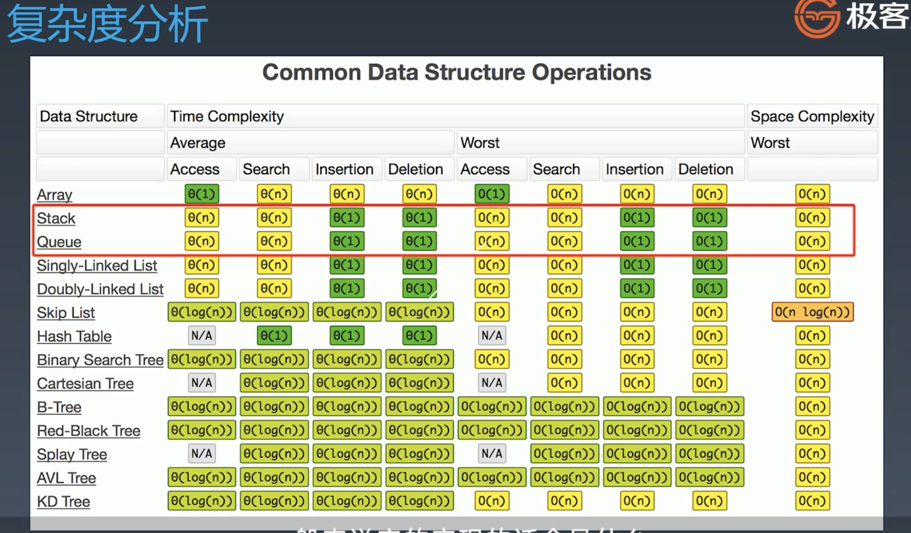

## 参考链接

- [Java 的 PriorityQueue 文档](http://docs.oracle.com/javase/10/docs/api/java/util/PriorityQueue.html)
- [Java 的 Stack 源码](http://developer.classpath.org/doc/java/util/Stack-source.html)
- [Java 的 Queue 源码](http://fuseyism.com/classpath/doc/java/util/Queue-source.html)
- [Python 的 heapq](http://docs.python.org/2/library/heapq.html)
- [高性能的 container 库](http://docs.python.org/2/library/collections.html)

##  预习题目

- 20    https://leetcode.com/problems/valid-parentheses/
- 155  https://leetcode.com/problems/min-stack/

## 实战题目

- 84   https://leetcode.com/problems/largest-rectangle-in-histogram
- 239 https://leetcode.com/problems/sliding-window-maximum

## 课后作业

- 用 add first 或     add last 这套新的 API 改写 Deque     的代码
- 分析 Queue 和     Priority Queue 的源码
- 641 https://leetcode.com/problems/design-circular-deque
- 42   https://leetcode.com/problems/trapping-rain-water/

说明：改写代码和分析源码这两项作业，同学们需要在第 1 周的学习总结中完成。如果不熟悉 Java 语言，这两项作业可选做。

------

20. Valid parentheses  的stack数据结构用法

84. largest rectangle in histogram 的分治法， 暴力法注意遍历

155. min stack的双stack方法

239. sliding window maximum的dp方法

42. trapping rain water 的 dp, stack, 2 pointer方法

用栈解决的题目： 如果一个东西具有最近相关性，那么就可以用栈来解决 （洋葱型结构，外对外，内对内）

先来后到用queue

只用栈实现队列，只用队列实现栈： 辅助栈，辅助队列

所有滑动窗口的题，用队列去解决

------

不推荐用stack，现实中直接用deque (double-end queue)双端队列

queue，deque在java中只是个接口

#### priority queue

插入操作： O(1)

取出操作： O(log N) - 按照元素的优先级取出

底层具体实现的数据结构较为多样和复杂： heap （heap也是多重实现的，不一定是二叉树实现，也可能是fibonacci堆等等），BST，红黑，AVL， treap， 

