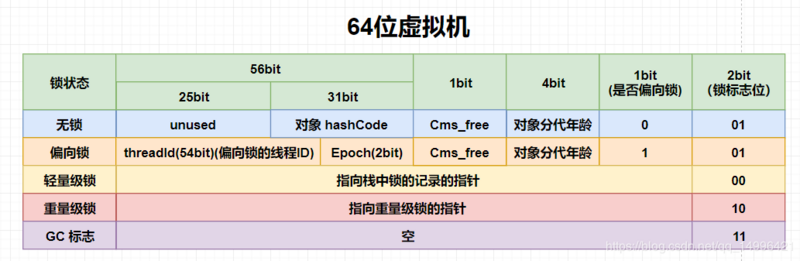

### object类

#### 1.20 介绍一下Object类中的方法

**参考答案**

Object类提供了如下几个常用方法：

- Class<?> getClass()：返回该对象的运行时类。
- boolean equals(Object obj)：判断指定对象与该对象是否相等。
- int hashCode()：返回该对象的hashCode值。在默认情况下，Object类的hashCode()方法根据该对象的地址来计算。但很多类都重写了Object类的hashCode()方法，不再根据地址来计算其hashCode()方法值。
- String toString()：返回该对象的字符串表示，当程序使用System.out.println()方法输出一个对象，或者把某个对象和字符串进行连接运算时，系统会自动调用该对象的toString()方法返回该对象的字符串表示。Object类的toString()方法返回 `运行时类名@十六进制hashCode值` 格式的字符串，但很多类都重写了Object类的toString()方法，用于返回可以表述该对象信息的字符串。

另外，Object类还提供了wait()、notify()、notifyAll()这几个方法，通过这几个方法可以控制线程的暂停和运行。Object类还提供了一个clone()方法，该方法用于帮助其他对象来实现“自我克隆”，所谓“自我克隆”就是得到一个当前对象的副本，而且二者之间完全隔离。由于该方法使用了protected修饰，因此它只能被子类重写或调用。

**扩展阅读**

Object类还提供了一个finalize()方法，当系统中没有引用变量引用到该对象时，垃圾回收器调用此方法来清理该对象的资源。并且，针对某一个对象，垃圾回收器最多只会调用它的finalize()方法一次。

注意，finalize()方法何时调用、是否调用都是不确定的，我们也不要主动调用finalize()方法。从JDK9开始，这个方法被标记为不推荐使用的方法。

#### 1.21 说一说hashCode()和equals()的关系

**参考答案**

hashCode()用于获取哈希码（散列码），eauqls()用于比较两个对象是否相等，它们应遵守如下规定：

- 如果两个对象相等，则它们必须有相同的哈希码。
- 如果两个对象有相同的哈希码，则它们未必相等。

**扩展阅读**

在Java中，Set接口代表无序的、元素不可重复的集合，HashSet则是Set接口的典型实现。

当向HashSet中加入一个元素时，它需要判断集合中是否已经包含了这个元素，从而避免重复存储。由于这个判断十分的频繁，所以要讲求效率，绝不能采用遍历集合逐个元素进行比较的方式。实际上，HashSet是通过获取对象的哈希码，以及调用对象的equals()方法来解决这个判断问题的。

HashSet首先会调用对象的hashCode()方法获取其哈希码，并通过哈希码确定该对象在集合中存放的位置。假设这个位置之前已经存了一个对象，则HashSet会调用equals()对两个对象进行比较。若相等则说明对象重复，此时不会保存新加的对象。若不等说明对象不重复，但是它们存储的位置发生了碰撞，此时HashSet会采用链式结构在同一位置保存多个对象，即将新加对象链接到原来对象的之后。之后，再有新添加对象也映射到这个位置时，就需要与这个位置中所有的对象进行equals()比较，若均不相等则将其链到最后一个对象之后。

#### 1.22 为什么要重写hashCode()和equals()？

**参考答案**

Object类提供的equals()方法默认是用`==`来进行比较的，也就是说只有两个对象是同一个对象时，才能返回相等的结果。而实际的业务中，我们通常的需求是，若两个不同的对象它们的内容是相同的，就认为它们相等。鉴于这种情况，Object类中equals()方法的默认实现是没有实用价值的，所以通常都要重写。

由于hashCode()与equals()具有联动关系（参考“说一说hashCode()和equals()的关系”一题），所以equals()方法重写时，通常也要将hashCode()进行重写，使得这两个方法始终满足相关的约定。

#### 1.23 ==和equals()有什么区别？

**参考答案**

==运算符：

- 作用于基本数据类型时，是比较两个数值是否相等；
- 作用于引用数据类型时，是比较两个对象的内存地址是否相同，即判断它们是否为同一个对象；

equals()方法：

- 没有重写时，Object默认以 `==` 来实现，即比较两个对象的内存地址是否相同；
- 进行重写后，一般会按照对象的内容来进行比较，若两个对象内容相同则认为对象相等，否则认为对象不等。


### string类

#### 1.24 String类有哪些方法？

**参考答案**

String类是Java最常用的API，它包含了大量处理字符串的方法，比较常用的有：

- char charAt(int index)：返回指定索引处的字符；
- String substring(int beginIndex, int endIndex)：从此字符串中截取出一部分子字符串；
- String[] split(String regex)：以指定的规则将此字符串分割成数组；
- String trim()：删除字符串前导和后置的空格；
- int indexOf(String str)：返回子串在此字符串首次出现的索引；
- int lastIndexOf(String str)：返回子串在此字符串最后出现的索引；
- boolean startsWith(String prefix)：判断此字符串是否以指定的前缀开头；
- boolean endsWith(String suffix)：判断此字符串是否以指定的后缀结尾；
- String toUpperCase()：将此字符串中所有的字符大写；
- String toLowerCase()：将此字符串中所有的字符小写；
- String replaceFirst(String regex, String replacement)：用指定字符串替换第一个匹配的子串；
- String replaceAll(String regex, String replacement)：用指定字符串替换所有的匹配的子串。

**注意事项**

String类的方法太多了，你没必要都记下来，更不需要一一列举。面试时能说出一些常用的方法，表现出对这个类足够的熟悉就可以了。另外，建议你挑几个方法仔细看看源码实现，面试时可以重点说这几个方法。

#### 1.25 String可以被继承吗？

**参考答案**

String类由final修饰，所以不能被继承。

**扩展阅读**

在Java中，String类被设计为不可变类，主要表现在它保存字符串的成员变量是final的。

- Java 9之前字符串采用char[]数组来保存字符，即 `private final char[] value`；
- Java 9做了改进，采用byte[]数组来保存字符，即 `private final byte[] value`；

之所以要把String类设计为不可变类，主要是出于安全和性能的考虑，可归纳为如下4点。

- 由于字符串无论在任何 Java 系统中都广泛使用，会用来存储敏感信息，如账号，密码，网络路径，文件处理等场景里，保证字符串 String 类的安全性就尤为重要了，如果字符串是可变的，容易被篡改，那我们就无法保证使用字符串进行操作时，它是安全的，很有可能出现 SQL 注入，访问危险文件等操作。
- 在多线程中，只有不变的对象和值是线程安全的，可以在多个线程中共享数据。由于 String 天然的不可变，当一个线程”修改“了字符串的值，只会产生一个新的字符串对象，不会对其他线程的访问产生副作用，访问的都是同样的字符串数据，不需要任何同步操作。
- 字符串作为基础的数据结构，大量地应用在一些集合容器之中，尤其是一些散列集合，在散列集合中，存放元素都要根据对象的 `hashCode()` 方法来确定元素的位置。由于字符串 `hashcode` 属性不会变更，保证了唯一性，使得类似 HashMap，HashSet 等容器才能实现相应的缓存功能。由于 String 的不可变，避免重复计算 `hashcode`，只要使用缓存的 `hashcode` 即可，这样一来大大提高了在散列集合中使用 String 对象的性能。
- 当字符串不可变时，字符串常量池才有意义。字符串常量池的出现，可以减少创建相同字面量的字符串，让不同的引用指向池中同一个字符串，为运行时节约很多的堆内存。若字符串可变，字符串常量池失去意义，基于常量池的 `String.intern()` 方法也失效，每次创建新的字符串将在堆内开辟出新的空间，占据更多的内存。

因为要保证String类的不可变，那么将这个类定义为final的就很容易理解了。如果没有final修饰，那么就会存在String的子类，这些子类可以重写String类的方法，强行改变字符串的值，这便违背了String类设计的初衷。

#### 1.26 说一说String和StringBuffer有什么区别

**参考答案**

String类是不可变类，即一旦一个String对象被创建以后，包含在这个对象中的字符序列是不可改变的，直至这个对象被销毁。

StringBuffer对象则代表一个字符序列可变的字符串，当一个StringBuffer被创建以后，通过StringBuffer提供的append()、insert()、reverse()、setCharAt()、setLength()等方法可以改变这个字符串对象的字符序列。一旦通过StringBuffer生成了最终想要的字符串，就可以调用它的toString()方法将其转换为一个String对象。

#### 1.27 说一说StringBuffer和StringBuilder有什么区别

**参考答案**

StringBuffer、StringBuilder都代表可变的字符串对象，它们有共同的父类 `AbstractStringBuilder`，并且两个类的构造方法和成员方法也基本相同。不同的是，StringBuffer是线程安全的，而StringBuilder是非线程安全的，所以StringBuilder性能略高。一般情况下，要创建一个内容可变的字符串，建议优先考虑StringBuilder类。

#### 1.28 使用字符串时，new和""推荐使用哪种方式？

**参考答案**

先看看 `"hello"` 和 `new String("hello")` 的区别：

- 当Java程序直接使用 `"hello"` 的字符串直接量时，JVM将会使用常量池来管理这个字符串；
- 当使用 `new String("hello")` 时，JVM会先使用常量池来管理 `"hello"` 直接量，再调用String类的构造器来创建一个新的String对象，新创建的String对象被保存在堆内存中。

显然，采用new的方式会多创建一个对象出来，会占用更多的内存，所以一般建议使用直接量的方式创建字符串。

#### 1.29 说一说你对字符串拼接的理解

**参考答案**

拼接字符串有很多种方式，其中最常用的有4种，下面列举了这4种方式各自适合的场景。

1. `+` 运算符：如果拼接的都是字符串直接量，则适合使用 `+` 运算符实现拼接；
2. StringBuilder：如果拼接的字符串中包含变量，并不要求线程安全，则适合使用StringBuilder；
3. StringBuffer：如果拼接的字符串中包含变量，并且要求线程安全，则适合使用StringBuffer；
4. String类的concat方法：如果只是对两个字符串进行拼接，并且包含变量，则适合使用concat方法；

**扩展阅读**

采用 `+` 运算符拼接字符串时：

- 如果拼接的都是字符串直接量，则在编译时编译器会将其直接优化为一个完整的字符串，和你直接写一个完整的字符串是一样的，所以效率非常的高。
- 如果拼接的字符串中包含变量，则在编译时编译器采用StringBuilder对其进行优化，即自动创建StringBuilder实例并调用其append()方法，将这些字符串拼接在一起，效率也很高。但如果这个拼接操作是在循环中进行的，那么每次循环编译器都会创建一个StringBuilder实例，再去拼接字符串，相当于执行了 `new StringBuilder().append(str)`，所以此时效率很低。

采用StringBuilder/StringBuffer拼接字符串时：

- StringBuilder/StringBuffer都有字符串缓冲区，缓冲区的容量在创建对象时确定，并且默认为16。当拼接的字符串超过缓冲区的容量时，会触发缓冲区的扩容机制，即缓冲区加倍。
- 缓冲区频繁的扩容会降低拼接的性能，所以如果能提前预估最终字符串的长度，则建议在创建可变字符串对象时，放弃使用默认的容量，可以指定缓冲区的容量为预估的字符串的长度。

采用String类的concat方法拼接字符串时：

- concat方法的拼接逻辑是，先创建一个足以容纳待拼接的两个字符串的字节数组，然后先后将两个字符串拼到这个数组里，最后将此数组转换为字符串。
- 在拼接大量字符串的时候，concat方法的效率低于StringBuilder。但是只拼接2个字符串时，concat方法的效率要优于StringBuilder。并且这种拼接方式代码简洁，所以只拼2个字符串时建议优先选择concat方法。

#### 1.30 两个字符串相加的底层是如何实现的？

**参考答案**

如果拼接的都是字符串直接量，则在编译时编译器会将其直接优化为一个完整的字符串，和你直接写一个完整的字符串是一样的。

如果拼接的字符串中包含变量，则在编译时编译器采用StringBuilder对其进行优化，即自动创建StringBuilder实例并调用其append()方法，将这些字符串拼接在一起。

#### 1.31 `String a = "abc";` ，说一下这个过程会创建什么，放在哪里？

**参考答案**

JVM会使用常量池来管理字符串直接量。在执行这句话时，JVM会先检查常量池中是否已经存有"abc"，若没有则将"abc"存入常量池，否则就复用常量池中已有的"abc"，将其引用赋值给变量a。

#### 1.32 `new String("abc")` 是去了哪里，仅仅是在堆里面吗？

**参考答案**

在执行这句话时，JVM会先使用常量池来管理字符串直接量，即将"abc"存入常量池。然后再创建一个新的String对象，这个对象会被保存在堆内存中。并且，堆中对象的数据会指向常量池中的直接量。


### 异常处理机制

#### 1.36 遇到过异常吗，如何处理？

**参考答案**

在Java中，可以按照如下三个步骤处理异常：

1. 捕获异常

   将业务代码包裹在try块内部，当业务代码中发生任何异常时，系统都会为此异常创建一个异常对象。创建异常对象之后，JVM会在try块之后寻找可以处理它的catch块，并将异常对象交给这个catch块处理。

2. 处理异常

   在catch块中处理异常时，应该先记录日志，便于以后追溯这个异常。然后根据异常的类型、结合当前的业务情况，进行相应的处理。比如，给变量赋予一个默认值、直接返回空值、向外抛出一个新的业务异常交给调用者处理，等等。

3. 回收资源

   如果业务代码打开了某个资源，比如数据库连接、网络连接、磁盘文件等，则需要在这段业务代码执行完毕后关闭这项资源。并且，无论是否发生异常，都要尝试关闭这项资源。将关闭资源的代码写在finally块内，可以满足这种需求，即无论是否发生异常，finally块内的代码总会被执行。

#### 1.37 说一说Java的异常机制

**参考答案**

关于异常处理：

在Java中，处理异常的语句由try、catch、finally三部分组成。其中，try块用于包裹业务代码，catch块用于捕获并处理某个类型的异常，finally块则用于回收资源。当业务代码发生异常时，系统会创建一个异常对象，然后由JVM寻找可以处理这个异常的catch块，并将异常对象交给这个catch块处理。若业务代码打开了某项资源，则可以在finally块中关闭这项资源，因为无论是否发生异常，finally块一定会执行。

关于抛出异常：

当程序出现错误时，系统会自动抛出异常。除此以外，Java也允许程序主动抛出异常。当业务代码中，判断某项错误的条件成立时，可以使用throw关键字向外抛出异常。在这种情况下，如果当前方法不知道该如何处理这个异常，可以在方法签名上通过throws关键字声明抛出异常，则该异常将交给JVM处理。

关于异常跟踪栈：

程序运行时，经常会发生一系列方法调用，从而形成方法调用栈。异常机制会导致异常在这些方法之间传播，而异常传播的顺序与方法的调用相反。异常从发生异常的方法向外传播，首先传给该方法的调用者，再传给上层调用者，以此类推。最终会传到main方法，若依然没有得到处理，则JVM会终止程序，并打印异常跟踪栈的信息


#### 1.38 请介绍Java的异常接口

**参考答案**

Throwable是异常的顶层父类，代表所有的非正常情况。它有两个直接子类，分别是Error、Exception。

Error是错误，一般是指与虚拟机相关的问题，如系统崩溃、虚拟机错误、动态链接失败等，这种错误无法恢复或不可能捕获，将导致应用程序中断。通常应用程序无法处理这些错误，因此应用程序不应该试图使用catch块来捕获Error对象。在定义方法时，也无须在其throws子句中声明该方法可能抛出Error及其任何子类。

Exception是异常，它被分为两大类，分别是Checked异常和Runtime异常。所有的RuntimeException类及其子类的实例被称为Runtime异常；不是RuntimeException类及其子类的异常实例则被称为Checked异常。Java认为Checked异常都是可以被处理（修复）的异常，所以Java程序必须显式处理Checked异常。如果程序没有处理Checked异常，该程序在编译时就会发生错误，无法通过编译。Runtime异常则更加灵活，Runtime异常无须显式声明抛出，如果程序需要捕获Runtime异常，也可以使用try...catch块来实现。

#### 1.39 finally是无条件执行的吗？

**参考答案**

不管try块中的代码是否出现异常，也不管哪一个catch块被执行，甚至在try块或catch块中执行了return语句，finally块总会被执行。

**注意事项**

如果在try块或catch块中使用 `System.exit(1);` 来退出虚拟机，则finally块将失去执行的机会。但是我们在实际的开发中，重来都不会这样做，所以尽管存在这种导致finally块无法执行的可能，也只是一种可能而已。

#### 1.40 在finally中return会发生什么？

**参考答案**

在通常情况下，不要在finally块中使用return、throw等导致方法终止的语句，一旦在finally块中使用了return、throw语句，将会导致try块、catch块中的return、throw语句失效。

**详细解析**

当Java程序执行try块、catch块时遇到了return或throw语句，这两个语句都会导致该方法立即结束，但是系统执行这两个语句并不会结束该方法，而是去寻找该异常处理流程中是否包含finally块，如果没有finally块，程序立即执行return或throw语句，方法终止；如果有finally块，系统立即开始执行finally块。只有当finally块执行完成后，系统才会再次跳回来执行try块、catch块里的return或throw语句；如果finally块里也使用了return或throw等导致方法终止的语句，finally块已经终止了方法，系统将不会跳回去执行try块、catch块里的任何代码。

#### 

### Hashmap

#### 2.6 HashMap有什么特点？

**参考答案**

1. HashMap是线程不安全的实现；
2. HashMap可以使用null作为key或value。

#### 2.7 JDK7和JDK8中的HashMap有什么区别？

**参考答案**

JDK7中的HashMap，是基于数组+链表来实现的，它的底层维护一个Entry数组。它会根据计算的hashCode将对应的KV键值对存储到该数组中，一旦发生hashCode冲突，那么就会将该KV键值对放到对应的已有元素的后面， 此时便形成了一个链表式的存储结构。

JDK7中HashMap的实现方案有一个明显的缺点，即当Hash冲突严重时，在桶上形成的链表会变得越来越长，这样在查询时的效率就会越来越低，其时间复杂度为O(N)。

JDK8中的HashMap，是基于数组+链表+红黑树来实现的，它的底层维护一个Node数组。当链表的存储的数据个数大于等于8的时候，不再采用链表存储，而采用了红黑树存储结构。这么做主要是在查询的时间复杂度上进行优化，链表为O(N)，而红黑树一直是O(logN)，可以大大的提高查找性能。

#### 2.8 介绍一下HashMap底层的实现原理

**参考答案**

它基于hash算法，通过put方法和get方法存储和获取对象。

存储对象时，我们将K/V传给put方法时，它调用K的hashCode计算hash从而得到bucket位置，进一步存储，HashMap会根据当前bucket的占用情况自动调整容量(超过Load Facotr则resize为原来的2倍)。获取对象时，我们将K传给get，它调用hashCode计算hash从而得到bucket位置，并进一步调用equals()方法确定键值对。

如果发生碰撞的时候，HashMap通过链表将产生碰撞冲突的元素组织起来。在Java 8中，如果一个bucket中碰撞冲突的元素超过某个限制(默认是8)，则使用红黑树来替换链表，从而提高速度。

#### 2.9 介绍一下HashMap的扩容机制

**参考答案**

1. 数组的初始容量为16，而容量是以2的次方扩充的，一是为了提高性能使用足够大的数组，二是为了能使用位运算代替取模预算(据说提升了5~8倍)。
2. 数组是否需要扩充是通过负载因子判断的，如果当前元素个数为数组容量的0.75时，就会扩充数组。这个0.75就是默认的负载因子，可由构造器传入。我们也可以设置大于1的负载因子，这样数组就不会扩充，牺牲性能，节省内存。
3. 为了解决碰撞，数组中的元素是单向链表类型。当链表长度到达一个阈值时（7或8），会将链表转换成红黑树提高性能。而当链表长度缩小到另一个阈值时（6），又会将红黑树转换回单向链表提高性能。
4. 对于第三点补充说明，检查链表长度转换成红黑树之前，还会先检测当前数组数组是否到达一个阈值（64），如果没有到达这个容量，会放弃转换，先去扩充数组。所以上面也说了链表长度的阈值是7或8，因为会有一次放弃转换的操作。

**扩展阅读**

例如我们从16扩展为32时，具体的变化如下所示：


因此元素在重新计算hash之后，因为n变为2倍，那么n-1的mask范围在高位多1bit(红色)，因此新的index就会发生这样的变化：


因此，我们在扩充HashMap的时候，不需要重新计算hash，只需要看看原来的hash值新增的那个bit是1还是0就好了，是0的话索引没变，是1的话索引变成“原索引+oldCap”。可以看看下图为16扩充为32的resize示意图：


这个设计确实非常的巧妙，既省去了重新计算hash值的时间，而且同时，由于新增的1bit是0还是1可以认为是随机的，因此resize的过程，均匀的把之前的冲突的节点分散到新的bucket了。

#### 2.10 HashMap中的循环链表是如何产生的？

**参考答案**

在多线程的情况下，当重新调整HashMap大小的时候，就会存在条件竞争，因为如果两个线程都发现HashMap需要重新调整大小了，它们会同时试着调整大小。在调整大小的过程中，存储在链表中的元素的次序会反过来，因为移动到新的bucket位置的时候，HashMap并不会将元素放在链表的尾部，而是放在头部，这是为了避免尾部遍历。如果条件竞争发生了，那么就会产生死循环了。

#### 2.11 HashMap为什么用红黑树而不用B树？

**参考答案**

B/B+树多用于外存上时，B/B+也被成为一个磁盘友好的数据结构。

HashMap本来是数组+链表的形式，链表由于其查找慢的特点，所以需要被查找效率更高的树结构来替换。如果用B/B+树的话，在数据量不是很多的情况下，数据都会“挤在”一个结点里面，这个时候遍历效率就退化成了链表。

#### 2.12 HashMap为什么线程不安全？

**参考答案**

HashMap在并发执行put操作时，可能会导致形成循环链表，从而引起死循环。

#### 2.13 HashMap如何实现线程安全？

**参考答案**

1. 直接使用Hashtable类；
2. 直接使用ConcurrentHashMap；
3. 使用Collections将HashMap包装成线程安全的Map。

#### 2.14 HashMap是如何解决哈希冲突的？

**参考答案**

为了解决碰撞，数组中的元素是单向链表类型。当链表长度到达一个阈值时，会将链表转换成红黑树提高性能。而当链表长度缩小到另一个阈值时，又会将红黑树转换回单向链表提高性能。


### concurrentHashmap

#### 2.16 HashMap与ConcurrentHashMap有什么区别？

**参考答案**

HashMap是非线程安全的，这意味着不应该在多线程中对这些Map进行修改操作，否则会产生数据不一致的问题，甚至还会因为并发插入元素而导致链表成环，这样在查找时就会发生死循环，影响到整个应用程序。

Collections工具类可以将一个Map转换成线程安全的实现，其实也就是通过一个包装类，然后把所有功能都委托给传入的Map，而包装类是基于synchronized关键字来保证线程安全的（Hashtable也是基于synchronized关键字），底层使用的是互斥锁，性能与吞吐量比较低。

ConcurrentHashMap的实现细节远没有这么简单，因此性能也要高上许多。它没有使用一个全局锁来锁住自己，而是采用了减少锁粒度的方法，尽量减少因为竞争锁而导致的阻塞与冲突，而且ConcurrentHashMap的检索操作是不需要锁的。

#### 2.17 介绍一下ConcurrentHashMap是怎么实现的？

**参考答案**

JDK 1.7中的实现：

在 jdk 1.7 中，ConcurrentHashMap 是由 Segment 数据结构和 HashEntry 数组结构构成，采取分段锁来保证安全性。Segment 是 ReentrantLock 重入锁，在 ConcurrentHashMap 中扮演锁的角色，HashEntry 则用于存储键值对数据。一个 ConcurrentHashMap 里包含一个 Segment 数组，一个 Segment 里包含一个 HashEntry 数组，Segment 的结构和 HashMap 类似，是一个数组和链表结构。


JDK 1.8中的实现：

JDK1.8 的实现已经摒弃了 Segment 的概念，而是直接用 Node 数组+链表+红黑树的数据结构来实现，并发控制使用 Synchronized 和 CAS 来操作，整个看起来就像是优化过且线程安全的 HashMap，虽然在 JDK1.8 中还能看到 Segment 的数据结构，但是已经简化了属性，只是为了兼容旧版本。


#### 2.18 ConcurrentHashMap是怎么分段分组的？

**参考答案**

get操作：

Segment的get操作实现非常简单和高效，先经过一次再散列，然后使用这个散列值通过散列运算定位到 Segment，再通过散列算法定位到元素。get操作的高效之处在于整个get过程都不需要加锁，除非读到空的值才会加锁重读。原因就是将使用的共享变量定义成 `volatile` 类型。

put操作：

当执行put操作时，会经历两个步骤：

1. 判断是否需要扩容；
2. 定位到添加元素的位置，将其放入 HashEntry 数组中。

插入过程会进行第一次 key 的 hash 来定位 Segment 的位置，如果该 Segment 还没有初始化，即通过 CAS 操作进行赋值，然后进行第二次 hash 操作，找到相应的 HashEntry 的位置，这里会利用继承过来的锁的特性，在将数据插入指定的 HashEntry 位置时（尾插法），会通过继承 ReentrantLock 的 `tryLock()` 方法尝试去获取锁，如果获取成功就直接插入相应的位置，如果已经有线程获取该Segment的锁，那当前线程会以自旋的方式去继续的调用 `tryLock()` 方法去获取锁，超过指定次数就挂起，等待唤醒。


### ArrayList

#### 2.24 ArrayList和LinkedList有什么区别？

**参考答案**

1. ArrayList的实现是基于数组，LinkedList的实现是基于双向链表；
2. 对于随机访问ArrayList要优于LinkedList，ArrayList可以根据下标以O(1)时间复杂度对元素进行随机访问，而LinkedList的每一个元素都依靠地址指针和它后一个元素连接在一起，查找某个元素的时间复杂度是O(N)；
3. 对于插入和删除操作，LinkedList要优于ArrayList，因为当元素被添加到LinkedList任意位置的时候，不需要像ArrayList那样重新计算大小或者是更新索引；
4. LinkedList比ArrayList更占内存，因为LinkedList的节点除了存储数据，还存储了两个引用，一个指向前一个元素，一个指向后一个元素。

#### 2.25 有哪些线程安全的List？

**参考答案**

1. Vector

   Vector是比较古老的API，虽然保证了线程安全，但是由于效率低一般不建议使用。

2. Collections.SynchronizedList

   SynchronizedList是Collections的内部类，Collections提供了synchronizedList方法，可以将一个线程不安全的List包装成线程安全的List，即SynchronizedList。它比Vector有更好的扩展性和兼容性，但是它所有的方法都带有同步锁，也不是性能最优的List。

3. CopyOnWriteArrayList

   CopyOnWriteArrayList是Java 1.5在java.util.concurrent包下增加的类，它采用复制底层数组的方式来实现写操作。当线程对此类集合执行读取操作时，线程将会直接读取集合本身，无须加锁与阻塞。当线程对此类集合执行写入操作时，集合会在底层复制一份新的数组，接下来对新的数组执行写入操作。由于对集合的写入操作都是对数组的副本执行操作，因此它是线程安全的。在所有线程安全的List中，它是性能最优的方案。

#### 2.26 介绍一下ArrayList的数据结构？

**参考答案**

ArrayList的底层是用数组来实现的，默认第一次插入元素时创建大小为10的数组，超出限制时会增加50%的容量，并且数据以 `System.arraycopy()` 复制到新的数组，因此最好能给出数组大小的预估值。

按数组下标访问元素的性能很高，这是数组的基本优势。直接在数组末尾加入元素的性能也高，但如果按下标插入、删除元素，则要用 `System.arraycopy()` 来移动部分受影响的元素，性能就变差了，这是基本劣势。

#### 2.27 谈谈CopyOnWriteArrayList的原理

**参考答案**

CopyOnWriteArrayList是Java并发包里提供的并发类，简单来说它就是一个线程安全且读操作无锁的ArrayList。正如其名字一样，在写操作时会复制一份新的List，在新的List上完成写操作，然后再将原引用指向新的List。这样就保证了写操作的线程安全。

CopyOnWriteArrayList允许线程并发访问读操作，这个时候是没有加锁限制的，性能较高。而写操作的时候，则首先将容器复制一份，然后在新的副本上执行写操作，这个时候写操作是上锁的。结束之后再将原容器的引用指向新容器。注意，在上锁执行写操作的过程中，如果有需要读操作，会作用在原容器上。因此上锁的写操作不会影响到并发访问的读操作。

- 优点：读操作性能很高，因为无需任何同步措施，比较适用于读多写少的并发场景。在遍历传统的List时，若中途有别的线程对其进行修改，则会抛出ConcurrentModificationException异常。而CopyOnWriteArrayList由于其"读写分离"的思想，遍历和修改操作分别作用在不同的List容器，所以在使用迭代器进行遍历时候，也就不会抛出ConcurrentModificationException异常了。
- 缺点：一是内存占用问题，毕竟每次执行写操作都要将原容器拷贝一份，数据量大时，对内存压力较大，可能会引起频繁GC。二是无法保证实时性，Vector对于读写操作均加锁同步，可以保证读和写的强一致性。而CopyOnWriteArrayList由于其实现策略的原因，写和读分别作用在新老不同容器上，在写操作执行过程中，读不会阻塞但读取到的却是老容器的数据。


### 多线程

#### 4.1 创建线程有哪几种方式？

**参考答案**

创建线程有三种方式，分别是继承Thread类、实现Runnable接口、实现Callable接口。

通过继承Thread类来创建并启动线程的步骤如下：

1. 定义Thread类的子类，并重写该类的run()方法，该run()方法将作为线程执行体。
2. 创建Thread子类的实例，即创建了线程对象。
3. 调用线程对象的start()方法来启动该线程。

通过实现Runnable接口来创建并启动线程的步骤如下：

1. 定义Runnable接口的实现类，并实现该接口的run()方法，该run()方法将作为线程执行体。
2. 创建Runnable实现类的实例，并将其作为Thread的target来创建Thread对象，Thread对象为线程对象。
3. 调用线程对象的start()方法来启动该线程。

通过实现Callable接口来创建并启动线程的步骤如下：

1. 创建Callable接口的实现类，并实现call()方法，该call()方法将作为线程执行体，且该call()方法有返回值。然后再创建Callable实现类的实例。
2. 使用FutureTask类来包装Callable对象，该FutureTask对象封装了该Callable对象的call()方法的返回值。
3. 使用FutureTask对象作为Thread对象的target创建并启动新线程。
4. 调用FutureTask对象的get()方法来获得子线程执行结束后的返回值。

**扩展阅读**

通过继承Thread类、实现Runnable接口、实现Callable接口都可以实现多线程，不过实现Runnable接口与实现Callable接口的方式基本相同，只是Callable接口里定义的方法有返回值，可以声明抛出异常而已。因此可以将实现Runnable接口和实现Callable接口归为一种方式。

采用实现Runnable、Callable接口的方式创建多线程的优缺点：

- 线程类只是实现了Runnable接口或Callable接口，还可以继承其他类。
- 在这种方式下，多个线程可以共享同一个target对象，所以非常适合多个相同线程来处理同一份资源的情况，从而可以将CPU、代码和数据分开，形成清晰的模型，较好地体现了面向对象的思想。
- 劣势是，编程稍稍复杂，如果需要访问当前线程，则必须使用Thread.currentThread()方法。

采用继承Thread类的方式创建多线程的优缺点：

- 劣势是，因为线程类已经继承了Thread类，所以不能再继承其他父类。
- 优势是，编写简单，如果需要访问当前线程，则无须使用Thread.currentThread()方法，直接使用this即可获得当前线程。

鉴于上面分析，因此一般推荐采用实现Runnable接口、Callable接口的方式来创建多线程。


#### 4.4 线程是否可以重复启动，会有什么后果？

**参考答案**

只能对处于新建状态的线程调用start()方法，否则将引发IllegalThreadStateException异常。

**扩展阅读**

当程序使用new关键字创建了一个线程之后，该线程就处于新建状态，此时它和其他的Java对象一样，仅仅由Java虚拟机为其分配内存，并初始化其成员变量的值。此时的线程对象没有表现出任何线程的动态特征，程序也不会执行线程的线程执行体。

当线程对象调用了start()方法之后，该线程处于就绪状态，Java虚拟机会为其创建方法调用栈和程序计数器，处于这个状态中的线程并没有开始运行，只是表示该线程可以运行了。至于该线程何时开始运行，取决于JVM里线程调度器的调度。

#### 4.5 介绍一下线程的生命周期

**参考答案**

在线程的生命周期中，它要经过新建（New）、就绪（Ready）、运行（Running）、阻塞（Blocked）和死亡（Dead）5种状态。尤其是当线程启动以后，它不可能一直“霸占”着CPU独自运行，所以CPU需要在多条线程之间切换，于是线程状态也会多次在运行、就绪之间切换。

当程序使用new关键字创建了一个线程之后，该线程就处于新建状态，此时它和其他的Java对象一样，仅仅由Java虚拟机为其分配内存，并初始化其成员变量的值。此时的线程对象没有表现出任何线程的动态特征，程序也不会执行线程的线程执行体。

当线程对象调用了start()方法之后，该线程处于就绪状态，Java虚拟机会为其创建方法调用栈和程序计数器，处于这个状态中的线程并没有开始运行，只是表示该线程可以运行了。至于该线程何时开始运行，取决于JVM里线程调度器的调度。

如果处于就绪状态的线程获得了CPU，开始执行run()方法的线程执行体，则该线程处于运行状态，如果计算机只有一个CPU，那么在任何时刻只有一个线程处于运行状态。当然，在一个多处理器的机器上，将会有多个线程并行执行；当线程数大于处理器数时，依然会存在多个线程在同一个CPU上轮换的现象。

当一个线程开始运行后，它不可能一直处于运行状态，线程在运行过程中需要被中断，目的是使其他线程获得执行的机会，线程调度的细节取决于底层平台所采用的策略。对于采用抢占式策略的系统而言，系统会给每个可执行的线程一个小时间段来处理任务。当该时间段用完后，系统就会剥夺该线程所占用的资源，让其他线程获得执行的机会。当发生如下情况时，线程将会进入阻塞状态：

- 线程调用sleep()方法主动放弃所占用的处理器资源。
- 线程调用了一个阻塞式IO方法，在该方法返回之前，该线程被阻塞。
- 线程试图获得一个同步监视器，但该同步监视器正被其他线程所持有。
- 线程在等待某个通知（notify）。
- 程序调用了线程的suspend()方法将该线程挂起。但这个方法容易导致死锁，所以应该尽量避免使用该方法。

针对上面几种情况，当发生如下特定的情况时可以解除上面的阻塞，让该线程重新进入就绪状态：

- 调用sleep()方法的线程经过了指定时间。
- 线程调用的阻塞式IO方法已经返回。
- 线程成功地获得了试图取得的同步监视器。
- 线程正在等待某个通知时，其他线程发出了一个通知。
- 处于挂起状态的线程被调用了resume()恢复方法。

线程会以如下三种方式结束，结束后就处于死亡状态：

- run()或call()方法执行完成，线程正常结束。
- 线程抛出一个未捕获的Exception或Error。
- 直接调用该线程的stop()方法来结束该线程，该方法容易导致死锁，通常不推荐使用。

**扩展阅读**

线程5种状态的转换关系，如下图所示：


#### 4.6 如何实现线程同步？

**参考答案**

1. 同步方法

   即有synchronized关键字修饰的方法，由于java的每个对象都有一个内置锁，当用此关键字修饰方法时， 内置锁会保护整个方法。在调用该方法前，需要获得内置锁，否则就处于阻塞状态。需要注意， synchronized关键字也可以修饰静态方法，此时如果调用该静态方法，将会锁住整个类。

2. 同步代码块

   即有synchronized关键字修饰的语句块，被该关键字修饰的语句块会自动被加上内置锁，从而实现同步。需值得注意的是，同步是一种高开销的操作，因此应该尽量减少同步的内容。通常没有必要同步整个方法，使用synchronized代码块同步关键代码即可。

3. ReentrantLock

   Java 5新增了一个java.util.concurrent包来支持同步，其中ReentrantLock类是可重入、互斥、实现了Lock接口的锁，它与使用synchronized方法和快具有相同的基本行为和语义，并且扩展了其能力。需要注意的是，ReentrantLock还有一个可以创建公平锁的构造方法，但由于能大幅度降低程序运行效率，因此不推荐使用。

4. volatile

   volatile关键字为域变量的访问提供了一种免锁机制，使用volatile修饰域相当于告诉虚拟机该域可能会被其他线程更新，因此每次使用该域就要重新计算，而不是使用寄存器中的值。需要注意的是，volatile不会提供任何原子操作，它也不能用来修饰final类型的变量。

5. 原子变量

   在java的util.concurrent.atomic包中提供了创建了原子类型变量的工具类，使用该类可以简化线程同步。例如AtomicInteger 表可以用原子方式更新int的值，可用在应用程序中（如以原子方式增加的计数器），但不能用于替换Integer。可扩展Number，允许那些处理机遇数字类的工具和实用工具进行统一访问。

#### 4.7 说一说Java多线程之间的通信方式

**参考答案**

在Java中线程通信主要有以下三种方式：

1. wait()、notify()、notifyAll()

   如果线程之间采用synchronized来保证线程安全，则可以利用wait()、notify()、notifyAll()来实现线程通信。这三个方法都不是Thread类中所声明的方法，而是Object类中声明的方法。原因是每个对象都拥有锁，所以让当前线程等待某个对象的锁，当然应该通过这个对象来操作。并且因为当前线程可能会等待多个线程的锁，如果通过线程来操作，就非常复杂了。另外，这三个方法都是本地方法，并且被final修饰，无法被重写。

   wait()方法可以让当前线程释放对象锁并进入阻塞状态。notify()方法用于唤醒一个正在等待相应对象锁的线程，使其进入就绪队列，以便在当前线程释放锁后竞争锁，进而得到CPU的执行。notifyAll()用于唤醒所有正在等待相应对象锁的线程，使它们进入就绪队列，以便在当前线程释放锁后竞争锁，进而得到CPU的执行。

   每个锁对象都有两个队列，一个是就绪队列，一个是阻塞队列。就绪队列存储了已就绪（将要竞争锁）的线程，阻塞队列存储了被阻塞的线程。当一个阻塞线程被唤醒后，才会进入就绪队列，进而等待CPU的调度。反之，当一个线程被wait后，就会进入阻塞队列，等待被唤醒。

2. await()、signal()、signalAll()

   如果线程之间采用Lock来保证线程安全，则可以利用await()、signal()、signalAll()来实现线程通信。这三个方法都是Condition接口中的方法，该接口是在Java 1.5中出现的，它用来替代传统的wait+notify实现线程间的协作，它的使用依赖于 Lock。相比使用wait+notify，使用Condition的await+signal这种方式能够更加安全和高效地实现线程间协作。

   Condition依赖于Lock接口，生成一个Condition的基本代码是lock.newCondition() 。 必须要注意的是，Condition 的 await()/signal()/signalAll() 使用都必须在lock保护之内，也就是说，必须在lock.lock()和lock.unlock之间才可以使用。事实上，await()/signal()/signalAll() 与 wait()/notify()/notifyAll()有着天然的对应关系。即：Conditon中的await()对应Object的wait()，Condition中的signal()对应Object的notify()，Condition中的signalAll()对应Object的notifyAll()。

3. BlockingQueue

   Java 5提供了一个BlockingQueue接口，虽然BlockingQueue也是Queue的子接口，但它的主要用途并不是作为容器，而是作为线程通信的工具。BlockingQueue具有一个特征：当生产者线程试图向BlockingQueue中放入元素时，如果该队列已满，则该线程被阻塞；当消费者线程试图从BlockingQueue中取出元素时，如果该队列已空，则该线程被阻塞。

   程序的两个线程通过交替向BlockingQueue中放入元素、取出元素，即可很好地控制线程的通信。线程之间需要通信，最经典的场景就是生产者与消费者模型，而BlockingQueue就是针对该模型提供的解决方案。

#### 4.8 说一说Java同步机制中的wait和notify

**参考答案**

wait()、notify()、notifyAll()用来实现线程之间的通信，这三个方法都不是Thread类中所声明的方法，而是Object类中声明的方法。原因是每个对象都拥有锁，所以让当前线程等待某个对象的锁，当然应该通过这个对象来操作。并且因为当前线程可能会等待多个线程的锁，如果通过线程来操作，就非常复杂了。另外，这三个方法都是本地方法，并且被final修饰，无法被重写，并且只有采用synchronized实现线程同步时才能使用这三个方法。

wait()方法可以让当前线程释放对象锁并进入阻塞状态。notify()方法用于唤醒一个正在等待相应对象锁的线程，使其进入就绪队列，以便在当前线程释放锁后竞争锁，进而得到CPU的执行。notifyAll()方法用于唤醒所有正在等待相应对象锁的线程，使它们进入就绪队列，以便在当前线程释放锁后竞争锁，进而得到CPU的执行。

每个锁对象都有两个队列，一个是就绪队列，一个是阻塞队列。就绪队列存储了已就绪（将要竞争锁）的线程，阻塞队列存储了被阻塞的线程。当一个阻塞线程被唤醒后，才会进入就绪队列，进而等待CPU的调度。反之，当一个线程被wait后，就会进入阻塞队列，等待被唤醒。

#### 4.9 说一说sleep()和wait()的区别

**参考答案**

1. sleep()是Thread类中的静态方法，而wait()是Object类中的成员方法；
2. sleep()可以在任何地方使用，而wait()只能在同步方法或同步代码块中使用；
3. sleep()不会释放锁，而wait()会释放锁，并需要通过notify()/notifyAll()重新获取锁。

#### 4.10 说一说notify()、notifyAll()的区别

**参考答案**

- notify()

  用于唤醒一个正在等待相应对象锁的线程，使其进入就绪队列，以便在当前线程释放锁后竞争锁，进而得到CPU的执行。

- notifyAll()

  用于唤醒所有正在等待相应对象锁的线程，使它们进入就绪队列，以便在当前线程释放锁后竞争锁，进而得到CPU的执行。


### 线程池

#### 4.31 介绍一下线程池

**参考答案**

系统启动一个新线程的成本是比较高的，因为它涉及与操作系统交互。在这种情形下，使用线程池可以很好地提高性能，尤其是当程序中需要创建大量生存期很短暂的线程时，更应该考虑使用线程池。

与数据库连接池类似的是，线程池在系统启动时即创建大量空闲的线程，程序将一个Runnable对象或Callable对象传给线程池，线程池就会启动一个空闲的线程来执行它们的run()或call()方法，当run()或call()方法执行结束后，该线程并不会死亡，而是再次返回线程池中成为空闲状态，等待执行下一个Runnable对象的run()或call()方法。

从Java 5开始，Java内建支持线程池。Java 5新增了一个Executors工厂类来产生线程池，该工厂类包含如下几个静态工厂方法来创建线程池。创建出来的线程池，都是通过ThreadPoolExecutor类来实现的。

- newCachedThreadPool()：创建一个具有缓存功能的线程池，系统根据需要创建线程，这些线程将会被缓存在线程池中。
- newFixedThreadPool(int nThreads)：创建一个可重用的、具有固定线程数的线程池。
- newSingleThreadExecutor()：创建一个只有单线程的线程池，它相当于调用newFixedThread Pool()方法时传入参数为1。
- newScheduledThreadPool(int corePoolSize)：创建具有指定线程数的线程池，它可以在指定延迟后执行线程任务。corePoolSize指池中所保存的线程数，即使线程是空闲的也被保存在线程池内。
- newSingleThreadScheduledExecutor()：创建只有一个线程的线程池，它可以在指定延迟后执行线程任务。
- ExecutorService newWorkStealingPool(int parallelism)：创建持有足够的线程的线程池来支持给定的并行级别，该方法还会使用多个队列来减少竞争。
- ExecutorService newWorkStealingPool()：该方法是前一个方法的简化版本。如果当前机器有4个CPU，则目标并行级别被设置为4，也就是相当于为前一个方法传入4作为参数。

#### 4.32 介绍一下线程池的工作流程

**参考答案**

线程池的工作流程如下图所示：


1. 判断核心线程池是否已满，没满则创建一个新的工作线程来执行任务。
2. 判断任务队列是否已满，没满则将新提交的任务添加在工作队列。
3. 判断整个线程池是否已满，没满则创建一个新的工作线程来执行任务，已满则执行饱和（拒绝）策略。

#### 4.33 线程池都有哪些状态？

**参考答案**

线程池一共有五种状态, 分别是：

1. RUNNING ：能接受新提交的任务，并且也能处理阻塞队列中的任务。
2. SHUTDOWN：关闭状态，不再接受新提交的任务，但却可以继续处理阻塞队列中已保存的任务。在线程池处于 RUNNING 状态时，调用 shutdown()方法会使线程池进入到该状态。
3. STOP：不能接受新任务，也不处理队列中的任务，会中断正在处理任务的线程。在线程池处于 RUNNING 或 SHUTDOWN 状态时，调用 shutdownNow() 方法会使线程池进入到该状态。
4. TIDYING：如果所有的任务都已终止了，workerCount (有效线程数) 为0，线程池进入该状态后会调用 terminated() 方法进入TERMINATED 状态。
5. TERMINATED：在terminated() 方法执行完后进入该状态，默认terminated()方法中什么也没有做。进入TERMINATED的条件如下：
   - 线程池不是RUNNING状态；
   - 线程池状态不是TIDYING状态或TERMINATED状态；
   - 如果线程池状态是SHUTDOWN并且workerQueue为空；
   - workerCount为0；
   - 设置TIDYING状态成功。

下图为线程池的状态转换过程：


#### 4.34 谈谈线程池的拒绝策略

**参考答案**

当线程池的任务缓存队列已满并且线程池中的线程数目达到maximumPoolSize，如果还有任务到来就会采取任务拒绝策略，通常有以下四种策略：

1. AbortPolicy：丢弃任务并抛出RejectedExecutionException异常。
2. DiscardPolicy：也是丢弃任务，但是不抛出异常。
3. DiscardOldestPolicy：丢弃队列最前面的任务，然后重新尝试执行任务（重复该过程）。
4. CallerRunsPolicy：由调用线程处理该任务。

#### 4.35 线程池的队列大小你通常怎么设置？

**参考答案**

1. CPU密集型任务

   尽量使用较小的线程池，一般为CPU核心数+1。 因为CPU密集型任务使得CPU使用率很高，若开过多的线程数，会造成CPU过度切换。

2. IO密集型任务

   可以使用稍大的线程池，一般为2*CPU核心数。 IO密集型任务CPU使用率并不高，因此可以让CPU在等待IO的时候有其他线程去处理别的任务，充分利用CPU时间。

3. 混合型任务

   可以将任务分成IO密集型和CPU密集型任务，然后分别用不同的线程池去处理。 只要分完之后两个任务的执行时间相差不大，那么就会比串行执行来的高效。因为如果划分之后两个任务执行时间有数据级的差距，那么拆分没有意义。因为先执行完的任务就要等后执行完的任务，最终的时间仍然取决于后执行完的任务，而且还要加上任务拆分与合并的开销，得不偿失。

#### 4.36 线程池有哪些参数，各个参数的作用是什么？

**参考答案**

线程池主要有如下6个参数：

1. corePoolSize（核心工作线程数）：当向线程池提交一个任务时，若线程池已创建的线程数小于corePoolSize，即便此时存在空闲线程，也会通过创建一个新线程来执行该任务，直到已创建的线程数大于或等于corePoolSize时。
2. maximumPoolSize（最大线程数）：线程池所允许的最大线程个数。当队列满了，且已创建的线程数小于maximumPoolSize，则线程池会创建新的线程来执行任务。另外，对于无界队列，可忽略该参数。
3. keepAliveTime（多余线程存活时间）：当线程池中线程数大于核心线程数时，线程的空闲时间如果超过线程存活时间，那么这个线程就会被销毁，直到线程池中的线程数小于等于核心线程数。
4. workQueue（队列）：用于传输和保存等待执行任务的阻塞队列。
5. threadFactory（线程创建工厂）：用于创建新线程。threadFactory创建的线程也是采用new Thread()方式，threadFactory创建的线程名都具有统一的风格：pool-m-thread-n（m为线程池的编号，n为线程池内的线程编号）。
6. handler（拒绝策略）：当线程池和队列都满了，再加入线程会执行此策略。


### Java的锁

#### 4.13 说一说synchronized与Lock的区别

**参考答案**

1. synchronized是Java关键字，在JVM层面实现加锁和解锁；Lock是一个接口，在代码层面实现加锁和解锁。
2. synchronized可以用在代码块上、方法上；Lock只能写在代码里。
3. synchronized在代码执行完或出现异常时自动释放锁；Lock不会自动释放锁，需要在finally中显示释放锁。
4. synchronized会导致线程拿不到锁一直等待；Lock可以设置获取锁失败的超时时间。
5. synchronized无法得知是否获取锁成功；Lock则可以通过tryLock得知加锁是否成功。
6. synchronized锁可重入、不可中断、非公平；Lock锁可重入、可中断、可公平/不公平，并可以细分读写锁以提高效率。

#### 4.14 说一说synchronized的底层实现原理

**参考答案**

一、以下列代码为例，说明同步代码块的底层实现原理：

```java
public class SynchronizedDemo {
    public void method() {
        synchronized (this) {
            System.out.println("Method 1 start");
        }
    }
}
```

查看反编译后结果，如下图：


可见，synchronized作用在代码块时，它的底层是通过monitorenter、monitorexit指令来实现的。

- monitorenter：

  每个对象都是一个监视器锁（monitor），当monitor被占用时就会处于锁定状态，线程执行monitorenter指令时尝试获取monitor的所有权，过程如下：

  如果monitor的进入数为0，则该线程进入monitor，然后将进入数设置为1，该线程即为monitor的所有者。如果线程已经占有该monitor，只是重新进入，则进入monitor的进入数加1。如果其他线程已经占用了monitor，则该线程进入阻塞状态，直到monitor的进入数为0，再重新尝试获取monitor的所有权。

- monitorexit：

  执行monitorexit的线程必须是objectref所对应的monitor持有者。指令执行时，monitor的进入数减1，如果减1后进入数为0，那线程退出monitor，不再是这个monitor的所有者。其他被这个monitor阻塞的线程可以尝试去获取这个monitor的所有权。

  monitorexit指令出现了两次，第1次为同步正常退出释放锁，第2次为发生异步退出释放锁。

二、以下列代码为例，说明同步方法的底层实现原理：

```java
public class SynchronizedMethod {
    public synchronized void method() {
        System.out.println("Hello World!");
    }
}
```

查看反编译后结果，如下图：


从反编译的结果来看，方法的同步并没有通过 monitorenter 和 monitorexit 指令来完成，不过相对于普通方法，其常量池中多了 ACC_SYNCHRONIZED 标示符。JVM就是根据该标示符来实现方法的同步的：

当方法调用时，调用指令将会检查方法的 ACC_SYNCHRONIZED 访问标志是否被设置，如果设置了，执行线程将先获取monitor，获取成功之后才能执行方法体，方法执行完后再释放monitor。在方法执行期间，其他任何线程都无法再获得同一个monitor对象。

三、总结

两种同步方式本质上没有区别，只是方法的同步是一种隐式的方式来实现，无需通过字节码来完成。两个指令的执行是JVM通过调用操作系统的互斥原语mutex来实现，被阻塞的线程会被挂起、等待重新调度，会导致“用户态和内核态”两个态之间来回切换，对性能有较大影响。

#### 4.15 synchronized可以修饰静态方法和静态代码块吗？

**参考答案**

synchronized可以修饰静态方法，但不能修饰静态代码块。

当修饰静态方法时，监视器锁（monitor）便是对象的Class实例，因为Class数据存在于永久代，因此静态方法锁相当于该类的一个全局锁。

#### 4.16 谈谈ReentrantLock的实现原理

**参考答案**

`ReentrantLock`是基于`AQS`实现的，`AQS`即`AbstractQueuedSynchronizer`的缩写，这个是个内部实现了两个队列的抽象类，分别是同步队列和条件队列。其中同步队列是一个双向链表，里面储存的是处于等待状态的线程，正在排队等待唤醒去获取锁，而条件队列是一个单向链表，里面储存的也是处于等待状态的线程，只不过这些线程唤醒的结果是加入到了同步队列的队尾，`AQS`所做的就是管理这两个队列里面线程之间的等待状态-唤醒的工作。

在同步队列中，还存在`2`中模式，分别是独占模式和共享模式，这两种模式的区别就在于`AQS`在唤醒线程节点的时候是不是传递唤醒，这两种模式分别对应独占锁和共享锁。

`AQS`是一个抽象类，所以不能直接实例化，当我们需要实现一个自定义锁的时候可以去继承`AQS`然后重写获取锁的方式和释放锁的方式还有管理state，而`ReentrantLock`就是通过重写了`AQS`的`tryAcquire`和`tryRelease`方法实现的`lock`和`unlock`。

`ReentrantLock` 结构如下图所示：


首先`ReentrantLock` 实现了 `Lock` 接口，然后有`3`个内部类，其中`Sync`内部类继承自`AQS`，另外的两个内部类继承自`Sync`，这两个类分别是用来公平锁和非公平锁的。通过`Sync`重写的方法`tryAcquire`、`tryRelease`可以知道，`ReentrantLock`实现的是`AQS`的独占模式，也就是独占锁，这个锁是悲观锁。

#### 4.17 如果不使用synchronized和Lock，如何保证线程安全？

**参考答案**

1. volatile

   volatile关键字为域变量的访问提供了一种免锁机制，使用volatile修饰域相当于告诉虚拟机该域可能会被其他线程更新，因此每次使用该域就要重新计算，而不是使用寄存器中的值。需要注意的是，volatile不会提供任何原子操作，它也不能用来修饰final类型的变量。

2. 原子变量

   在java的util.concurrent.atomic包中提供了创建了原子类型变量的工具类，使用该类可以简化线程同步。例如AtomicInteger 表可以用原子方式更新int的值，可用在应用程序中（如以原子方式增加的计数器），但不能用于替换Integer。可扩展Number，允许那些处理机遇数字类的工具和实用工具进行统一访问。

3. 本地存储

   可以通过ThreadLocal类来实现线程本地存储的功能。每一个线程的Thread对象中都有一个ThreadLocalMap对象，这个对象存储了一组以ThreadLocal.threadLocalHashCode为键，以本地线程变量为值的K-V值对，ThreadLocal对象就是当前线程的ThreadLocalMap的访问入口，每一个ThreadLocal对象都包含了一个独一无二的threadLocalHashCode值，使用这个值就可以在线程K-V值对中找回对应的本地线程变量。

4. 不可变的

   只要一个不可变的对象被正确地构建出来，那其外部的可见状态永远都不会改变，永远都不会看到它在多个线程之中处于不一致的状态，“不可变”带来的安全性是最直接、最纯粹的。Java语言中，如果多线程共享的数据是一个基本数据类型，那么只要在定义时使用final关键字修饰它就可以保证它是不可变的。如果共享数据是一个对象，由于Java语言目前暂时还没有提供值类型的支持，那就需要对象自行保证其行为不会对其状态产生任何影响才行。String类是一个典型的不可变类，可以参考它设计一个不可变类。

#### 4.18 说一说Java中乐观锁和悲观锁的区别

**参考答案**

悲观锁：总是假设最坏的情况，每次去拿数据的时候都认为别人会修改，所以每次在拿数据的时候都会上锁，这样别人想拿这个数据就会阻塞直到它拿到锁。Java中悲观锁是通过synchronized关键字或Lock接口来实现的。

乐观锁：顾名思义，就是很乐观，每次去拿数据的时候都认为别人不会修改，所以不会上锁，但是在更新的时候会判断一下在此期间别人有没有去更新这个数据。乐观锁适用于多读的应用类型，这样可以提高吞吐量。在JDK1.5 中新增 java.util.concurrent (J.U.C)就是建立在CAS之上的。相对于对于 synchronized 这种阻塞算法，CAS是非阻塞算法的一种常见实现。所以J.U.C在性能上有了很大的提升。

#### 4.19 公平锁与非公平锁是怎么实现的？

**参考答案**

在Java中实现锁的方式有两种，一种是使用Java自带的关键字synchronized对相应的类或者方法以及代码块进行加锁，另一种是ReentrantLock，前者只能是非公平锁，而后者是默认非公平但可实现公平的一把锁。

ReentrantLock是基于其内部类FairSync(公平锁)和NonFairSync(非公平锁)实现的，并且它的实现依赖于Java同步器框架AbstractQueuedSynchronizer（AQS），AQS使用一个整形的volatile变量state来维护同步状态，这个volatile变量是实现ReentrantLock的关键。我们来看一下ReentrantLock的类图：


ReentrantLock 的公平锁和非公平锁都委托了 `AbstractQueuedSynchronizer#acquire` 去请求获取。

```
public` `final` `void` `acquire(``int` `arg) {``  ``if` `(!tryAcquire(arg) &&``    ``acquireQueued(addWaiter(Node.EXCLUSIVE), arg))``    ``selfInterrupt();``}
```

- tryAcquire 是一个抽象方法，是公平与非公平的实现原理所在。
- addWaiter 是将当前线程结点加入等待队列之中。公平锁在锁释放后会严格按照等到队列去取后续值，而非公平锁在对于新晋线程有很大优势。
- acquireQueued 在多次循环中尝试获取到锁或者将当前线程阻塞。
- selfInterrupt 如果线程在阻塞期间发生了中断，调用 Thread.currentThread().interrupt() 中断当前线程。

公平锁和非公平锁在说的获取上都使用到了 volatile 关键字修饰的state字段， 这是保证多线程环境下锁的获取与否的核心。但是当并发情况下多个线程都读取到 `state == 0`时，则必须用到CAS技术，一门CPU的原子锁技术，可通过CPU对共享变量加锁的形式，实现数据变更的原子操作。volatile 和 CAS的结合是并发抢占的关键。

- 公平锁FairSync

  公平锁的实现机理在于每次有线程来抢占锁的时候，都会检查一遍有没有等待队列，如果有， 当前线程会执行如下步骤：

  ```java
  if (!hasQueuedPredecessors() && compareAndSetState(0, acquires)) {         
      setExclusiveOwnerThread(current);
      return true; 
  }
  ```

  其中hasQueuedPredecessors是用于检查是否有等待队列的：

  ```java
  public final boolean hasQueuedPredecessors() {
      Node t = tail; // Read fields in reverse initialization order
      Node h = head;
      Node s;
      return h != t &&
          ((s = h.next) == null || s.thread != Thread.currentThread());
  }
  ```

  

- 非公平锁NonfairSync

  非公平锁在实现的时候多次强调随机抢占：

  ```java
  if (c == 0) {
      if (compareAndSetState(0, acquires)) {
          setExclusiveOwnerThread(current);
          return true; 
      }
  } 
  ```

  与公平锁的区别在于新晋获取锁的进程会有多次机会去抢占锁，被加入了等待队列后则跟公平锁没有区别。

#### 4.20 了解Java中的锁升级吗？

**参考答案**

JDK 1.6之前，synchronized 还是一个重量级锁，是一个效率比较低下的锁。但是在JDK 1.6后，JVM为了提高锁的获取与释放效率对synchronized 进行了优化，引入了偏向锁和轻量级锁 ，从此以后锁的状态就有了四种：无锁、偏向锁、轻量级锁、重量级锁。并且四种状态会随着竞争的情况逐渐升级，而且是不可逆的过程，即不可降级，这四种锁的级别由低到高依次是：无锁、偏向锁，轻量级锁，重量级锁。如下图所示：


1. 无锁

   无锁是指没有对资源进行锁定，所有的线程都能访问并修改同一个资源，但同时只有一个线程能修改成功。无锁的特点是修改操作会在循环内进行，线程会不断的尝试修改共享资源。如果没有冲突就修改成功并退出，否则就会继续循环尝试。如果有多个线程修改同一个值，必定会有一个线程能修改成功，而其他修改失败的线程会不断重试直到修改成功。

2. 偏向锁

   初次执行到synchronized代码块的时候，锁对象变成偏向锁（通过CAS修改对象头里的锁标志位），字面意思是“偏向于第一个获得它的线程”的锁。执行完同步代码块后，线程并不会主动释放偏向锁。当第二次到达同步代码块时，线程会判断此时持有锁的线程是否就是自己（持有锁的线程ID也在对象头里），如果是则正常往下执行。由于之前没有释放锁，这里也就不需要重新加锁。如果自始至终使用锁的线程只有一个，很明显偏向锁几乎没有额外开销，性能极高。

   偏向锁是指当一段同步代码一直被同一个线程所访问时，即不存在多个线程的竞争时，那么该线程在后续访问时便会自动获得锁，从而降低获取锁带来的消耗，即提高性能。

   当一个线程访问同步代码块并获取锁时，会在 Mark Word 里存储锁偏向的线程 ID。在线程进入和退出同步块时不再通过 CAS 操作来加锁和解锁，而是检测 Mark Word 里是否存储着指向当前线程的偏向锁。轻量级锁的获取及释放依赖多次 CAS 原子指令，而偏向锁只需要在置换 ThreadID 的时候依赖一次 CAS 原子指令即可。

   偏向锁只有遇到其他线程尝试竞争偏向锁时，持有偏向锁的线程才会释放锁，线程是不会主动释放偏向锁的。关于偏向锁的撤销，需要等待全局安全点，即在某个时间点上没有字节码正在执行时，它会先暂停拥有偏向锁的线程，然后判断锁对象是否处于被锁定状态。如果线程不处于活动状态，则将对象头设置成无锁状态，并撤销偏向锁，恢复到无锁（标志位为01）或轻量级锁（标志位为00）的状态。

3. 轻量级锁

   轻量级锁是指当锁是偏向锁的时候，却被另外的线程所访问，此时偏向锁就会升级为轻量级锁，其他线程会通过自旋的形式尝试获取锁，线程不会阻塞，从而提高性能。

   轻量级锁的获取主要由两种情况：

   1. 当关闭偏向锁功能时；
   2. 由于多个线程竞争偏向锁导致偏向锁升级为轻量级锁。

   一旦有第二个线程加入锁竞争，偏向锁就升级为轻量级锁（自旋锁）。这里要明确一下什么是锁竞争：如果多个线程轮流获取一个锁，但是每次获取锁的时候都很顺利，没有发生阻塞，那么就不存在锁竞争。只有当某线程尝试获取锁的时候，发现该锁已经被占用，只能等待其释放，这才发生了锁竞争。

   在轻量级锁状态下继续锁竞争，没有抢到锁的线程将自旋，即不停地循环判断锁是否能够被成功获取。获取锁的操作，其实就是通过CAS修改对象头里的锁标志位。先比较当前锁标志位是否为“释放”，如果是则将其设置为“锁定”，比较并设置是原子性发生的。这就算抢到锁了，然后线程将当前锁的持有者信息修改为自己。

   长时间的自旋操作是非常消耗资源的，一个线程持有锁，其他线程就只能在原地空耗CPU，执行不了任何有效的任务，这种现象叫做忙等（busy-waiting）。如果多个线程用一个锁，但是没有发生锁竞争，或者发生了很轻微的锁竞争，那么synchronized就用轻量级锁，允许短时间的忙等现象。这是一种折衷的想法，短时间的忙等，换取线程在用户态和内核态之间切换的开销。

4. 重量级锁

   重量级锁显然，此忙等是有限度的（有个计数器记录自旋次数，默认允许循环10次，可以通过虚拟机参数更改）。如果锁竞争情况严重，某个达到最大自旋次数的线程，会将轻量级锁升级为重量级锁（依然是CAS修改锁标志位，但不修改持有锁的线程ID）。当后续线程尝试获取锁时，发现被占用的锁是重量级锁，则直接将自己挂起（而不是忙等），等待将来被唤醒。

   重量级锁是指当有一个线程获取锁之后，其余所有等待获取该锁的线程都会处于阻塞状态。简言之，就是所有的控制权都交给了操作系统，由操作系统来负责线程间的调度和线程的状态变更。而这样会出现频繁地对线程运行状态的切换，线程的挂起和唤醒，从而消耗大量的系统资。

**扩展阅读**

synchronized 用的锁是存在Java对象头里的，那么什么是对象头呢？我们以 Hotspot 虚拟机为例进行说明，Hopspot 对象头主要包括两部分数据：Mark Word（标记字段） 和 Klass Pointer（类型指针）。

- Mark Word：默认存储对象的HashCode，分代年龄和锁标志位信息。这些信息都是与对象自身定义无关的数据，所以Mark Word被设计成一个非固定的数据结构以便在极小的空间内存存储尽量多的数据。它会根据对象的状态复用自己的存储空间，也就是在运行期间Mark Word里存储的数据会随着锁标志位的变化而变化。
- Klass Point：对象指向它的类元数据的指针，虚拟机通过这个指针来确定这个对象是哪个类的实例。

那么，synchronized 具体是存在对象头哪里呢？答案是：存在锁对象的对象头的Mark Word中，那么MarkWord在对象头中到底长什么样，它到底存储了什么呢？

在64位的虚拟机中：



在32位的虚拟机中：


下面我们以 32位虚拟机为例，来看一下其 Mark Word 的字节具体是如何分配的：

- 无锁 ：对象头开辟 25bit 的空间用来存储对象的 hashcode ，4bit 用于存放对象分代年龄，1bit 用来存放是否偏向锁的标识位，2bit 用来存放锁标识位为01。
- 偏向锁： 在偏向锁中划分更细，还是开辟 25bit 的空间，其中23bit 用来存放线程ID，2bit 用来存放 Epoch，4bit 存放对象分代年龄，1bit 存放是否偏向锁标识， 0表示无锁，1表示偏向锁，锁的标识位还是01。
- 轻量级锁：在轻量级锁中直接开辟 30bit 的空间存放指向栈中锁记录的指针，2bit 存放锁的标志位，其标志位为00。
- 重量级锁： 在重量级锁中和轻量级锁一样，30bit 的空间用来存放指向重量级锁的指针，2bit 存放锁的标识位，为11。
- GC标记： 开辟30bit 的内存空间却没有占用，2bit 空间存放锁标志位为11。

其中无锁和偏向锁的锁标志位都是01，只是在前面的1bit区分了这是无锁状态还是偏向锁状态。关于内存的分配，我们可以在git中openJDK中 markOop.hpp 可以看出：

```java
public:
  // Constants
  enum { age_bits          = 4,
         lock_bits         = 2,
         biased_lock_bits  = 1,
         max_hash_bits     = BitsPerWord - age_bits - lock_bits - biased_lock_bits,
         hash_bits         = max_hash_bits > 31 ? 31 : max_hash_bits,
         cms_bits          = LP64_ONLY(1) NOT_LP64(0),
         epoch_bits        = 2
  };
```

- age_bits： 就是我们说的分代回收的标识，占用4字节。
- lock_bits： 是锁的标志位，占用2个字节。
- biased_lock_bits： 是是否偏向锁的标识，占用1个字节。
- max_hash_bits： 是针对无锁计算的hashcode 占用字节数量，如果是32位虚拟机，就是 32 - 4 - 2 -1 = 25 byte，如果是64 位虚拟机，64 - 4 - 2 - 1 = 57 byte，但是会有 25 字节未使用，所以64位的 hashcode 占用 31 byte。
- hash_bits： 是针对 64 位虚拟机来说，如果最大字节数大于 31，则取31，否则取真实的字节数。
- cms_bits： 不是64位虚拟机就占用 0 byte，是64位就占用 1byte。
- epoch_bits： 就是 epoch 所占用的字节大小，2字节。

#### 4.21 如何实现互斥锁（mutex）？

**参考答案**

在Java里面，最基本的互斥同步手段就是synchronized关键字，这是一种块结构（Block Structured）的同步语法。synchronized关键字经过Javac编译之后，会在同步块的前后分别形成monitorenter和monitorexit这两个字节码指令。这两个字节码指令都需要一个reference类型的参数来指明要锁定和解锁的对象。如果Java源码中的synchronized明确指定了对象参数，那就以这个对象的引用作为reference。如果没有明确指定，那将根据synchronized修饰的方法类型（如实例方法或类方法），来决定是取代码所在的对象实例还是取类型对应的Class对象来作为线程要持有的锁。

自JDK 5起，Java类库中新提供了java.util.concurrent包（J.U.C包），其中的java.util.concurrent.locks.Lock接口便成了Java的另一种全新的互斥同步手段。基于Lock接口，用户能够以非块结构（Non-Block Structured）来实现互斥同步，从而摆脱了语言特性的束缚，改为在类库层面去实现同步，这也为日后扩展出不同调度算法、不同特征、不同性能、不同语义的各种锁提供了广阔的空间。

#### 4.22 分段锁是怎么实现的？

**参考答案**

在并发程序中，串行操作是会降低可伸缩性，并且上下文切换也会减低性能。在锁上发生竞争时将通水导致这两种问题，使用独占锁时保护受限资源的时候，基本上是采用串行方式—-每次只能有一个线程能访问它。所以对于可伸缩性来说最大的威胁就是独占锁。

我们一般有三种方式降低锁的竞争程度：

1. 减少锁的持有时间；
2. 降低锁的请求频率；
3. 使用带有协调机制的独占锁，这些机制允许更高的并发性。

在某些情况下我们可以将锁分解技术进一步扩展为一组独立对象上的锁进行分解，这称为分段锁。其实说的简单一点就是：容器里有多把锁，每一把锁用于锁容器其中一部分数据，那么当多线程访问容器里不同数据段的数据时，线程间就不会存在锁竞争，从而可以有效的提高并发访问效率，这就是ConcurrentHashMap所使用的锁分段技术，首先将数据分成一段一段的存储，然后给每一段数据配一把锁，当一个线程占用锁访问其中一个段数据的时候，其他段的数据也能被其他线程访问。

如下图，ConcurrentHashMap使用Segment数据结构，将数据分成一段一段的存储，然后给每一段数据配一把锁，当一个线程占用锁访问其中一个段数据的时候，其他段的数据也能被其他线程访问，能够实现真正的并发访问。所以说，ConcurrentHashMap在并发情况下，不仅保证了线程安全，而且提高了性能。


#### 4.23 说说你对读写锁的了解

**参考答案**

与传统锁不同的是读写锁的规则是可以共享读，但只能一个写，总结起来为：读读不互斥、读写互斥、写写互斥，而一般的独占锁是：读读互斥、读写互斥、写写互斥，而场景中往往读远远大于写，读写锁就是为了这种优化而创建出来的一种机制。
注意是读远远大于写，一般情况下独占锁的效率低来源于高并发下对临界区的激烈竞争导致线程上下文切换。因此当并发不是很高的情况下，读写锁由于需要额外维护读锁的状态，可能还不如独占锁的效率高。因此需要根据实际情况选择使用。

在Java中`ReadWriteLock`的主要实现为`ReentrantReadWriteLock`，其提供了以下特性：

1. 公平性选择：支持公平与非公平（默认）的锁获取方式，吞吐量非公平优先于公平。
2. 可重入：读线程获取读锁之后可以再次获取读锁，写线程获取写锁之后可以再次获取写锁。
3. 可降级：写线程获取写锁之后，其还可以再次获取读锁，然后释放掉写锁，那么此时该线程是读锁状态，也就是降级操作。


#### 4.24 volatile关键字有什么用？

**参考答案**

当一个变量被定义成volatile之后，它将具备两项特性：

1. 保证可见性

   当写一个volatile变量时，JMM会把该线程本地内存中的变量强制刷新到主内存中去，这个写会操作会导致其他线程中的volatile变量缓存无效。

2. 禁止指令重排

   使用volatile关键字修饰共享变量可以禁止指令重排序，volatile禁止指令重排序有一些规则：

   - 当程序执行到volatile变量的读操作或者写操作时，在其前面的操作的更改肯定全部已经进行，且结果已经对后面的操作可见，在其后面的操作肯定还没有进行；
   - 在进行指令优化时，不能将对volatile变量访问的语句放在其后面执行，也不能把volatile变量后面的语句放到其前面执行。

   即执行到volatile变量时，其前面的所有语句都执行完，后面所有语句都未执行。且前面语句的结果对volatile变量及其后面语句可见。

注意，虽然volatile能够保证可见性，但它不能保证原子性。volatile变量在各个线程的工作内存中是不存在一致性问题的，但是Java里面的运算操作符并非原子操作，这导致volatile变量的运算在并发下一样是不安全的。

#### 4.25 谈谈volatile的实现原理

**参考答案**

volatile可以保证线程可见性且提供了一定的有序性，但是无法保证原子性。在JVM底层volatile是采用“内存屏障”来实现的。观察加入volatile关键字和没有加入volatile关键字时所生成的汇编代码发现，加入volatile关键字时，会多出一个lock前缀指令，lock前缀指令实际上相当于一个内存屏障，内存屏障会提供3个功能：

1. 它确保指令重排序时不会把其后面的指令排到内存屏障之前的位置，也不会把前面的指令排到内存屏障的后面；即在执行到内存屏障这句指令时，在它前面的操作已经全部完成；
2. 它会强制将对缓存的修改操作立即写入主存；
3. 如果是写操作，它会导致其他CPU中对应的缓存行无效。