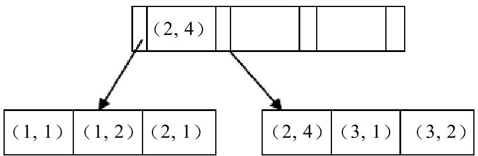

## 2. 索引

#### 2.1 说一说你对MySQL索引的理解

**参考答案**

索引是一个单独的、存储在磁盘上的数据库结构，包含着对数据表里所有记录的引用指针。使用索引可以快速找出在某个或多个列中有一特定值的行，所有MySQL列类型都可以被索引，对相关列使用索引是提高查询操作速度的最佳途径。

索引是在存储引擎中实现的，因此，每种存储引擎的索引都不一定完全相同，并且每种存储引擎也不一定支持所有索引类型。MySQL中索引的存储类型有两种，即BTREE和HASH，具体和表的存储引擎相关。MyISAM和InnoDB存储引擎只支持BTREE索引；MEMORY/HEAP存储引擎可以支持HASH和BTREE索引。

索引的优点主要有以下几条：

1. 通过创建唯一索引，可以保证数据库表中每一行数据的唯一性。
2. 可以大大加快数据的查询速度，这也是创建索引的主要原因。
3. 在实现数据的参考完整性方面，可以加速表和表之间的连接。
4. 在使用分组和排序子句进行数据查询时，也可以显著减少查询中分组和排序的时间。

增加索引也有许多不利的方面，主要表现在如下几个方面：

1. 创建索引和维护索引要耗费时间，并且随着数据量的增加所耗费的时间也会增加。
2. 索引需要占磁盘空间，除了数据表占数据空间之外，每一个索引还要占一定的物理空间，如果有大量的索引，索引文件可能比数据文件更快达到最大文件尺寸。
3. 当对表中的数据进行增加、删除和修改的时候，索引也要动态地维护，这样就降低了数据的维护速度。

#### 2.2 索引有哪几种？

**参考答案**

MySQL的索引可以分为以下几类：

1. 普通索引和唯一索引

   普通索引是MySQL中的基本索引类型，允许在定义索引的列中插入重复值和空值。

   唯一索引要求索引列的值必须唯一，但允许有空值。如果是组合索引，则列值的组合必须唯一。

   主键索引是一种特殊的唯一索引，不允许有空值。

2. 单列索引和组合索引

   单列索引即一个索引只包含单个列，一个表可以有多个单列索引。

   组合索引是指在表的多个字段组合上创建的索引，只有在查询条件中使用了这些字段的左边字段时，索引才会被使用。使用组合索引时遵循最左前缀集合。

3. 全文索引

   全文索引类型为FULLTEXT，在定义索引的列上支持值的全文查找，允许在这些索引列中插入重复值和空值。全文索引可以在CHAR、VARCHAR或者TEXT类型的列上创建。MySQL中只有MyISAM存储引擎支持全文索引。

4. 空间索引

   空间索引是对空间数据类型的字段建立的索引，MySQL中的空间数据类型有4种，分别是GEOMETRY、POINT、LINESTRING和POLYGON。MySQL使用SPATIAL关键字进行扩展，使得能够用创建正规索引类似的语法创建空间索引。创建空间索引的列，必须将其声明为NOT NULL，空间索引只能在存储引擎为MyISAM的表中创建。

#### 2.3 如何创建及保存MySQL的索引？

**参考答案**

MySQL支持多种方法在单个或多个列上创建索引：

在创建表的时候创建索引：

使用CREATE TABLE创建表时，除了可以定义列的数据类型，还可以定义主键约束、外键约束或者唯一性约束，而不论创建哪种约束，在定义约束的同时相当于在指定列上创建了一个索引。创建表时创建索引的基本语法如下：

```sql
CREATE TABLE table_name [col_name data_type]
[UNIQUE|FULLTEXT|SPATIAL] [INDEX|KEY] [index_name] (col_name [length]) [ASC|DESC]
```

其中，UNIQUE、FULLTEXT和SPATIAL为可选参数，分别表示唯一索引、全文索引和空间索引；INDEX与KEY为同义词，两者作用相同，用来指定创建索引。

例如，可以按照如下方式，在id字段上使用UNIQUE关键字创建唯一索引：

```sql
CREATE TABLE t1 (
    id INT NOT NULL,
    name CHAR(30) NOT NULL,
    UNIQUE INDEX UniqIdx(id)
);
```

在已存在的表上创建索引

在已经存在的表中创建索引，可以使用ALTER TABLE语句或者CREATEINDEX语句。

ALTER TABLE创建索引的基本语法如下：

```sql
ALTER TABLE table_name ADD 
[UNIQUE|FULLTEXT|SPATIAL] [INDEX|KEY] [index_name] (col_name[length],...) [ASC|DESC]
```

例如，可以按照如下方式，在bookId字段上建立名称为UniqidIdx的唯一索引

```sql
ALTER TABLE book ADD UNIQUE INDEX UniqidIdx (bookId);
```

CREATE INDEX创建索引的基本语法如下：

```sql
CREATE [UNIQUE|FULLTEXT|SPATIAL] INDEX index_name 
ON table_name (col_name [length],...) [ASC|DESC]
```

例如，可以按照如下方式，在bookId字段上建立名称为UniqidIdx的唯一索引：

```sql
CREATE UNIQUE INDEX UniqidIdx ON book (bookId);
```

#### 2.4 MySQL怎么判断要不要加索引？

**参考答案**

建议按照如下的原则来创建索引：

1. 当唯一性是某种数据本身的特征时，指定唯一索引。使用唯一索引需能确保定义的列的数据完整性，以提高查询速度。
2. 在频繁进行排序或分组（即进行group by或order by操作）的列上建立索引，如果待排序的列有多个，可以在这些列上建立组合索引。

#### 2.5 只要创建了索引，就一定会走索引吗？

**参考答案**

不一定。

比如，在使用组合索引的时候，如果没有遵从“最左前缀”的原则进行搜索，则索引是不起作用的。

举例，假设在id、name、age字段上已经成功建立了一个名为MultiIdx的组合索引。索引行中按id、name、age的顺序存放，索引可以搜索id、（id,name）、（id, name, age）字段组合。如果列不构成索引最左面的前缀，那么MySQL不能使用局部索引，如（age）或者（name,age）组合则不能使用该索引查询。


#### 2.16 聚簇索引和非聚簇索引有什么区别？

**参考答案**

在InnoDB存储引擎中，可以将B+树索引分为聚簇索引和辅助索引（非聚簇索引）。无论是何种索引，每个页的大小都为16KB，且不能更改。

聚簇索引是根据主键创建的一棵B+树，聚簇索引的叶子节点存放了表中的所有记录。辅助索引是根据索引键创建的一棵B+树，与聚簇索引不同的是，其叶子节点仅存放索引键值，以及该索引键值指向的主键。也就是说，如果通过辅助索引来查找数据，那么当找到辅助索引的叶子节点后，很有可能还需要根据主键值查找聚簇索引来得到数据，这种查找方式又被称为书签查找。因为辅助索引不包含行记录的所有数据，这就意味着每页可以存放更多的键值，因此其高度一般都要小于聚簇索引。

#### 2.17 什么是联合索引？

**参考答案**

联合索引是指对表上的多个列进行索引，联合索引的创建方法与单个索引创建的方法一样，不同之处仅在于有多个索引列。从本质上来说，联合索引还是一棵B+树，不同的是联合索引的键值数量不是1，而是大于等于2，参考下图。另外，只有在查询条件中使用了这些字段的左边字段时，索引才会被使用，所以使用联合索引时遵循最左前缀集合。



#### 2.18 select in语句中如何使用索引？

**参考答案**

索引是否起作用，主要取决于字段类型：

- 如果字段类型为字符串，需要给in查询中的数值与字符串值都需要添加引号，索引才能起作用。
- 如果字段类型为int，则in查询中的值不需要添加引号，索引也会起作用。

IN的字段，在联合索引中，按以上方法，也会起作用。

#### 2.19 模糊查询语句中如何使用索引？

**参考答案**

在MySQL中模糊查询 `mobile like ‘%8765’`，这种情况是不能使用 mobile 上的索引的，那么如果需要根据手机号码后四位进行模糊查询，可以用一下方法进行改造。

我们可以加入冗余列（MySQL5.7之后加入了虚拟列，使用虚拟列更合适，思路相同），比如 mobile_reverse，内部存储为 mobile 的倒叙文本，如 mobile为17312345678，那么 mobile_reverse 存储 87654321371，为 mobile_reverse 列建立索引，查询中使用语句 mobile_reverse like reverse(’%5678’) 即可。

reverse 是 MySQL 中的反转函数，这条语句相当于 mobile_reverse like ‘8765%’ ，这种语句是可以使用索引的。

