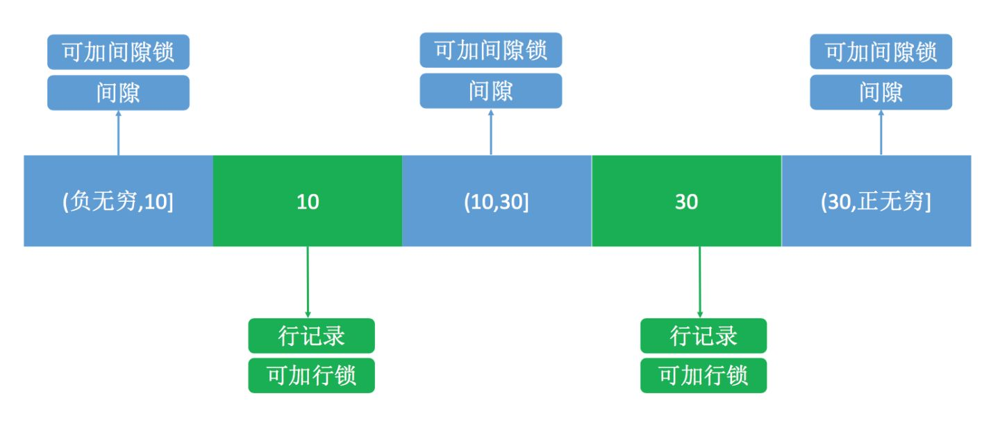

## 3. 事务

#### 3.1 说一说你对数据库事务的了解

**参考答案**

事务可由一条非常简单的SQL语句组成，也可以由一组复杂的SQL语句组成。在事务中的操作，要么都执行修改，要么都不执行，这就是事务的目的，也是事务模型区别于文件系统的重要特征之一。

事务需遵循ACID四个特性：

- A（atomicity），原子性。原子性指整个数据库事务是不可分割的工作单位。只有使事务中所有的数据库操作都执行成功，整个事务的执行才算成功。事务中任何一个SQL语句执行失败，那么已经执行成功的SQL语句也必须撤销，数据库状态应该退回到执行事务前的状态。
- C（consistency），一致性。一致性指事务将数据库从一种状态转变为另一种一致的状态。在事务开始之前和事务结束以后，数据库的完整性约束没有被破坏。
- I（isolation），隔离性。事务的隔离性要求每个读写事务的对象与其他事务的操作对象能相互分离，即该事务提交前对其他事务都不可见，这通常使用锁来实现。
- D（durability） ，持久性。事务一旦提交，其结果就是永久性的，即使发生宕机等故障，数据库也能将数据恢复。持久性保证的是事务系统的高可靠性，而不是高可用性。

事务可以分为以下几种类型：

- 扁平事务：是事务类型中最简单的一种，而在实际生产环境中，这可能是使用最为频繁的事务。在扁平事务中，所有操作都处于同一层次，其由BEGIN WORK开始，由COMMIT WORK或ROLLBACK WORK结束。处于之间的操作是原子的，要么都执行，要么都回滚。
- 带有保存点的扁平事务：除了支持扁平事务支持的操作外，允许在事务执行过程中回滚到同一事务中较早的一个状态，这是因为可能某些事务在执行过程中出现的错误并不会对所有的操作都无效，放弃整个事务不合乎要求，开销也太大。保存点（savepoint）用来通知系统应该记住事务当前的状态，以便以后发生错误时，事务能回到该状态。
- 链事务：可视为保存点模式的一个变种。链事务的思想是：在提交一个事务时，释放不需要的数据对象，将必要的处理上下文隐式地传给下一个要开始的事务。注意，提交事务操作和开始下一个事务操作将合并为一个原子操作。这意味着下一个事务将看到上一个事务的结果，就好像在一个事务中进行的。
- 嵌套事务：是一个层次结构框架。有一个顶层事务（top-level transaction）控制着各个层次的事务。顶层事务之下嵌套的事务被称为子事务（subtransaction），其控制每一个局部的变换。
- 分布式事务：通常是一个在分布式环境下运行的扁平事务，因此需要根据数据所在位置访问网络中的不同节点。对于分布式事务，同样需要满足ACID特性，要么都发生，要么都失效。

对于MySQL的InnoDB存储引擎来说，它支持扁平事务、带有保存点的扁平事务、链事务、分布式事务。对于嵌套事务，MySQL数据库并不是原生的，因此对于有并行事务需求的用户来说MySQL就无能为力了，但是用户可以通过带有保存点的事务来模拟串行的嵌套事务。

#### 3.2 事务有哪几种类型，它们之间有什么区别？

**参考答案**

事务可以分为以下几种类型：

- 扁平事务：是事务类型中最简单的一种，而在实际生产环境中，这可能是使用最为频繁的事务。在扁平事务中，所有操作都处于同一层次，其由BEGIN WORK开始，由COMMIT WORK或ROLLBACK WORK结束。处于之间的操作是原子的，要么都执行，要么都回滚。
- 带有保存点的扁平事务：除了支持扁平事务支持的操作外，允许在事务执行过程中回滚到同一事务中较早的一个状态，这是因为可能某些事务在执行过程中出现的错误并不会对所有的操作都无效，放弃整个事务不合乎要求，开销也太大。保存点（savepoint）用来通知系统应该记住事务当前的状态，以便以后发生错误时，事务能回到该状态。
- 链事务：可视为保存点模式的一个变种。链事务的思想是：在提交一个事务时，释放不需要的数据对象，将必要的处理上下文隐式地传给下一个要开始的事务。注意，提交事务操作和开始下一个事务操作将合并为一个原子操作。这意味着下一个事务将看到上一个事务的结果，就好像在一个事务中进行的。
- 嵌套事务：是一个层次结构框架。有一个顶层事务（top-level transaction）控制着各个层次的事务。顶层事务之下嵌套的事务被称为子事务（subtransaction），其控制每一个局部的变换。
- 分布式事务：通常是一个在分布式环境下运行的扁平事务，因此需要根据数据所在位置访问网络中的不同节点。对于分布式事务，同样需要满足ACID特性，要么都发生，要么都失效。

对于MySQL的InnoDB存储引擎来说，它支持扁平事务、带有保存点的扁平事务、链事务、分布式事务。对于嵌套事务，MySQL数据库并不是原生的，因此对于有并行事务需求的用户来说MySQL就无能为力了，但是用户可以通过带有保存点的事务来模拟串行的嵌套事务。

#### 3.3 MySQL的ACID特性分别是怎么实现的？

**参考答案**

原子性实现原理：

实现原子性的关键，是当事务回滚时能够撤销所有已经成功执行的sql语句。InnoDB实现回滚靠的是undo log，当事务对数据库进行修改时，InnoDB会生成对应的undo log。如果事务执行失败或调用了rollback，导致事务需要回滚，便可以利用undo log中的信息将数据回滚到修改之前的样子。

undo log属于逻辑日志，它记录的是sql执行相关的信息。当发生回滚时，InnoDB会根据undo log的内容做与之前相反的工作。对于insert，回滚时会执行delete。对于delete，回滚时会执行insert。对于update，回滚时则会执行相反的update，把数据改回去。

持久性实现原理：

InnoDB作为MySQL的存储引擎，数据是存放在磁盘中的，但如果每次读写数据都需要磁盘IO，效率会很低。为此，InnoDB提供了缓存(Buffer Pool)，Buffer Pool中包含了磁盘中部分数据页的映射，作为访问数据库的缓冲。当从数据库读取数据时，会首先从Buffer Pool中读取，如果Buffer Pool中没有，则从磁盘读取后放入Buffer Pool。当向数据库写入数据时，会首先写入Buffer Pool，Buffer Pool中修改的数据会定期刷新到磁盘中（这一过程称为刷脏）。

Buffer Pool的使用大大提高了读写数据的效率，但是也带了新的问题：如果MySQL宕机，而此时Buffer Pool中修改的数据还没有刷新到磁盘，就会导致数据的丢失，事务的持久性无法保证。

于是，redo log被引入来解决这个问题。当数据修改时，除了修改Buffer Pool中的数据，还会在redo log记录这次操作。当事务提交时，会调用fsync接口对redo log进行刷盘。如果MySQL宕机，重启时可以读取redo log中的数据，对数据库进行恢复。redo log采用的是WAL（Write-ahead logging，预写式日志），所有修改先写入日志，再更新到Buffer Pool，保证了数据不会因MySQL宕机而丢失，从而满足了持久性要求。

既然redo log也需要在事务提交时将日志写入磁盘，为什么它比直接将Buffer Pool中修改的数据写入磁盘(即刷脏)要快呢？主要有以下两方面的原因：

- 刷脏是随机IO，因为每次修改的数据位置随机，但写redo log是追加操作，属于顺序IO。
- 刷脏是以数据页（Page）为单位的，MySQL默认页大小是16KB，一个Page上一个小修改都要整页写入。而redo log中只包含真正需要写入的部分，无效IO大大减少。

隔离性实现原理：

隔离性追求的是并发情形下事务之间互不干扰。简单起见，我们主要考虑最简单的读操作和写操作(加锁读等特殊读操作会特殊说明)，那么隔离性的探讨，主要可以分为两个方面。

第一方面，(一个事务)写操作对(另一个事务)写操作的影响：锁机制保证隔离性。

隔离性要求同一时刻只能有一个事务对数据进行写操作，InnoDB通过锁机制来保证这一点。锁机制的基本原理可以概括为：事务在修改数据之前，需要先获得相应的锁。获得锁之后，事务便可以修改数据。该事务操作期间，这部分数据是锁定的，其他事务如果需要修改数据，需要等待当前事务提交或回滚后释放锁。

按照粒度，锁可以分为表锁、行锁以及其他位于二者之间的锁。表锁在操作数据时会锁定整张表，并发性能较差。行锁则只锁定需要操作的数据，并发性能好。但是由于加锁本身需要消耗资源，因此在锁定数据较多情况下使用表锁可以节省大量资源。MySQL中不同的存储引擎支持的锁是不一样的，例如MyIsam只支持表锁，而InnoDB同时支持表锁和行锁，且出于性能考虑，绝大多数情况下使用的都是行锁。

第二方面，(一个事务)写操作对(另一个事务)读操作的影响：MVCC保证隔离性。

InnoDB默认的隔离级别是RR（REPEATABLE READ），RR解决脏读、不可重复读、幻读等问题，使用的是MVCC。MVCC全称Multi-Version Concurrency Control，即多版本的并发控制协议。它最大的优点是读不加锁，因此读写不冲突，并发性能好。InnoDB实现MVCC，多个版本的数据可以共存，主要基于以下技术及数据结构：

1. 隐藏列：InnoDB中每行数据都有隐藏列，隐藏列中包含了本行数据的事务id、指向undo log的指针等。
2. 基于undo log的版本链：每行数据的隐藏列中包含了指向undo log的指针，而每条undo log也会指向更早版本的undo log，从而形成一条版本链。
3. ReadView：通过隐藏列和版本链，MySQL可以将数据恢复到指定版本。但是具体要恢复到哪个版本，则需要根据ReadView来确定。所谓ReadView，是指事务（记做事务A）在某一时刻给整个事务系统（trx_sys）打快照，之后再进行读操作时，会将读取到的数据中的事务id与trx_sys快照比较，从而判断数据对该ReadView是否可见，即对事务A是否可见。

一致性实现原理：

可以说，一致性是事务追求的最终目标。前面提到的原子性、持久性和隔离性，都是为了保证数据库状态的一致性。此外，除了数据库层面的保障，一致性的实现也需要应用层面进行保障。实现一致性的措施包括：

- 保证原子性、持久性和隔离性，如果这些特性无法保证，事务的一致性也无法保证。
- 数据库本身提供保障，例如不允许向整形列插入字符串值、字符串长度不能超过列的限制等。
- 应用层面进行保障，例如如果转账操作只扣除转账者的余额，而没有增加接收者的余额，无论数据库实现的多么完美，也无法保证状态的一致。

#### 3.4 谈谈MySQL的事务隔离级别

**参考答案**

SQL 标准定义了四种隔离级别，这四种隔离级别分别是：

- 读未提交（READ UNCOMMITTED）；
- 读提交 （READ COMMITTED）；
- 可重复读 （REPEATABLE READ）；
- 串行化 （SERIALIZABLE）。

事务隔离是为了解决脏读、不可重复读、幻读问题，下表展示了 4 种隔离级别对这三个问题的解决程度：

|     隔离级别     |  脏读  | 不可重复读 |  幻读  |
| :--------------: | :----: | :--------: | :----: |
| READ UNCOMMITTED |  可能  |    可能    |  可能  |
|  READ COMMITTED  | 不可能 |    可能    |  可能  |
| REPEATABLE READ  | 不可能 |   不可能   |  可能  |
|   SERIALIZABLE   | 不可能 |   不可能   | 不可能 |

上述4种隔离级别MySQL都支持，并且InnoDB存储引擎默认的支持隔离级别是REPEATABLE READ，但是与标准SQL不同的是，InnoDB存储引擎在REPEATABLE READ事务隔离级别下，使用Next-Key Lock的锁算法，因此避免了幻读的产生。所以，InnoDB存储引擎在默认的事务隔离级别下已经能完全保证事务的隔离性要求，即达到SQL标准的SERIALIZABLE隔离级别。

**扩展阅读**

并发情况下，读操作可能存在的三类问题：

1. 脏读：当前事务(A)中可以读到其他事务(B)未提交的数据（脏数据），这种现象是脏读。
2. 不可重复读：在事务A中先后两次读取同一个数据，两次读取的结果不一样，这种现象称为不可重复读。脏读与不可重复读的区别在于：前者读到的是其他事务未提交的数据，后者读到的是其他事务已提交的数据。
3. 幻读：在事务A中按照某个条件先后两次查询数据库，两次查询结果的条数不同，这种现象称为幻读。不可重复读与幻读的区别可以通俗的理解为：前者是数据变了，后者是数据的行数变了。

#### 3.5 MySQL的事务隔离级别是怎么实现的？

**参考答案**

READ UNCOMMITTED：

它是性能最好、也最野蛮的方式，因为它压根儿就不加锁，所以根本谈不上什么隔离效果，可以理解为没有隔离。

SERIALIZABLE：

读的时候加共享锁，其他事务可以并发读，但是不能写。写的时候加排它锁，其他事务不能并发写也不能并发读。

REPEATABLE READ & READ COMMITTED：

为了解决不可重复读，MySQL 采用了 MVVC (多版本并发控制) 的方式。

我们在数据库表中看到的一行记录可能实际上有多个版本，每个版本的记录除了有数据本身外，还要有一个表示版本的字段，记为 row trx_id，而这个字段就是使其产生的事务的 id，事务 ID 记为 transaction id，它在事务开始的时候向事务系统申请，按时间先后顺序递增。

如下图，一行记录现在有 3 个版本，每一个版本都记录这使其产生的事务 ID，比如事务A的transaction id 是100，那么版本1的row trx_id 就是 100，同理版本2和版本3。

可重复读是在事务开始的时候生成一个当前事务全局性的快照，而读提交则是每次执行语句的时候都重新生成一次快照。对于一个快照来说，它能够读到那些版本数据，要遵循以下规则：

1. 当前事务内的更新，可以读到；
2. 版本未提交，不能读到；
3. 版本已提交，但是却在快照创建后提交的，不能读到；
4. 版本已提交，且是在快照创建前提交的，可以读到。

再强调一次，两者主要的区别就是在快照的创建上，可重复读仅在事务开始是创建一次，而读提交每次执行语句的时候都要重新创建一次。

MySQL 已经在可重复读隔离级别下解决了幻读的问题，用的是间隙锁。MySQL 把行锁和间隙锁合并在一起，解决了并发写和幻读的问题，这个锁叫做 Next-Key锁。

假设现在表中有两条记录，并且 age 字段已经添加了索引，两条记录 age 的值分别为 10 和 30。此时，在数据库中会为索引维护一套B+树，用来快速定位行记录。B+索引树是有序的，所以会把这张表的索引分割成几个区间。

此时，在数据库中会为索引维护一套B+树，用来快速定位行记录。B+索引树是有序的，所以会把这张表的索引分割成几个区间。如图所示，分成了3 个区间，在这3个区间是可以加间隙锁的。

之后，我用下面的两个事务演示一下加锁过程。

在事务A提交之前，事务B的插入操作只能等待，这就是间隙锁起得作用。当事务A执行`update user set name='风筝2号’ where age = 10;` 的时候，由于条件 where age = 10 ，数据库不仅在 age =10 的行上添加了行锁，而且在这条记录的两边，也就是(负无穷,10]、(10,30]这两个区间加了间隙锁，从而导致事务B插入操作无法完成，只能等待事务A提交。不仅插入 age = 10 的记录需要等待事务A提交，age<10、10<age<30 的记录页无法完成，而大于等于30的记录则不受影响，这足以解决幻读问题了。

这是有索引的情况，如果 age 不是索引列，那么数据库会为整个表加上间隙锁。所以，如果是没有索引的话，不管 age 是否大于等于30，都要等待事务A提交才可以成功插入。

#### 3.6 事务可以嵌套吗？

**参考答案**

可以，因为嵌套事务也是众多事务分类中的一种，它是一个层次结构框架。有一个顶层事务控制着各个层次的事务，顶层事务之下嵌套的事务被称为子事务，它控制每一个局部的变换。

需要注意的是，MySQL数据库不支持嵌套事务。

#### 3.7 如何实现可重复读？

**参考答案**

为了实现可重复读，MySQL 采用了 MVVC (多版本并发控制) 的方式。

我们在数据库表中看到的一行记录可能实际上有多个版本，每个版本的记录除了有数据本身外，还要有一个表示版本的字段，记为 row trx_id，而这个字段就是使其产生的事务的 id，事务 ID 记为 transaction id，它在事务开始的时候向事务系统申请，按时间先后顺序递增。

如下图，一行记录现在有 3 个版本，每一个版本都记录这使其产生的事务 ID，比如事务A的transaction id 是100，那么版本1的row trx_id 就是 100，同理版本2和版本3。

可重复读是在事务开始的时候生成一个当前事务全局性的快照。对于一个快照来说，它能够读到那些版本数据，要遵循以下规则：

1. 当前事务内的更新，可以读到；
2. 版本未提交，不能读到；
3. 版本已提交，但是却在快照创建后提交的，不能读到；
4. 版本已提交，且是在快照创建前提交的，可以读到。

#### 3.8 如何解决幻读问题？

**参考答案**

MySQL 已经在可重复读隔离级别下解决了幻读的问题，用的是间隙锁。MySQL 把行锁和间隙锁合并在一起，解决了并发写和幻读的问题，这个锁叫做 Next-Key锁。

假设现在表中有两条记录，并且 age 字段已经添加了索引，两条记录 age 的值分别为 10 和 30。此时，在数据库中会为索引维护一套B+树，用来快速定位行记录。B+索引树是有序的，所以会把这张表的索引分割成几个区间。

此时，在数据库中会为索引维护一套B+树，用来快速定位行记录。B+索引树是有序的，所以会把这张表的索引分割成几个区间。如图所示，分成了3 个区间，在这3个区间是可以加间隙锁的。

之后，我用下面的两个事务演示一下加锁过程。

在事务A提交之前，事务B的插入操作只能等待，这就是间隙锁起得作用。当事务A执行`update user set name='风筝2号’ where age = 10;` 的时候，由于条件 where age = 10 ，数据库不仅在 age =10 的行上添加了行锁，而且在这条记录的两边，也就是(负无穷,10]、(10,30]这两个区间加了间隙锁，从而导致事务B插入操作无法完成，只能等待事务A提交。不仅插入 age = 10 的记录需要等待事务A提交，age<10、10<age<30 的记录页无法完成，而大于等于30的记录则不受影响，这足以解决幻读问题了。

这是有索引的情况，如果 age 不是索引列，那么数据库会为整个表加上间隙锁。所以，如果是没有索引的话，不管 age 是否大于等于30，都要等待事务A提交才可以成功插入。

#### 3.9 MySQL事务如何回滚？

**参考答案**

在MySQL默认的配置下，事务都是自动提交和回滚的。当显示地开启一个事务时，可以使用ROLLBACK语句进行回滚。该语句有两种用法：

- ROLLBACK：要使用这个语句的最简形式，只需发出ROLLBACK。同样地，也可以写为ROLLBACK WORK，但是二者几乎是等价的。回滚会结束用户的事务，并撤销正在进行的所有未提交的修改。
- ROLLBACK TO [SAVEPOINT] identifier ：这个语句与SAVEPOINT命令一起使用。可以把事务回滚到标记点，而不回滚在此标记点之前的任何工作。