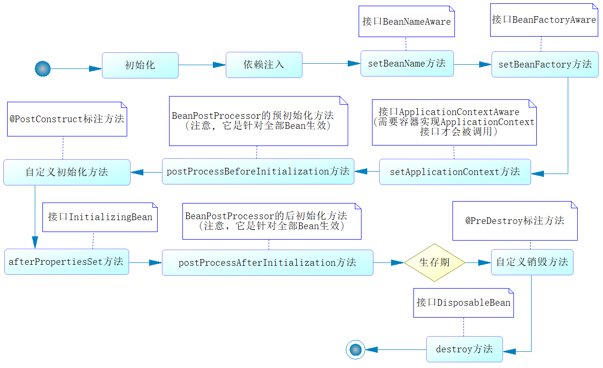

## 2. Spring

对于AOP术语一开始看不明白，在网上搜了文章看，有一个解释让我茅塞顿开：连接点就是地铁的各个站点，切入点就是我要到的那个目的站点，通知就是我到站后要干什么。切入点+通知=切面，就是我要到哪个目的站干什么。


#### 2.1 请你说说Spring的核心是什么

**参考答案**

Spring框架包含众多模块，如Core、Testing、Data Access、Web Servlet等，其中Core是整个Spring框架的核心模块。Core模块提供了IoC容器、AOP功能、数据绑定、类型转换等一系列的基础功能，而这些功能以及其他模块的功能都是建立在IoC和AOP之上的，所以IoC和AOP是Spring框架的核心。

IoC（Inversion of Control）是控制反转的意思，这是一种面向对象编程的设计思想。在不采用这种思想的情况下，我们需要自己维护对象与对象之间的依赖关系，很容易造成对象之间的耦合度过高，在一个大型的项目中这十分的不利于代码的维护。IoC则可以解决这种问题，它可以帮我们维护对象与对象之间的依赖关系，降低对象之间的耦合度。

说到IoC就不得不说DI（Dependency Injection），DI是依赖注入的意思，它是IoC实现的实现方式，就是说IoC是通过DI来实现的。由于IoC这个词汇比较抽象而DI却更直观，所以很多时候我们就用DI来代替它，在很多时候我们简单地将IoC和DI划等号，这是一种习惯。而实现依赖注入的关键是IoC容器，它的本质就是一个工厂。

AOP（Aspect Oriented Programing）是面向切面编程思想，这种思想是对OOP的补充，它可以在OOP的基础上进一步提高编程的效率。简单来说，它可以统一解决一批组件的共性需求（如权限检查、记录日志、事务管理等）。在AOP思想下，我们可以将解决共性需求的代码独立出来，然后通过配置的方式，声明这些代码在什么地方、什么时机调用。当满足调用条件时，AOP会将该业务代码织入到我们指定的位置，从而统一解决了问题，又不需要修改这一批组件的代码。

#### 2.2 说一说你对Spring容器的了解

**参考答案**

Spring主要提供了两种类型的容器：BeanFactory和ApplicationContext。

- BeanFactory：是基础类型的IoC容器，提供完整的IoC服务支持。如果没有特殊指定，默认采用延
  迟初始化策略。只有当客户端对象需要访问容器中的某个受管对象的时候，才对该受管对象进行初始化以及依赖注入操作。所以，相对来说，容器启动初期速度较快，所需要的资源有限。对于资源有限，并且功能要求不是很严格的场景，BeanFactory是比较合适的IoC容器选择。
- ApplicationContext：它是在BeanFactory的基础上构建的，是相对比较高级的容器实现，除了拥有BeanFactory的所有支持，ApplicationContext还提供了其他高级特性，比如事件发布、国际化信息支持等。ApplicationContext所管理的对象，在该类型容器启动之后，默认全部初始化并绑定完成。所以，相对于BeanFactory来说，ApplicationContext要求更多的系统资源，同时，因为在启动时就完成所有初始化，容
  器启动时间较之BeanFactory也会长一些。在那些系统资源充足，并且要求更多功能的场景中，ApplicationContext类型的容器是比较合适的选择。

#### 2.3 说一说你对BeanFactory的了解

**参考答案**

BeanFactory是一个类工厂，与传统类工厂不同的是，BeanFactory是类的通用工厂，它可以创建并管理各种类的对象。这些可被创建和管理的对象本身没有什么特别之处，仅是一个POJO，Spring称这些被创建和管理的Java对象为Bean。并且，Spring中所说的Bean比JavaBean更为宽泛一些，所有可以被Spring容器实例化并管理的Java类都可以成为Bean。

BeanFactory是Spring容器的顶层接口，Spring为BeanFactory提供了多种实现，最常用的是XmlBeanFactory。但它在Spring 3.2中已被废弃，建议使用XmlBeanDefinitionReader、DefaultListableBeanFactory替代。BeanFactory最主要的方法就是 `getBean(String beanName)`，该方法从容器中返回特定名称的Bean。

#### 2.4 说一说你对Spring IOC的理解

**参考答案**

IoC（Inversion of Control）是控制反转的意思，这是一种面向对象编程的设计思想。在不采用这种思想的情况下，我们需要自己维护对象与对象之间的依赖关系，很容易造成对象之间的耦合度过高，在一个大型的项目中这十分的不利于代码的维护。IoC则可以解决这种问题，它可以帮我们维护对象与对象之间的依赖关系，降低对象之间的耦合度。

说到IoC就不得不说DI（Dependency Injection），DI是依赖注入的意思，它是IoC实现的实现方式，就是说IoC是通过DI来实现的。由于IoC这个词汇比较抽象而DI却更直观，所以很多时候我们就用DI来代替它，在很多时候我们简单地将IoC和DI划等号，这是一种习惯。而实现依赖注入的关键是IoC容器，它的本质就是一个工厂。

在具体的实现中，主要由三种注入方式：

1. 构造方法注入

   就是被注入对象可以在它的构造方法中声明依赖对象的参数列表，让外部知道它需要哪些依赖对象。然后，IoC Service Provider会检查被注入的对象的构造方法，取得它所需要的依赖对象列表，进而为其注入相应的对象。构造方法注入方式比较直观，对象被构造完成后，即进入就绪状态，可以马上使用。

2. setter方法注入

   通过setter方法，可以更改相应的对象属性。所以，当前对象只要为其依赖对象所对应的属性添加setter方法，就可以通过setter方法将相应的依赖对象设置到被注入对象中。setter方法注入虽不像构造方法注入那样，让对象构造完成后即可使用，但相对来说更宽松一些，
   可以在对象构造完成后再注入。

3. 接口注入

   相对于前两种注入方式来说，接口注入没有那么简单明了。被注入对象如果想要IoC Service Provider为其注入依赖对象，就必须实现某个接口。这个接口提供一个方法，用来为其注入依赖对象。IoC Service Provider最终通过这些接口来了解应该为被注入对象注入什么依赖对象。相对于前两种依赖注入方式，接口注入比较死板和烦琐。

总体来说，构造方法注入和setter方法注入因为其侵入性较弱，且易于理解和使用，所以是现在使用最多的注入方式。而接口注入因为侵入性较强，近年来已经不流行了。

#### 2.5 Spring是如何管理Bean的？

**参考答案**

Spring通过IoC容器来管理Bean，我们可以通过XML配置或者注解配置，来指导IoC容器对Bean的管理。因为注解配置比XML配置方便很多，所以现在大多时候会使用注解配置的方式。

以下是管理Bean时常用的一些注解：

1. @ComponentScan用于声明扫描策略，通过它的声明，容器就知道要扫描哪些包下带有声明的类，也可以知道哪些特定的类是被排除在外的。
2. @Component、@Repository、@Service、@Controller用于声明Bean，它们的作用一样，但是语义不同。@Component用于声明通用的Bean，@Repository用于声明DAO层的Bean，@Service用于声明业务层的Bean，@Controller用于声明视图层的控制器Bean，被这些注解声明的类就可以被容器扫描并创建。
3. @Autowired、@Qualifier用于注入Bean，即告诉容器应该为当前属性注入哪个Bean。其中，@Autowired是按照Bean的类型进行匹配的，如果这个属性的类型具有多个Bean，就可以通过@Qualifier指定Bean的名称，以消除歧义。
4. @Scope用于声明Bean的作用域，默认情况下Bean是单例的，即在整个容器中这个类型只有一个实例。可以通过@Scope注解指定prototype值将其声明为多例的，也可以将Bean声明为session级作用域、request级作用域等等，但最常用的还是默认的单例模式。
5. @PostConstruct、@PreDestroy用于声明Bean的生命周期。其中，被@PostConstruct修饰的方法将在Bean实例化后被调用，@PreDestroy修饰的方法将在容器销毁前被调用。

#### 2.6 介绍Bean的作用域

**参考答案**

默认情况下，Bean在Spring容器中是单例的，我们可以通过@Scope注解修改Bean的作用域。该注解有如下5个取值，它们代表了Bean的5种不同类型的作用域：

|     类型      |                             说明                             |
| :-----------: | :----------------------------------------------------------: |
|   singleton   |    在Spring容器中仅存在一个实例，即Bean以单例的形式存在。    |
|   prototype   |   每次调用getBean()时，都会执行new操作，返回一个新的实例。   |
|    request    |              每次HTTP请求都会创建一个新的Bean。              |
|    session    | 同一个HTTP Session共享一个Bean，不同的HTTP Session使用不同的Bean。 |
| globalSession |    同一个全局的Session共享一个Bean，一般用于Portlet环境。    |

#### 2.7 说一说Bean的生命周期

**参考答案**

Spring容器管理Bean，涉及对Bean的创建、初始化、调用、销毁等一系列的流程，这个流程就是Bean的生命周期。整个流程参考下图：



这个过程是由Spring容器自动管理的，其中有两个环节我们可以进行干预。

1. 我们可以自定义初始化方法，并在该方法前增加@PostConstruct注解，届时Spring容器将在调用SetBeanFactory方法之后调用该方法。
2. 我们可以自定义销毁方法，并在该方法前增加@PreDestroy注解，届时Spring容器将在自身销毁前，调用这个方法。

#### 2.8 Spring是怎么解决循环依赖的？

**参考答案**

首先，需要明确的是spring对循环依赖的处理有三种情况：

1. 构造器的循环依赖：这种依赖spring是处理不了的，直接抛出BeanCurrentlylnCreationException异常。
2. 单例模式下的setter循环依赖：通过“三级缓存”处理循环依赖。
3. 非单例循环依赖：无法处理。

接下来，我们具体看看spring是如何处理第二种循环依赖的。

Spring单例对象的初始化大略分为三步：

1. createBeanInstance：实例化，其实也就是调用对象的构造方法实例化对象；
2. populateBean：填充属性，这一步主要是多bean的依赖属性进行填充；
3. initializeBean：调用spring xml中的init 方法。

从上面讲述的单例bean初始化步骤我们可以知道，循环依赖主要发生在第一步、第二步。也就是构造器循环依赖和field循环依赖。 Spring为了解决单例的循环依赖问题，使用了三级缓存。

```java
/** Cache of singleton objects: bean name –> bean instance */
private final Map singletonObjects = new ConcurrentHashMap(256);
/** Cache of singleton factories: bean name –> ObjectFactory */
private final Map> singletonFactories = new HashMap>(16);
/** Cache of early singleton objects: bean name –> bean instance */
private final Map earlySingletonObjects = new HashMap(16);
```

这三级缓存的作用分别是：

- singletonFactories ： 进入实例化阶段的单例对象工厂的cache （三级缓存）；
- earlySingletonObjects ：完成实例化但是尚未初始化的，提前暴光的单例对象的Cache （二级缓存）；
- singletonObjects：完成初始化的单例对象的cache（一级缓存）。

我们在创建bean的时候，会首先从cache中获取这个bean，这个缓存就是sigletonObjects。主要的调用方法是：

```java
protected Object getSingleton(String beanName, boolean allowEarlyReference) {
    Object singletonObject = this.singletonObjects.get(beanName);
    //isSingletonCurrentlyInCreation()判断当前单例bean是否正在创建中
    if (singletonObject == null && isSingletonCurrentlyInCreation(beanName)) {
        synchronized (this.singletonObjects) {
            singletonObject = this.earlySingletonObjects.get(beanName);
            //allowEarlyReference 是否允许从singletonFactories中通过getObject拿到对象
            if (singletonObject == null && allowEarlyReference) {
                ObjectFactory<?> singletonFactory = this.singletonFactories.get(beanName);
                if (singletonFactory != null) {
                    singletonObject = singletonFactory.getObject();
                    //从singletonFactories中移除，并放入earlySingletonObjects中。
                    //其实也就是从三级缓存移动到了二级缓存
                    this.earlySingletonObjects.put(beanName, singletonObject);
                    this.singletonFactories.remove(beanName);
                }
            }
        }
    }
    return (singletonObject != NULL_OBJECT ? singletonObject : null);
}
```

从上面三级缓存的分析，我们可以知道，Spring解决循环依赖的诀窍就在于singletonFactories这个三级cache。这个cache的类型是ObjectFactory，定义如下：

```java
public interface ObjectFactory<T> {
    T getObject() throws BeansException;
}
```

这个接口在AbstractBeanFactory里实现，并在核心方法doCreateBean（）引用下面的方法：

```java
protected void addSingletonFactory(String beanName, ObjectFactory<?> singletonFactory) {
    Assert.notNull(singletonFactory, "Singleton factory must not be null");
    synchronized (this.singletonObjects) {
        if (!this.singletonObjects.containsKey(beanName)) {
            this.singletonFactories.put(beanName, singletonFactory);
            this.earlySingletonObjects.remove(beanName);
            this.registeredSingletons.add(beanName);
        }
    }
}
```

这段代码发生在createBeanInstance之后，populateBean（）之前，也就是说单例对象此时已经被创建出来(调用了构造器)。这个对象已经被生产出来了，此时将这个对象提前曝光出来，让大家使用。

这样做有什么好处呢？让我们来分析一下“A的某个field或者setter依赖了B的实例对象，同时B的某个field或者setter依赖了A的实例对象”这种循环依赖的情况。A首先完成了初始化的第一步，并且将自己提前曝光到singletonFactories中，此时进行初始化的第二步，发现自己依赖对象B，此时就尝试去get(B)，发现B还没有被create，所以走create流程，B在初始化第一步的时候发现自己依赖了对象A，于是尝试get(A)，尝试一级缓存singletonObjects(肯定没有，因为A还没初始化完全)，尝试二级缓存earlySingletonObjects（也没有），尝试三级缓存singletonFactories，由于A通过ObjectFactory将自己提前曝光了，所以B能够通过ObjectFactory.getObject拿到A对象(虽然A还没有初始化完全，但是总比没有好呀)，B拿到A对象后顺利完成了初始化阶段1、2、3，完全初始化之后将自己放入到一级缓存singletonObjects中。此时返回A中，A此时能拿到B的对象顺利完成自己的初始化阶段2、3，最终A也完成了初始化，进去了一级缓存singletonObjects中，而且更加幸运的是，由于B拿到了A的对象引用，所以B现在hold住的A对象完成了初始化。

#### 2.9 @Autowired和@Resource注解有什么区别？

**参考答案**

1. @Autowired是Spring提供的注解，@Resource是JDK提供的注解。
2. @Autowired是只能按类型注入，@Resource默认按名称注入，也支持按类型注入。
3. @Autowired按类型装配依赖对象，默认情况下它要求依赖对象必须存在，如果允许null值，可以设置它required属性为false，如果我们想使用按名称装配，可以结合@Qualifier注解一起使用。@Resource有两个中重要的属性：name和type。name属性指定byName，如果没有指定name属性，当注解标注在字段上，即默认取字段的名称作为bean名称寻找依赖对象，当注解标注在属性的setter方法上，即默认取属性名作为bean名称寻找依赖对象。需要注意的是，@Resource如果没有指定name属性，并且按照默认的名称仍然找不到依赖对象时， @Resource注解会回退到按类型装配。但一旦指定了name属性，就只能按名称装配了。


#### 2.10 Spring中默认提供的单例是线程安全的吗？

**参考答案**

不是。

Spring容器本身并没有提供Bean的线程安全策略。如果单例的Bean是一个无状态的Bean，即线程中的操作不会对Bean的成员执行查询以外的操作，那么这个单例的Bean是线程安全的。比如，Controller、Service、DAO这样的组件，通常都是单例且线程安全的。如果单例的Bean是一个有状态的Bean，则可以采用ThreadLocal对状态数据做线程隔离，来保证线程安全。

#### 2.11 说一说你对Spring AOP的理解

**参考答案**

AOP（Aspect Oriented Programming）是面向切面编程，它是一种编程思想，是面向对象编程（OOP）的一种补充。面向对象编程将程序抽象成各个层次的对象，而面向切面编程是将程序抽象成各个切面。如下图，可以很形象地看出，所谓切面，相当于应用对象间的横切点，我们可以将其单独抽象为单独的模块。


AOP的术语：

- 连接点（join point）：对应的是具体被拦截的对象，因为Spring只能支持方法，所以被拦截的对象往往就是指特定的方法，AOP将通过动态代理技术把它织入对应的流程中。
- 切点（point cut）：有时候，我们的切面不单单应用于单个方法，也可能是多个类的不同方法，这时，可以通过正则式和指示器的规则去定义，从而适配连接点。切点就是提供这样一个功能的概念。
- 通知（advice）：就是按照约定的流程下的方法，分为前置通知、后置通知、环绕通知、事后返回通知和异常通知，它会根据约定织入流程中。
- 目标对象（target）：即被代理对象。
- 引入（introduction）：是指引入新的类和其方法，增强现有Bean的功能。
- 织入（weaving）：它是一个通过动态代理技术，为原有服务对象生成代理对象，然后将与切点定义匹配的连接点拦截，并按约定将各类通知织入约定流程的过程。
- 切面（aspect）：是一个可以定义切点、各类通知和引入的内容，SpringAOP将通过它的信息来增强Bean的功能或者将对应的方法织入流程。

Spring AOP：

AOP可以有多种实现方式，而Spring AOP支持如下两种实现方式。

- JDK动态代理：这是Java提供的动态代理技术，可以在运行时创建接口的代理实例。Spring AOP默认采用这种方式，在接口的代理实例中织入代码。
- CGLib动态代理：采用底层的字节码技术，在运行时创建子类代理的实例。当目标对象不存在接口时，Spring AOP就会采用这种方式，在子类实例中织入代码。

#### 2.12 请你说说AOP的应用场景

**参考答案**

Spring AOP为IoC的使用提供了更多的便利，一方面，应用可以直接使用AOP的功能，设计应用的横切关注点，把跨越应用程序多个模块的功能抽象出来，并通过简单的AOP的使用，灵活地编制到模块中，比如可以通过AOP实现应用程序中的日志功能。另一方面，在Spring内部，一些支持模块也是通过Spring AOP来实现的，比如事务处理。从这两个角度就已经可以看到Spring AOP的核心地位了。

#### 2.13 Spring AOP不能对哪些类进行增强？

**参考答案**

1. Spring AOP只能对IoC容器中的Bean进行增强，对于不受容器管理的对象不能增强。
2. 由于CGLib采用动态创建子类的方式生成代理对象，所以不能对final修饰的类进行代理。

#### 2.14 JDK动态代理和CGLIB有什么区别？

**参考答案**

JDK动态代理

这是Java提供的动态代理技术，可以在运行时创建接口的代理实例。Spring AOP默认采用这种方式，在接口的代理实例中织入代码。

CGLib动态代理

采用底层的字节码技术，在运行时创建子类代理的实例。当目标对象不存在接口时，Spring AOP就会采用这种方式，在子类实例中织入代码。

#### 2.15 既然有没有接口都可以用CGLIB，为什么Spring还要使用JDK动态代理？

**参考答案**

在性能方面，CGLib创建的代理对象比JDK动态代理创建的代理对象高很多。但是，CGLib在创建代理对象时所花费的时间比JDK动态代理多很多。所以，对于单例的对象因为无需频繁创建代理对象，采用CGLib动态代理比较合适。反之，对于多例的对象因为需要频繁的创建代理对象，则JDK动态代理更合适。

#### 2.16 Spring如何管理事务？

**参考答案**

Spring为事务管理提供了一致的编程模板，在高层次上建立了统一的事务抽象。也就是说，不管是选择MyBatis、Hibernate、JPA还是Spring JDBC，Spring都可以让用户以统一的编程模型进行事务管理。

Spring支持两种事务编程模型：

1. 编程式事务

   Spring提供了TransactionTemplate模板，利用该模板我们可以通过编程的方式实现事务管理，而无需关注资源获取、复用、释放、事务同步及异常处理等操作。相对于声明式事务来说，这种方式相对麻烦一些，但是好在更为灵活，我们可以将事务管理的范围控制的更为精确。

2. 声明式事务

   Spring事务管理的亮点在于声明式事务管理，它允许我们通过声明的方式，在IoC配置中指定事务的边界和事务属性，Spring会自动在指定的事务边界上应用事务属性。相对于编程式事务来说，这种方式十分的方便，只需要在需要做事务管理的方法上，增加@Transactional注解，以声明事务特征即可。

#### 2.17 Spring的事务传播方式有哪些？

**参考答案**

当我们调用一个业务方法时，它的内部可能会调用其他的业务方法，以完成一个完整的业务操作。这种业务方法嵌套调用的时候，如果这两个方法都是要保证事务的，那么就要通过Spring的事务传播机制控制当前事务如何传播到被嵌套调用的业务方法中。

Spring在TransactionDefinition接口中规定了7种类型的事务传播行为，它们规定了事务方法和事务方法发生嵌套调用时如何进行传播，如下表：

|       事务传播类型        |                             说明                             |
| :-----------------------: | :----------------------------------------------------------: |
|   PROPAGATION_REQUIRED    | 如果当前没有事务，则新建一个事务；如果已存在一个事务，则加入到这个事务中。这是最常见的选择。 |
|   PROPAGATION_SUPPORTS    |     支持当前事务，如果当前没有事务，则以非事务方式执行。     |
|   PROPAGATION_MANDATORY   |        使用当前的事务，如果当前没有事务，则抛出异常。        |
| PROPAGATION_REQUIRES_NEW  |        新建事务，如果当前存在事务，则把当前事务挂起。        |
| PROPAGATION_NOT_SUPPORTED |  以非事务方式执行操作，如果当前存在事务，则把当前事务挂起。  |
|     PROPAGATION_NEVER     |     以非事务方式执行操作，如果当前存在事务，则抛出异常。     |
|    PROPAGATION_NESTED     | 如果当前存在事务，则在嵌套事务内执行；如果当前没有事务，则执行与PROPAGATION_REQUIRED类似的操作。 |

#### 2.18 Spring的事务如何配置，常用注解有哪些？

**参考答案**

事务的打开、回滚和提交是由事务管理器来完成的，我们使用不同的数据库访问框架，就要使用与之对应的事务管理器。在Spring Boot中，当你添加了数据库访问框架的起步依赖时，它就会进行自动配置，即自动实例化正确的事务管理器。

对于声明式事务，是使用@Transactional进行标注的。这个注解可以标注在类或者方法上。

- 当它标注在类上时，代表这个类所有公共（public）非静态的方法都将启用事务功能。
- 当它标注在方法上时，代表这个方法将启用事务功能。

另外，在@Transactional注解上，我们可以使用isolation属性声明事务的隔离级别，使用propagation属性声明事务的传播机制。

#### 2.19 说一说你对声明式事务的理解

**参考答案**

Spring事务管理的亮点在于声明式事务管理，它允许我们通过声明的方式，在IoC配置中指定事务的边界和事务属性，Spring会自动在指定的事务边界上应用事务属性。相对于编程式事务来说，这种方式十分的方便，只需要在需要做事务管理的方法上，增加@Transactional注解，以声明事务特征即可。