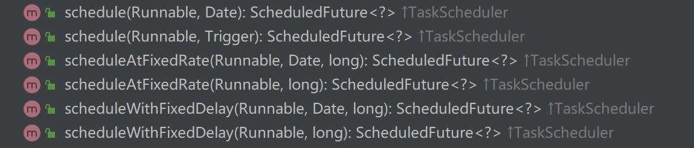

## 5. 其他

#### 5.1 cookie和session的区别是什么？

**参考答案**

1. 存储位置不同：cookie存放于客户端；session存放于服务端。
2. 存储容量不同：单个cookie保存的数据<=4KB，一个站点最多保存20个cookie；而session并没有上限。
3. 存储方式不同：cookie只能保存ASCII字符串，并需要通过编码当时存储为Unicode字符或者二进制数据；session中能够存储任何类型的数据，例如字符串、整数、集合等。
4. 隐私策略不同：cookie对客户端是可见的，别有用心的人可以分析存放在本地的cookie并进行cookie欺骗，所以它是不安全的；session存储在服务器上，对客户端是透明的，不存在敏感信息泄露的风险。
5. 生命周期不同：可以通过设置cookie的属性，达到cookie长期有效的效果；session依赖于名为JSESSIONID的cookie，而该cookie的默认过期时间为-1，只需关闭窗口该session就会失效，因此session不能长期有效。
6. 服务器压力不同：cookie保存在客户端，不占用服务器资源；session保管在服务器上，每个用户都会产生一个session，如果并发量大的话，则会消耗大量的服务器内存。
7. 浏览器支持不同：cookie是需要浏览器支持的，如果客户端禁用了cookie，则会话跟踪就会失效；运用session就需要使用URL重写的方式，所有用到session的URL都要进行重写，否则session会话跟踪也会失效。
8. 跨域支持不同：cookie支持跨域访问，session不支持跨域访问。

#### 5.2 cookie和session各自适合的场景是什么？

**参考答案**

对于敏感数据，应存放在session里，因为cookie不安全。

对于普通数据，优先考虑存放在cookie里，这样会减少对服务器资源的占用。

#### 5.3 请介绍session的工作原理

**参考答案**

session依赖于cookie。

当客户端首次访问服务器时，服务器会为其创建一个session对象，该对象具有一个唯一标识SESSIONID。并且在响应阶段，服务器会创建一个cookie，并将SESSIONID存入其中。

客户端通过响应的cookie而持有SESSIONID，所以当它再次访问服务器时，会通过cookie携带这个SESSIONID。服务器获取到SESSIONID后，就可以找到与之对应的session对象，进而从这个session中获取该客户端的状态。

#### 5.4 get请求与post请求有什么区别？

**参考答案**

- GET在浏览器回退时是无害的，而POST会再次提交请求。
- GET产生的URL地址可以被Bookmark，而POST不可以。
- GET请求会被浏览器主动cache，而POST不会，除非手动设置。
- GET请求只能进行url编码，而POST支持多种编码方式。
- GET请求参数会被完整保留在浏览器历史记录里，而POST中的参数不会被保留。
- GET请求在URL中传送的参数是有长度限制的，而POST没有。
- 对参数的数据类型，GET只接受ASCII字符，而POST没有限制。
- GET比POST更不安全，因为参数直接暴露在URL上，所以不能用来传递敏感信息。
- GET参数通过URL传递，POST放在Request body中。

#### 5.5 get请求的参数能放到body里面吗？

**参考答案**

GET请求是可以将参数放到BODY里面的，官方并没有明确禁止，但给出的建议是这样不符合规范，无法保证所有的实现都支持。这就意味着，如果你试图这样做，可能出现各种未知的问题，所以应该当避免。

#### 5.6 post不幂等是为什么？

**参考答案**

HTTP方法的幂等性是指一次和多次请求某一个资源应该具有同样的副作用。幂等性属于语义范畴，正如编译器只能帮助检查语法错误一样，HTTP规范也没有办法通过消息格式等语法手段来定义它。

POST所对应的URI并非创建的资源本身，而是资源的接收者。比如：POST `http://www.forum.com/articles`的语义是在`http://www.forum.com/articles`下创建一篇帖子，HTTP响应中应包含帖子的创建状态以及帖子的URI。两次相同的POST请求会在服务器端创建两份资源，它们具有不同的URI。所以，POST方法不具备幂等性。

#### 5.7 页面报400错误是什么意思？

**参考答案**

400状态码标识请求的语义有误，当前请求无法被服务器理解。除非进行修改，否则客户端不应该重复提交这个请求。通常情况下，是本次请求中包含有错误的参数，此时应该排查前端传递的参数。

#### 5.8 请求数据出现乱码该怎么处理？

**参考答案**

服务端出现请求乱码的原因是，客户端编码与服务器解码方案不一致，可以有如下几种解决办法：

1. 将获得的数据按照客户端编码转成BYTE，再将BYTE按服务端编码转成字符串，这种方案对各种请求方式均有效，但是十分的麻烦。
2. 在接受请求数据之前，显示声明实体内容的编码与服务器一致，这种方式只对POST请求有效。
3. 修改服务器的配置文件，显示声明请求路径的编码与服务器一致，这种方式只对GET请求有效。

#### 5.9 如何在SpringBoot框架下实现一个定时任务？

**参考答案**

Spring给我们提供了可执行定时任务的线程池ThreadPoolTaskScheduler，该线程池提供了多个可以与执行定时任务的方法，如下图。在Spring Boot中，只需要在配置类中启用线程池注解，就可以直接使用这个线程池了。

#### 5.10 调用接口时要记录日志，该怎么设计？

**参考答案**

可以定义一个记录日志的组件，并通过AOP将其织入到这个接口的调用中。这种方式对接口无需做任何改造，业务代码中也无需增加任何调用的逻辑，完美地消除了记录日志和业务代码的耦合度。

#### 5.11 了解Spring Boot JPA吗？

**参考答案**

JPA即Java Persistence API，它是一个基于O/R映射的标准规范。也就是说它指定以了标准规则，不提供实现，软件提供商可以按照标准规范来实现，而使用者只需按照规范中定义的方式来使用，不用和软件提供商打交道。JPA主要实现有Hibernate、EclipseLink、OpenJPA等，我们使用JPA来开发，无论是采用哪一种实现方式都一样。