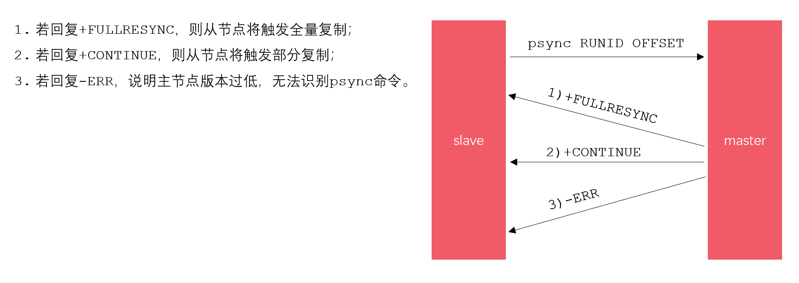
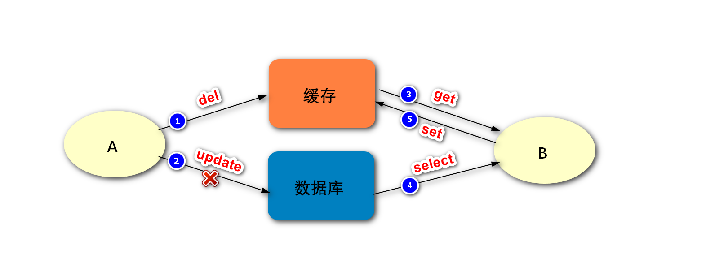
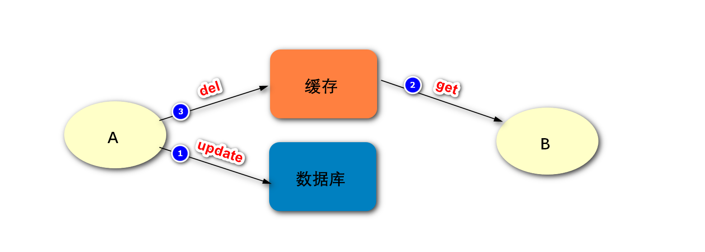
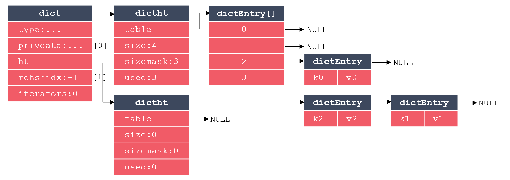
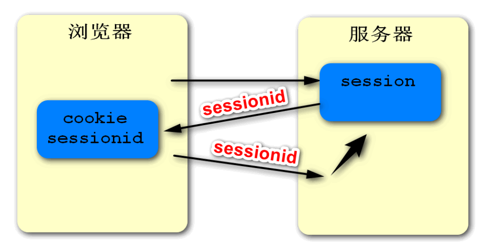
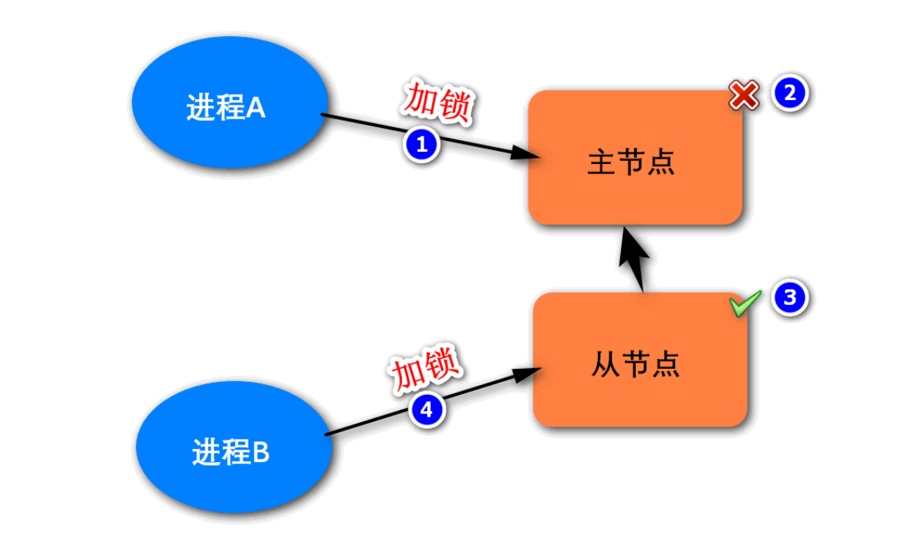
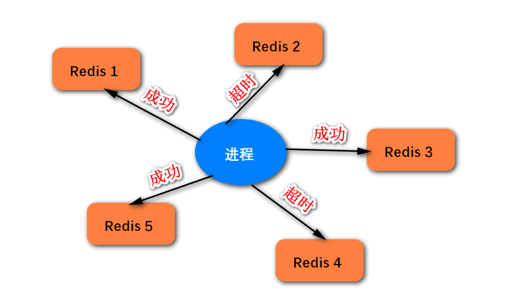

## 1. Redis

#### 1.1 Redis可以用来做什么？

**参考答案**

1. Redis最常用来做缓存，是实现分布式缓存的首先中间件；
2. Redis可以作为数据库，实现诸如点赞、关注、排行等对性能要求极高的互联网需求；
3. Redis可以作为计算工具，能用很小的代价，统计诸如PV/UV、用户在线天数等数据；
4. Redis还有很多其他的使用场景，例如：可以实现分布式锁，可以作为消息队列使用。

#### 1.2 Redis和传统的关系型数据库有什么不同？

**参考答案**

Redis是一种基于键值对的NoSQL数据库，而键值对的值是由多种数据结构和算法组成的。Redis的数据都存储于内存中，因此它的速度惊人，读写性能可达10万/秒，远超关系型数据库。

关系型数据库是基于二维数据表来存储数据的，它的数据格式更为严谨，并支持关系查询。关系型数据库的数据存储于磁盘上，可以存放海量的数据，但性能远不如Redis。

#### 1.3 Redis有哪些数据类型？

**参考答案**

1. Redis支持5种核心的数据类型，分别是字符串、哈希、列表、集合、有序集合；
2. Redis还提供了Bitmap、HyperLogLog、Geo类型，但这些类型都是基于上述核心数据类型实现的；
3. Redis在5.0新增加了Streams数据类型，它是一个功能强大的、支持多播的、可持久化的消息队列。

#### 1.4 Redis是单线程的，为什么还能这么快？

**参考答案**

1. 对服务端程序来说，线程切换和锁通常是性能杀手，而单线程避免了线程切换和竞争所产生的消耗；
2. Redis的大部分操作是在内存上完成的，这是它实现高性能的一个重要原因；
3. Redis采用了IO多路复用机制，使其在网络IO操作中能并发处理大量的客户端请求，实现高吞吐率。

关于Redis的单线程架构实现，如下图：


#### 1.5 Redis在持久化时fork出一个子进程，这时已经有两个进程了，怎么能说是单线程呢？

**参考答案**

Redis是单线程的，主要是指Redis的网络IO和键值对读写是由一个线程来完成的。而Redis的其他功能，如持久化、异步删除、集群数据同步等，则是依赖其他线程来执行的。所以，说Redis是单线程的只是一种习惯的说法，事实上它的底层不是单线程的。

#### 1.6 set和zset有什么区别？

**参考答案**

set：

- 集合中的元素是无序、不可重复的，一个集合最多能存储232-1个元素；
- 集合除了支持对元素的增删改查之外，还支持对多个集合取交集、并集、差集。

zset：

- 有序集合保留了集合元素不能重复的特点；
- 有序集合会给每个元素设置一个分数，并以此作为排序的依据；
- 有序集合不能包含相同的元素，但是不同元素的分数可以相同。

#### 1.7 说一下Redis中的watch命令

**参考答案**

很多时候，要确保事务中的数据没有被其他客户端修改才执行该事务。Redis提供了watch命令来解决这类问题，这是一种乐观锁的机制。客户端通过watch命令，要求服务器对一个或多个key进行监视，如果在客户端执行事务之前，这些key发生了变化，则服务器将拒绝执行客户端提交的事务，并向它返回一个空值。

#### 1.8 说说Redis中List结构的相关操作

**参考答案**

列表是线性有序的数据结构，它内部的元素是可以重复的，并且一个列表最多能存储2^32-1个元素。列表包含如下的常用命令：

- lpush/rpush：从列表的左侧/右侧添加数据；
- lrange：指定索引范围，并返回这个范围内的数据；
- lindex：返回指定索引处的数据；
- lpop/rpop：从列表的左侧/右侧弹出一个数据；
- blpop/brpop：从列表的左侧/右侧弹出一个数据，若列表为空则进入阻塞状态。

#### 1.9 你要如何设计Redis的过期时间？

**参考答案**

1. 热点数据不设置过期时间，使其达到“物理”上的永不过期，可以避免缓存击穿问题；
2. 在设置过期时间时，可以附加一个随机数，避免大量的key同时过期，导致缓存雪崩。

#### 1.10 Redis中，sexnx命令的返回值是什么，如何使用该命令实现分布式锁？

**参考答案**

setnx命令返回整数值，当返回1时表示设置值成果，当返回0时表示设置值失败（key已存在）。

一般我们不建议直接使用setnx命令来实现分布式锁，因为为了避免出现死锁，我们要给锁设置一个自动过期时间。而setnx命令和设置过期时间的命令不是原子的，可能加锁成果而设置过期时间失败，依然存在死锁的隐患。对于这种情况，Redis改进了set命令，给它增加了nx选项，启用该选项时set命令的效果就会setnx一样了。

采用Redis实现分布式锁，就是在Redis里存一份代表锁的数据，通常用字符串即可。采用改进后的setnx命令（即`set...nx...`命令）实现分布式锁的思路，以及优化的过程如下：

加锁：

第一版，这种方式的缺点是容易产生死锁，因为客户端有可能忘记解锁，或者解锁失败。

```shell
setnx key value
```

第二版，给锁增加了过期时间，避免出现死锁。但这两个命令不是原子的，第二步可能会失败，依然无法避免死锁问题。

```
setnx key value``expire key seconds
```

第三版，通过“set...nx...”命令，将加锁、过期命令编排到一起，它们是原子操作了，可以避免死锁。

```
set key value nx ex seconds
```

解锁：

解锁就是删除代表锁的那份数据。

```
del key
```

问题：

看起来已经很完美了，但实际上还有隐患，如下图。进程A在任务没有执行完毕时，锁已经到期被释放了。等进程A的任务执行结束后，它依然会尝试释放锁，因为它的代码逻辑就是任务结束后释放锁。但是，它的锁早已自动释放过了，它此时释放的可能是其他线程的锁。


想要解决这个问题，我们需要解决两件事情：

1. 在加锁时就要给锁设置一个标识，进程要记住这个标识。当进程解锁的时候，要进行判断，是自己持有的锁才能释放，否则不能释放。可以为key赋一个随机值，来充当进程的标识。
2. 解锁时要先判断、再释放，这两步需要保证原子性，否则第二步失败的话，就会出现死锁。而获取和删除命令不是原子的，这就需要采用Lua脚本，通过Lua脚本将两个命令编排在一起，而整个Lua脚本的执行是原子的。

按照以上思路，优化后的命令如下：

```java
# 加锁
set key random-value nx ex seconds 

# 解锁
if redis.call("get",KEYS[1]) == ARGV[1] then
    return redis.call("del",KEYS[1])
else
    return 0
end
```

#### 1.11 说一说Redis的持久化策略

**参考答案**

Redis支持RDB持久化、AOF持久化、RDB-AOF混合持久化这三种持久化方式。

RDB：

RDB(Redis Database)是Redis默认采用的持久化方式，它以快照的形式将进程数据持久化到硬盘中。RDB会创建一个经过压缩的二进制文件，文件以“.rdb”结尾，内部存储了各个数据库的键值对数据等信息。RDB持久化的触发方式有两种：

- 手动触发：通过SAVE或BGSAVE命令触发RDB持久化操作，创建“.rdb”文件；
- 自动触发：通过配置选项，让服务器在满足指定条件时自动执行BGSAVE命令。

其中，SAVE命令执行期间，Redis服务器将阻塞，直到“.rdb”文件创建完毕为止。而BGSAVE命令是异步版本的SAVE命令，它会使用Redis服务器进程的子进程，创建“.rdb”文件。BGSAVE命令在创建子进程时会存在短暂的阻塞，之后服务器便可以继续处理其他客户端的请求。总之，BGSAVE命令是针对SAVE阻塞问题做的优化，Redis内部所有涉及RDB的操作都采用BGSAVE的方式，而SAVE命令已经废弃！

BGSAVE命令的执行流程，如下图：


BGSAVE命令的原理，如下图：


RDB持久化的优缺点如下：

- 优点：RDB生成紧凑压缩的二进制文件，体积小，使用该文件恢复数据的速度非常快；

- 缺点：BGSAVE每次运行都要执行fork操作创建子进程，属于重量级操作，不宜频繁执行，

  所以RDB持久化没办法做到实时的持久化。

AOF：

AOF（Append Only File），解决了数据持久化的实时性，是目前Redis持久化的主流方式。AOF以独立日志的方式，记录了每次写入命令，重启时再重新执行AOF文件中的命令来恢复数据。AOF的工作流程包括：命令写入（append）、文件同步（sync）、文件重写（rewrite）、重启加载（load），如下图：


AOF默认不开启，需要修改配置项来启用它：

```
appendonly yes                           # 启用AOF
appendfilename "appendonly.aof"      # 设置文件名
```

AOF以文本协议格式写入命令，如：

[复制代码](https://www.nowcoder.com/study/live/537/2/28#)

```shell
*3\r\n$3\r\nset\r\n$5\r\nhello\r\n$5\r\nworld\r\n
```

文本协议格式具有如下的优点：

1. 文本协议具有很好的兼容性；
2. 直接采用文本协议格式，可以避免二次处理的开销；
3. 文本协议具有可读性，方便直接修改和处理。

AOF持久化的文件同步机制：

为了提高程序的写入性能，现代操作系统会把针对硬盘的多次写操作优化为一次写操作。

1. 当程序调用write对文件写入时，系统不会直接把书记写入硬盘，而是先将数据写入内存的缓冲区中；
2. 当达到特定的时间周期或缓冲区写满时，系统才会执行flush操作，将缓冲区中的数据冲洗至硬盘中；

这种优化机制虽然提高了性能，但也给程序的写入操作带来了不确定性。

1. 对于AOF这样的持久化功能来说，冲洗机制将直接影响AOF持久化的安全性；
2. 为了消除上述机制的不确定性，Redis向用户提供了appendfsync选项，来控制系统冲洗AOF的频率；
3. Linux的glibc提供了fsync函数，可以将指定文件强制从缓冲区刷到硬盘，上述选项正是基于此函数。

appendfsync选项的取值和含义如下：


AOF持久化的优缺点如下：

- 优点：与RDB持久化可能丢失大量的数据相比，AOF持久化的安全性要高很多。通过使用everysec选项，用户可以将数据丢失的时间窗口限制在1秒之内。
- 缺点：AOF文件存储的是协议文本，它的体积要比二进制格式的”.rdb”文件大很多。AOF需要通过执行AOF文件中的命令来恢复数据库，其恢复速度比RDB慢很多。AOF在进行重写时也需要创建子进程，在数据库体积较大时将占用大量资源，会导致服务器的短暂阻塞。

RDB-AOF混合持久化：

Redis从4.0开始引入RDB-AOF混合持久化模式，这种模式是基于AOF持久化构建而来的。用户可以通过配置文件中的“aof-use-rdb-preamble yes”配置项开启AOF混合持久化。Redis服务器在执行AOF重写操作时，会按照如下原则处理数据：

- 像执行BGSAVE命令一样，根据数据库当前的状态生成相应的RDB数据，并将其写入AOF文件中；
- 对于重写之后执行的Redis命令，则以协议文本的方式追加到AOF文件的末尾，即RDB数据之后。

通过使用RDB-AOF混合持久化，用户可以同时获得RDB持久化和AOF持久化的优点，服务器既可以通过AOF文件包含的RDB数据来实现快速的数据恢复操作，又可以通过AOF文件包含的AOF数据来将丢失数据的时间窗口限制在1s之内。

#### 1.12 如何实现Redis的高可用？

**参考答案**

实现Redis的高可用，主要有哨兵和集群两种方式。

哨兵：

Redis Sentinel（哨兵）是一个分布式架构，它包含若干个哨兵节点和数据节点。每个哨兵节点会对数据节点和其余的哨兵节点进行监控，当发现节点不可达时，会对节点做下线标识。如果被标识的是主节点，它就会与其他的哨兵节点进行协商，当多数哨兵节点都认为主节点不可达时，它们便会选举出一个哨兵节点来完成自动故障转移的工作，同时还会将这个变化实时地通知给应用方。整个过程是自动的，不需要人工介入，有效地解决了Redis的高可用问题！

一组哨兵可以监控一个主节点，也可以同时监控多个主节点，两种情况的拓扑结构如下图：


哨兵节点包含如下的特征：

1. 哨兵节点会定期监控数据节点，其他哨兵节点是否可达；
2. 哨兵节点会将故障转移的结果通知给应用方；
3. 哨兵节点可以将从节点晋升为主节点，并维护后续正确的主从关系；
4. 哨兵模式下，客户端连接的是哨兵节点集合，从中获取主节点信息；
5. 节点的故障判断是由多个哨兵节点共同完成的，可有效地防止误判；
6. 哨兵节点集合是由多个哨兵节点组成的，即使个别哨兵节点不可用，整个集合依然是健壮的；
7. 哨兵节点也是独立的Redis节点，是特殊的Redis节点，它们不存储数据，只支持部分命令。

集群：

Redis集群采用虚拟槽分区来实现数据分片，它把所有的键根据哈希函数映射到`0-16383`整数槽内，计算公式为`slot=CRC16(key)&16383`，每一个节点负责维护一部分槽以及槽所映射的键值数据。虚拟槽分区具有如下特点：

1. 解耦数据和节点之间的关系，简化了节点扩容和收缩的难度；
2. 节点自身维护槽的映射关系，不需要客户端或者代理服务维护槽分区元数据；
3. 支持节点、槽、键之间的映射查询，用于数据路由，在线伸缩等场景。

Redis集群中数据的分片逻辑如下图：


#### 1.13 Redis的主从同步是如何实现的？

**参考答案**

从2.8版本开始，Redis使用psync命令完成主从数据同步，同步过程分为全量复制和部分复制。全量复制一般用于初次复制的场景，部分复制则用于处理因网络中断等原因造成数据丢失的场景。psync命令需要以下参数的支持：

1. 复制偏移量：主节点处理写命令后，会把命令长度做累加记录，从节点在接收到写命令后，也会做累加记录；从节点会每秒钟上报一次自身的复制偏移量给主节点，而主节点则会保存从节点的复制偏移量。
2. 积压缓冲区：保存在主节点上的一个固定长度的队列，默认大小为1M，当主节点有连接的从节点时被创建；主节点处理写命令时，不但会把命令发送给从节点，还会写入积压缓冲区；缓冲区是先进先出的队列，可以保存最近已复制的数据，用于部分复制和命令丢失的数据补救。
3. 主节点运行ID：每个Redis节点启动后，都会动态分配一个40位的十六进制字符串作为运行ID；如果使用IP和端口的方式标识主节点，那么主节点重启变更了数据集（RDB/AOF），从节点再基于复制偏移量复制数据将是不安全的，因此当主节点的运行ID变化后，从节点将做全量复制。

psync命令的执行过程以及返回结果，如下图：



全量复制的过程，如下图：


部分复制的过程，如下图：


#### 1.14 Redis为什么存的快，内存断电数据怎么恢复？

**参考答案**

Redis存的快是因为它的数据都存放在内存里，并且为了保证数据的安全性，Redis还提供了三种数据的持久化机制，即RDB持久化、AOF持久化、RDB-AOF混合持久化。若服务器断电，那么我们可以利用持久化文件，对数据进行恢复。理论上来说，AOF/RDB-AOF持久化可以将丢失数据的窗口控制在1S之内。

#### 1.15 说一说Redis的缓存淘汰策略

**参考答案**

当写入数据将导致超出maxmemory限制时，Redis会采用maxmemory-policy所指定的策略进行数据淘汰，该策略一共包含如下8种选项：

|    **策略**     |                         **描述**                         | **版本** |
| :-------------: | :------------------------------------------------------: | :------: |
|   noeviction    |                      直接返回错误；                      |          |
|  volatile-ttl   | 从设置了过期时间的键中，选择过期时间最小的键，进行淘汰； |          |
| volatile-random |      从设置了过期时间的键中，随机选择键，进行淘汰；      |          |
|  volatile-lru   |  从设置了过期时间的键中，使用LRU算法选择键，进行淘汰；   |          |
|  volatile-lfu   |  从设置了过期时间的键中，使用LFU算法选择键，进行淘汰；   |   4.0    |
| allleys-random  |           从所有的键中，随机选择键，进行淘汰；           |          |
|   allkeys-lru   |       从所有的键中，使用LRU算法选择键，进行淘汰；        |          |
|   allkeys-lfu   |       从所有的键中，使用LFU算法选择键，进行淘汰；        |   4.0    |

其中，volatile前缀代表从设置了过期时间的键中淘汰数据，allkeys前缀代表从所有的键中淘汰数据。关于后缀，ttl代表选择过期时间最小的键，random代表随机选择键，需要我们额外关注的是lru和lfu后缀，它们分别代表采用lru算法和lfu算法来淘汰数据。

LRU（Least Recently Used）是按照最近最少使用原则来筛选数据，即最不常用的数据会被筛选出来！

- 标准LRU：把所有的数据组成一个链表，表头和表尾分别表示MRU和LRU端，即最常使用端和最少使用端。刚被访问的数据会被移动到MRU端，而新增的数据也是刚被访问的数据，也会被移动到MRU端。当链表的空间被占满时，它会删除LRU端的数据。
- 近似LRU：Redis会记录每个数据的最近一次访问的时间戳（LRU）。Redis执行写入操作时，若发现内存超出maxmemory，就会执行一次近似LRU淘汰算法。近似LRU会随机采样N个key，然后淘汰掉最旧的key，若淘汰后内存依然超出限制，则继续采样淘汰。可以通过maxmemory_samples配置项，设置近似LRU每次采样的数据个数，该配置项的默认值为5。

LRU算法的不足之处在于，若一个key很少被访问，只是刚刚偶尔被访问了一次，则它就被认为是热点数据，短时间内不会被淘汰。

LFU算法正式用于解决上述问题，LFU（Least Frequently Used）是Redis4新增的淘汰策略，它根据key的最近访问频率进行淘汰。LFU在LRU的基础上，为每个数据增加了一个计数器，来统计这个数据的访问次数。当使用LFU策略淘汰数据时，首先会根据数据的访问次数进行筛选，把访问次数最低的数据淘汰出内存。如果两个数据的访问次数相同，LFU再比较这两个数据的访问时间，把访问时间更早的数据淘汰出内存。

#### 1.16 请介绍一下Redis的过期策略

**参考答案**

Redis支持如下两种过期策略：

惰性删除：客户端访问一个key的时候，Redis会先检查它的过期时间，如果发现过期就立刻删除这个key。

定期删除：Redis会将设置了过期时间的key放到一个独立的字典中，并对该字典进行每秒10次的过期扫描，

过期扫描不会遍历字典中所有的key，而是采用了一种简单的贪心策略。该策略的删除逻辑如下：

1. 从过期字典中随机选择20个key；
2. 删除这20个key中已过期的key；
3. 如果已过期key的比例超过25%，则重复步骤1。

#### 1.17 缓存穿透、缓存击穿、缓存雪崩有什么区别，该如何解决？

**参考答案**

缓存穿透：

问题描述：

客户端查询根本不存在的数据，使得请求直达存储层，导致其负载过大，甚至宕机。出现这种情况的原因，可能是业务层误将缓存和库中的数据删除了，也可能是有人恶意攻击，专门访问库中不存在的数据。

解决方案：

1. 缓存空对象：存储层未命中后，仍然将空值存入缓存层，客户端再次访问数据时，缓存层会直接返回空值。
2. 布隆过滤器：将数据存入布隆过滤器，访问缓存之前以过滤器拦截，若请求的数据不存在则直接返回空值。

缓存击穿：

问题描述：

一份热点数据，它的访问量非常大。在其缓存失效的瞬间，大量请求直达存储层，导致服务崩溃。

解决方案：

1. 永不过期：热点数据不设置过期时间，所以不会出现上述问题，这是“物理”上的永不过期。或者为每个数据设置逻辑过期时间，当发现该数据逻辑过期时，使用单独的线程重建缓存。
2. 加互斥锁：对数据的访问加互斥锁，当一个线程访问该数据时，其他线程只能等待。这个线程访问过后，缓存中的数据将被重建，届时其他线程就可以直接从缓存中取值。

缓存雪崩：

问题描述：

在某一时刻，缓存层无法继续提供服务，导致所有的请求直达存储层，造成数据库宕机。可能是缓存中有大量数据同时过期，也可能是Redis节点发生故障，导致大量请求无法得到处理。

解决方案：

1. 避免数据同时过期：设置过期时间时，附加一个随机数，避免大量的key同时过期。
2. 启用降级和熔断措施：在发生雪崩时，若应用访问的不是核心数据，则直接返回预定义信息/空值/错误信息。或者在发生雪崩时，对于访问缓存接口的请求，客户端并不会把请求发给Redis，而是直接返回。
3. 构建高可用的Redis服务：采用哨兵或集群模式，部署多个Redis实例，个别节点宕机，依然可以保持服务的整体可用。

#### 1.18 如何保证缓存与数据库的双写一致性？

**参考答案**

四种同步策略：

想要保证缓存与数据库的双写一致，一共有4种方式，即4种同步策略：

1. 先更新缓存，再更新数据库；
2. 先更新数据库，再更新缓存；
3. 先删除缓存，再更新数据库；
4. 先更新数据库，再删除缓存。

从这4种同步策略中，我们需要作出比较的是：

1. 更新缓存与删除缓存哪种方式更合适？
2. 应该先操作数据库还是先操作缓存？

更新缓存还是删除缓存：

下面，我们来分析一下，应该采用更新缓存还是删除缓存的方式。

- 更新缓存

  优点：每次数据变化都及时更新缓存，所以查询时不容易出现未命中的情况。

  缺点：更新缓存的消耗比较大。如果数据需要经过复杂的计算再写入缓存，那么频繁的更新缓存，就会影响服务器的性能。如果是写入数据频繁的业务场景，那么可能频繁的更新缓存时，却没有业务读取该数据。

- 删除缓存

  优点：操作简单，无论更新操作是否复杂，都是将缓存中的数据直接删除。

  缺点：删除缓存后，下一次查询缓存会出现未命中，这时需要重新读取一次数据库。

从上面的比较来看，一般情况下，删除缓存是更优的方案。

先操作数据库还是缓存：

下面，我们再来分析一下，应该先操作数据库还是先操作缓存。

首先，我们将先删除缓存与先更新数据库，在出现失败时进行一个对比：



如上图，是先删除缓存再更新数据库，在出现失败时可能出现的问题：

1. 进程A删除缓存成功；
2. 进程A更新数据库失败；
3. 进程B从缓存中读取数据；
4. 由于缓存被删，进程B无法从缓存中得到数据，进而从数据库读取数据；
5. 进程B从数据库成功获取数据，然后将数据更新到了缓存。

最终，缓存和数据库的数据是一致的，但仍然是旧的数据。而我们的期望是二者数据一致，并且是新的数据。


如上图，是先更新数据库再删除缓存，在出现失败时可能出现的问题：

1. 进程A更新数据库成功；
2. 进程A删除缓存失败；
3. 进程B读取缓存成功，由于缓存删除失败，所以进程B读取到的是旧的数据。

最终，缓存和数据库的数据是不一致的。

经过上面的比较，我们发现在出现失败的时候，是无法明确分辨出先删缓存和先更新数据库哪个方式更好，以为它们都存在问题。后面我们会进一步对这两种方式进行比较，但是在这里我们先探讨一下，上述场景出现的问题，应该如何解决呢？

实际上，无论上面我们采用哪种方式去同步缓存与数据库，在第二步出现失败的时候，都建议采用重试机制解决，因为最终我们是要解决掉这个错误的。而为了避免重试机制影响主要业务的执行，一般建议重试机制采用异步的方式执行，如下图：


这里我们按照先更新数据库，再删除缓存的方式，来说明重试机制的主要步骤：

1. 更新数据库成功；
2. 删除缓存失败；
3. 将此数据加入消息队列；
4. 业务代码消费这条消息；
5. 业务代码根据这条消息的内容，发起重试机制，即从缓存中删除这条记录。

好了，下面我们再将先删缓存与先更新数据库，在没有出现失败时进行对比：


如上图，是先删除缓存再更新数据库，在没有出现失败时可能出现的问题：

1. 进程A删除缓存成功；
2. 进程B读取缓存失败；
3. 进程B读取数据库成功，得到旧的数据；
4. 进程B将旧的数据成功地更新到了缓存；
5. 进程A将新的数据成功地更新到数据库。

可见，进程A的两步操作均成功，但由于存在并发，在这两步之间，进程B访问了缓存。最终结果是，缓存中存储了旧的数据，而数据库中存储了新的数据，二者数据不一致。



如上图，是先更新数据库再删除缓存，再没有出现失败时可能出现的问题：

1. 进程A更新数据库成功；
2. 进程B读取缓存成功；
3. 进程A更新数据库成功。

可见，最终缓存与数据库的数据是一致的，并且都是最新的数据。但进程B在这个过程里读到了旧的数据，可能还有其他进程也像进程B一样，在这两步之间读到了缓存中旧的数据，但因为这两步的执行速度会比较快，所以影响不大。对于这两步之后，其他进程再读取缓存数据的时候，就不会出现类似于进程B的问题了。

最终结论：

经过对比你会发现，先更新数据库、再删除缓存是影响更小的方案。如果第二步出现失败的情况，则可以采用重试机制解决问题。

**扩展阅读**

延时双删

上面我们提到，如果是先删缓存、再更新数据库，在没有出现失败时可能会导致数据的不一致。如果在实际的应用中，出于某些考虑我们需要选择这种方式，那有办法解决这个问题吗？答案是有的，那就是采用延时双删的策略，延时双删的基本思路如下：

1. 删除缓存；
2. 更新数据库；
3. sleep N毫秒；
4. 再次删除缓存。

阻塞一段时间之后，再次删除缓存，就可以把这个过程中缓存中不一致的数据删除掉。而具体的时间，要评估你这项业务的大致时间，按照这个时间来设定即可。

采用读写分离的架构怎么办？

如果数据库采用的是读写分离的架构，那么又会出现新的问题，如下图：


进程A先删除缓存，再更新主数据库，然后主库将数据同步到从库。而在主从数据库同步之前，可能会有进程B访问了缓存，发现数据不存在，进而它去访问从库获取到旧的数据，然后同步到缓存。这样，最终也会导致缓存与数据库的数据不一致。这个问题的解决方案，依然是采用延时双删的策略，但是在评估延长时间的时候，要考虑到主从数据库同步的时间。

第二次删除失败了怎么办？

如果第二次删除依然失败，则可以增加重试的次数，但是这个次数要有限制，当超出一定的次数时，要采取报错、记日志、发邮件提醒等措施。


#### 1.19 请介绍Redis集群的实现方案

**参考答案**

Redis集群的分区方案：

Redis集群采用虚拟槽分区来实现数据分片，它把所有的键根据哈希函数映射到`0-16383`整数槽内，计算公式为`slot=CRC16(key)&16383`，每一个节点负责维护一部分槽以及槽所映射的键值数据。虚拟槽分区具有如下特点：

1. 解耦数据和节点之间的关系，简化了节点扩容和收缩的难度；
2. 节点自身维护槽的映射关系，不需要客户端或者代理服务维护槽分区元数据；
3. 支持节点、槽、键之间的映射查询，用于数据路由，在线伸缩等场景。

Redis集群中数据的分片逻辑如下图：


Redis集群的功能限制：

Redis集群方案在扩展了Redis处理能力的同时，也带来了一些使用上的限制：

1. key批量操作支持有限。如mset、mget，目前只支持具有相同slot值的key执行批量操作。对于映射为不同slot值的key由于执行mset、mget等操作可能存在于多个节点上所以不被支持。
2. key事务操作支持有限。同理只支持多key在同一节点上的事务操作，当多个key分布在不同的节点上时无法使用事务功能。
3. key作为数据分区的最小粒度，因此不能将一个大的键值对象（如hash、list等）映射到不同的节点。
4. 不支持多数据库空间。单机下的Redis可以支持16个数据库，集群模式下只能使用一个数据库空间，即DB0。
5. 复制结构只支持一层，从节点只能复制主节点，不支持嵌套树状复制结构。

Redis集群的通信方案：

在分布式存储中需要提供维护节点元数据信息的机制，所谓元数据是指：节点负责哪些数据，是否出现故障等状态信息。常见的元数据维护方式分为：集中式和P2P方式。

Redis集群采用P2P的Gossip（流言）协议，Gossip协议的工作原理就是节点彼此不断通信交换信息，一段时间后所有的节点都会知道集群完整的信息，这种方式类似流言传播。通信的大致过程如下：

1. 集群中每个节点都会单独开辟一个TCP通道，用于节点之间彼此通信，通信端口号在基础端口号上加10000；
2. 每个节点再固定周期内通过特定规则选择几个节点发送ping消息；
3. 接收ping消息的节点用pong消息作为响应。

其中，Gossip协议的主要职责就是信息交换，而信息交换的载体就是节点彼此发送的Gossip消息，Gossip消息分为：meet消息、ping消息、pong消息、fail消息等。

- meet消息：用于通知新节点加入，消息发送者通知接受者加入到当前集群。meet消息通信正常完成后，接收节点会加入到集群中并进行周期性的ping、pong消息交换。
- ping消息：集群内交换最频繁的消息，集群内每个节点每秒向多个其他节点发送ping消息，用于检测节点是否在线和交换彼此状态信息。ping消息封装了自身节点和一部分其他节点的状态数据。
- pong消息：当接收到meet、ping消息时，作为响应消息回复给发送方确认消息正常通信。pong消息内封装了自身状态数据，节点也可以向集群内广播自身的pong消息来通知整个集群对自身状态进行更新。
- fail消息：当节点判定集群内另一个节点下线时，会向集群内广播一个fail消息，其他节点接收到fail消息之后把对应节点更新为下线状态。

虽然Gossip协议的信息交换机制具有天然的分布式特性，但它是有成本的。因为Redis集群内部需要频繁地进行节点信息交换，而ping/pong消息会携带当前节点和部分其他节点的状态数据，势必会加重带宽和计算的负担。所以，Redis集群的Gossip协议需要兼顾信息交换的实时性和成本的开销。

- 集群里的每个节点默认每隔一秒钟就会从已知节点列表中随机选出五个节点，然后对这五个节点中最长时间没有发送过PING消息的节点发送PING消息，以此来检测被选中的节点是否在线。
- 如果节点A最后一次收到节点B发送的PONG消息的时间，距离当前时间已经超过了节点A的超时选项设置时长的一半（cluster-node-timeout/2），那么节点A也会向节点B发送PING消息，这可以防止节点A因为长时间没有随机选中节点B作为PING消息的发送对象而导致对节点B的信息更新滞后。
- 每个消息主要的数据占用：slots槽数组（2KB）和整个集群1/10的状态数据（10个节点状态数据约1KB）。

#### 1.20 说一说Redis集群的分片机制

**参考答案**

Redis集群采用虚拟槽分区来实现数据分片，它把所有的键根据哈希函数映射到`0-16383`整数槽内，计算公式为`slot=CRC16(key)&16383`，每一个节点负责维护一部分槽以及槽所映射的键值数据。虚拟槽分区具有如下特点：

1. 解耦数据和节点之间的关系，简化了节点扩容和收缩的难度；
2. 节点自身维护槽的映射关系，不需要客户端或者代理服务维护槽分区元数据；
3. 支持节点、槽、键之间的映射查询，用于数据路由，在线伸缩等场景。

Redis集群中数据的分片逻辑如下图：


#### 1.21 说一说Redis集群的应用和优劣势

**参考答案**

优势：

Redis Cluster是Redis的分布式解决方案，在3.0版本正式推出，有效地解决了Redis分布式方面的需求。当遇到单机内存、并发、流量等瓶颈时，可以采用Cluster架构方案达到负载均衡的目的。

劣势：

Redis集群方案在扩展了Redis处理能力的同时，也带来了一些使用上的限制：

1. key批量操作支持有限。如mset、mget，目前只支持具有相同slot值的key执行批量操作。对于映射为不同slot值的key由于执行mset、mget等操作可能存在于多个节点上所以不被支持。
2. key事务操作支持有限。同理只支持多key在同一节点上的事务操作，当多个key分布在不同的节点上时无法使用事务功能。
3. key作为数据分区的最小粒度，因此不能将一个大的键值对象（如hash、list等）映射到不同的节点。
4. 不支持多数据库空间。单机下的Redis可以支持16个数据库，集群模式下只能使用一个数据库空间，即DB0。
5. 复制结构只支持一层，从节点只能复制主节点，不支持嵌套树状复制结构。

#### 1.22 说一说hash类型底层的数据结构

**参考答案**

哈希对象有两种编码方案，当同时满足以下条件时，哈希对象采用ziplist编码，否则采用hashtable编码：

- 哈希对象保存的键值对数量小于512个；
- 哈希对象保存的所有键值对中的键和值，其字符串长度都小于64字节。

其中，ziplist编码采用压缩列表作为底层实现，而hashtable编码采用字典作为底层实现。

压缩列表：

压缩列表（ziplist），是Redis为了节约内存而设计的一种线性数据结构，它是由一系列具有特殊编码的连续内存块构成的。一个压缩列表可以包含任意多个节点，每个节点可以保存一个字节数组或一个整数值。

压缩列表的结构如下图所示：


该结构当中的字段含义如下表所示：

| **属性** | **类型** | **长度** |                           **说明**                           |
| :------: | :------: | :------: | :----------------------------------------------------------: |
| zlbytes  | uint32_t |  4字节   |                  压缩列表占用的内存字节数；                  |
|  zltail  | uint32_t |  4字节   |    压缩列表表尾节点距离列表起始地址的偏移量（单位字节）；    |
|  zllen   | uint16_t |  2字节   | 压缩列表包含的节点数量，等于UINT16_MAX时，需遍历列表计算真实数量； |
|  entryX  | 列表节点 |  不固定  |    压缩列表包含的节点，节点的长度由节点所保存的内容决定；    |
|  zlend   | uint8_t  |  1字节   |            压缩列表的结尾标识，是一个固定值0xFF；            |

其中，压缩列表的节点由以下字段构成：


previous_entry_length（pel）属性以字节为单位，记录当前节点的前一节点的长度，其自身占据1字节或5字节：

1. 如果前一节点的长度小于254字节，则“pel”属性的长度为1字节，前一节点的长度就保存在这一个字节内；
2. 如果前一节点的长度达到254字节，则“pel”属性的长度为5字节，其中第一个字节被设置为0xFE，之后的四个字节用来保存前一节点的长度；

基于“pel”属性，程序便可以通过指针运算，根据当前节点的起始地址计算出前一节点的起始地址，从而实现从表尾向表头的遍历操作。

content属性负责保存节点的值（字节数组或整数），其类型和长度则由encoding属性决定，它们的关系如下：

|          **encoding**          | **长度** |                   **content**                   |
| :----------------------------: | :------: | :---------------------------------------------: |
|           00 xxxxxx            |  1字节   |           最大长度为26 -1的字节数组；           |
|       01 xxxxxx bbbbbbbb       |  2字节   |           最大长度为214-1的字节数组；           |
| 10 **__** bbbbbbbb ... ... ... |  5字节   |           最大长度为232-1的字节数组；           |
|           11 000000            |  1字节   |               int16_t类型的整数；               |
|           11 010000            |  1字节   |               int32_t类型的整数；               |
|           11 100000            |  1字节   |               int64_t类型的整数；               |
|           11 110000            |  1字节   |                24位有符号整数；                 |
|           11 111110            |  1字节   |                 8位有符号整数；                 |
|           11 11xxxx            |  1字节   | 没有content属性，xxxx直接存[0,12]范围的整数值； |

字典：

字典（dict）又称为散列表，是一种用来存储键值对的数据结构。C语言没有内置这种数据结构，所以Redis构建了自己的字典实现。

Redis字典的实现主要涉及三个结构体：字典、哈希表、哈希表节点。其中，每个哈希表节点保存一个键值对，每个哈希表由多个哈希表节点构成，而字典则是对哈希表的进一步封装。这三个结构体的关系如下图所示：



其中，dict代表字典，dictht代表哈希表，dictEntry代表哈希表节点。可以看出，dictEntry是一个数组，这很好理解，因为一个哈希表里要包含多个哈希表节点。而dict里包含2个dictht，多出的哈希表用于REHASH。当哈希表保存的键值对数量过多或过少时，需要对哈希表的大小进行扩展或收缩操作，在Redis中，扩展和收缩哈希表是通过REHASH实现的，执行REHASH的大致步骤如下：

1. 为字典的ht[1]哈希表分配内存空间

   如果执行的是扩展操作，则ht[1]的大小为第1个大于等于ht[0].used*2的2n。如果执行的是收缩操作，则ht[1]的大小为第1个大于等于ht[0].used的2n。

2. 将存储在ht[0]中的数据迁移到ht[1]上

   重新计算键的哈希值和索引值，然后将键值对放置到ht[1]哈希表的指定位置上。

3. 将字典的ht[1]哈希表晋升为默认哈希表

   迁移完成后，清空ht[0]，再交换ht[0]和ht[1]的值，为下一次REHASH做准备。

当满足以下任何一个条件时，程序会自动开始对哈希表执行扩展操作：

1. 服务器目前没有执行bgsave或bgrewriteof命令，并且哈希表的负载因子大于等于1；
2. 服务器目前正在执行bgsave或bgrewriteof命令，并且哈希表的负载因子大于等于5。

为了避免REHASH对服务器性能造成影响，REHASH操作不是一次性地完成的，而是分多次、渐进式地完成的。渐进式REHASH的详细过程如下：

1. 为ht[1]分配空间，让字典同时持有ht[0]和ht[1]两个哈希表；
2. 在字典中的索引计数器rehashidx设置为0，表示REHASH操作正式开始；
3. 在REHASH期间，每次对字典执行添加、删除、修改、查找操作时，程序除了执行指定的操作外，还会顺带将ht[0]中位于rehashidx上的所有键值对迁移到ht[1]中，再将rehashidx的值加1；
4. 随着字典不断被访问，最终在某个时刻，ht[0]上的所有键值对都被迁移到ht[1]上，此时程序将rehashidx属性值设置为-1，标识REHASH操作完成。

REHSH期间，字典同时持有两个哈希表，此时的访问将按照如下原则处理：

1. 新添加的键值对，一律被保存到ht[1]中；
2. 删除、修改、查找等其他操作，会在两个哈希表上进行，即程序先尝试去ht[0]中访问要操作的数据，若不存在则到ht[1]中访问，再对访问到的数据做相应的处理。

#### 1.23 介绍一下zset类型底层的数据结构

**参考答案**

有序集合对象有2种编码方案，当同时满足以下条件时，集合对象采用ziplist编码，否则采用skiplist编码：

- 有序集合保存的元素数量不超过128个；
- 有序集合保存的所有元素的成员长度都小于64字节。

其中，ziplist编码的有序集合采用压缩列表作为底层实现，skiplist编码的有序集合采用zset结构作为底层实现。

其中，zset是一个复合结构，它的内部采用字典和跳跃表来实现，其源码如下。其中，dict保存了从成员到分支的映射关系，zsl则按分值由小到大保存了所有的集合元素。这样，当按照成员来访问有序集合时可以直接从dict中取值，当按照分值的范围访问有序集合时可以直接从zsl中取值，采用了空间换时间的策略以提高访问效率。

```c
typedef struct zset {
    dict *dict;        // 字典，保存了从成员到分值的映射关系；
    zskiplist *zsl; // 跳跃表，按分值由小到大保存所有集合元素；
} zset;
```

综上，zset对象的底层数据结构包括：压缩列表、字典、跳跃表。

压缩列表：

压缩列表（ziplist），是Redis为了节约内存而设计的一种线性数据结构，它是由一系列具有特殊编码的连续内存块构成的。一个压缩列表可以包含任意多个节点，每个节点可以保存一个字节数组或一个整数值。

压缩列表的结构如下图所示：


该结构当中的字段含义如下表所示：

| **属性** | **类型** | **长度** |                           **说明**                           |
| :------: | :------: | :------: | :----------------------------------------------------------: |
| zlbytes  | uint32_t |  4字节   |                  压缩列表占用的内存字节数；                  |
|  zltail  | uint32_t |  4字节   |    压缩列表表尾节点距离列表起始地址的偏移量（单位字节）；    |
|  zllen   | uint16_t |  2字节   | 压缩列表包含的节点数量，等于UINT16_MAX时，需遍历列表计算真实数量； |
|  entryX  | 列表节点 |  不固定  |    压缩列表包含的节点，节点的长度由节点所保存的内容决定；    |
|  zlend   | uint8_t  |  1字节   |            压缩列表的结尾标识，是一个固定值0xFF；            |

其中，压缩列表的节点由以下字段构成：


previous_entry_length（pel）属性以字节为单位，记录当前节点的前一节点的长度，其自身占据1字节或5字节：

1. 如果前一节点的长度小于254字节，则“pel”属性的长度为1字节，前一节点的长度就保存在这一个字节内；
2. 如果前一节点的长度达到254字节，则“pel”属性的长度为5字节，其中第一个字节被设置为0xFE，之后的四个字节用来保存前一节点的长度；

基于“pel”属性，程序便可以通过指针运算，根据当前节点的起始地址计算出前一节点的起始地址，从而实现从表尾向表头的遍历操作。

content属性负责保存节点的值（字节数组或整数），其类型和长度则由encoding属性决定，它们的关系如下：

|          **encoding**          | **长度** |                   **content**                   |
| :----------------------------: | :------: | :---------------------------------------------: |
|           00 xxxxxx            |  1字节   |           最大长度为26 -1的字节数组；           |
|       01 xxxxxx bbbbbbbb       |  2字节   |           最大长度为214-1的字节数组；           |
| 10 **__** bbbbbbbb ... ... ... |  5字节   |           最大长度为232-1的字节数组；           |
|           11 000000            |  1字节   |               int16_t类型的整数；               |
|           11 010000            |  1字节   |               int32_t类型的整数；               |
|           11 100000            |  1字节   |               int64_t类型的整数；               |
|           11 110000            |  1字节   |                24位有符号整数；                 |
|           11 111110            |  1字节   |                 8位有符号整数；                 |
|           11 11xxxx            |  1字节   | 没有content属性，xxxx直接存[0,12]范围的整数值； |

字典：

字典（dict）又称为散列表，是一种用来存储键值对的数据结构。C语言没有内置这种数据结构，所以Redis构建了自己的字典实现。

Redis字典的实现主要涉及三个结构体：字典、哈希表、哈希表节点。其中，每个哈希表节点保存一个键值对，每个哈希表由多个哈希表节点构成，而字典则是对哈希表的进一步封装。这三个结构体的关系如下图所示：


其中，dict代表字典，dictht代表哈希表，dictEntry代表哈希表节点。可以看出，dictEntry是一个数组，这很好理解，因为一个哈希表里要包含多个哈希表节点。而dict里包含2个dictht，多出的哈希表用于REHASH。当哈希表保存的键值对数量过多或过少时，需要对哈希表的大小进行扩展或收缩操作，在Redis中，扩展和收缩哈希表是通过REHASH实现的，执行REHASH的大致步骤如下：

1. 为字典的ht[1]哈希表分配内存空间

   如果执行的是扩展操作，则ht[1]的大小为第1个大于等于ht[0].used*2的2n。如果执行的是收缩操作，则ht[1]的大小为第1个大于等于ht[0].used的2n。

2. 将存储在ht[0]中的数据迁移到ht[1]上

   重新计算键的哈希值和索引值，然后将键值对放置到ht[1]哈希表的指定位置上。

3. 将字典的ht[1]哈希表晋升为默认哈希表

   迁移完成后，清空ht[0]，再交换ht[0]和ht[1]的值，为下一次REHASH做准备。

当满足以下任何一个条件时，程序会自动开始对哈希表执行扩展操作：

1. 服务器目前没有执行bgsave或bgrewriteof命令，并且哈希表的负载因子大于等于1；
2. 服务器目前正在执行bgsave或bgrewriteof命令，并且哈希表的负载因子大于等于5。

为了避免REHASH对服务器性能造成影响，REHASH操作不是一次性地完成的，而是分多次、渐进式地完成的。渐进式REHASH的详细过程如下：

1. 为ht[1]分配空间，让字典同时持有ht[0]和ht[1]两个哈希表；
2. 在字典中的索引计数器rehashidx设置为0，表示REHASH操作正式开始；
3. 在REHASH期间，每次对字典执行添加、删除、修改、查找操作时，程序除了执行指定的操作外，还会顺带将ht[0]中位于rehashidx上的所有键值对迁移到ht[1]中，再将rehashidx的值加1；
4. 随着字典不断被访问，最终在某个时刻，ht[0]上的所有键值对都被迁移到ht[1]上，此时程序将rehashidx属性值设置为-1，标识REHASH操作完成。

REHSH期间，字典同时持有两个哈希表，此时的访问将按照如下原则处理：

1. 新添加的键值对，一律被保存到ht[1]中；
2. 删除、修改、查找等其他操作，会在两个哈希表上进行，即程序先尝试去ht[0]中访问要操作的数据，若不存在则到ht[1]中访问，再对访问到的数据做相应的处理。

跳跃表：

跳跃表的查找复杂度为平均O(logN)，最坏O(N)，效率堪比红黑树，却远比红黑树实现简单。跳跃表是在链表的基础上，通过增加索引来提高查找效率的。

有序链表插入、删除的复杂度为O(1)，而查找的复杂度为O(N)。例：若要查找值为60的元素，需要从第1个元素依次向后比较，共需比较6次才行，如下图：


跳跃表是从有序链表中选取部分节点，组成一个新链表，并以此作为原始链表的一级索引。再从一级索引中选取部分节点，组成一个新链表，并以此作为原始链表的二级索引。以此类推，可以有多级索引，如下图：


跳跃表在查找时，优先从高层开始查找，若next节点值大于目标值，或next指针指向NULL，则从当前节点下降一层继续向后查找，这样便可以提高查找的效率了。

跳跃表的实现主要涉及2个结构体：zskiplist、zskiplistNode，它们的关系如下图所示：


其中，蓝色的表格代表zskiplist，红色的表格代表zskiplistNode。zskiplist有指向头尾节点的指针，以及列表的长度，列表中最高的层级。zskiplistNode的头节点是空的，它不存储任何真实的数据，它拥有最高的层级，但这个层级不记录在zskiplist之内。

#### 1.24 如何利用Redis实现分布式Session？

**参考答案**

在web开发中，我们会把用户的登录信息存储在session里。而session是依赖于cookie的，即服务器创建session时会给它分配一个唯一的ID，并且在响应时创建一个cookie用于存储这个SESSIONID。当客户端收到这个cookie之后，就会自动保存这个SESSIONID，并且在下次访问时自动携带这个SESSIONID，届时服务器就可以通过这个SESSIONID得到与之对应的session，从而识别用户的身。如下图：



现在的互联网应用，基本都是采用分布式部署方式，即将应用程序部署在多台服务器上，并通过nginx做统一的请求分发。而服务器与服务器之间是隔离的，它们的session是不共享的，这就存在session同步的问题了，如下图：


如果客户端第一次访问服务器，请求被分发到了服务器A上，则服务器A会为该客户端创建session。如果客户端再次访问服务器，请求被分发到服务器B上，则由于服务器B中没有这个session，所以用户的身份无法得到验证，从而产生了不一致的问题。

解决这个问题的办法有很多，比如可以协调多个服务器，让他们的session保持同步。也可以在分发请求时做绑定处理，即将某一个IP固定分配给同一个服务器。但这些方式都比较麻烦，而且性能上也有一定的消耗。更合理的方式就是采用类似于Redis这样的高性能缓存服务器，来实现分布式session。

从上面的叙述可知，我们使用session保存用户的身份信息，本质上是要做两件事情。第一是保存用户的身份信息，第二是验证用户的身份信息。如果利用其它手段实现这两个目标，那么就可以不用session，或者说我们使用的是广义上的session了。

具体实现的思路如下图，我们在服务端增加两段程序：

第一是创建令牌的程序，就是在用户初次访问服务器时，给它创建一个唯一的身份标识，并且使用cookie封装这个标识再发送给客户端。那么当客户端下次再访问服务器时，就会自动携带这个身份标识了，这和SESSIONID的道理是一样的，只是改由我们自己来实现了。另外，在返回令牌之前，我们需要将它存储起来，以便于后续的验证。而这个令牌是不能保存在服务器本地的，因为其他服务器无法访问它。因此，我们可以将其存储在服务器之外的一个地方，那么Redis便是一个理想的场所。

第二是验证令牌的程序，就是在用户再次访问服务器时，我们获取到了它之前的身份标识，那么我们就要验证一下这个标识是否存在了。验证的过程很简单，我们从Redis中尝试获取一下就可以知道结果。


#### 1.25 如何利用Redis实现一个分布式锁？

**参考答案**

何时需要分布式锁？

在分布式的环境下，当多个server并发修改同一个资源时，为了避免竞争就需要使用分布式锁。那为什么不能使用Java自带的锁呢？因为Java中的锁是面向多线程设计的，它只局限于当前的JRE环境。而多个server实际上是多进程，是不同的JRE环境，所以Java自带的锁机制在这个场景下是无效的。

如何实现分布式锁？

采用Redis实现分布式锁，就是在Redis里存一份代表锁的数据，通常用字符串即可。实现分布式锁的思路，以及优化的过程如下：

1. 加锁：

   第一版，这种方式的缺点是容易产生死锁，因为客户端有可能忘记解锁，或者解锁失败。

   `setnx key value`

   第二版，给锁增加了过期时间，避免出现死锁。但这两个命令不是原子的，第二步可能会失败，依然无法避免死锁问题。

   `setnx key value``expire key seconds`

   第三版，通过“set...nx...”命令，将加锁、过期命令编排到一起，它们是原子操作了，可以避免死锁。

   `set key value nx ex seconds`

2. 解锁：

   解锁就是删除代表锁的那份数据。

   `del key`

3. 问题：

   看起来已经很完美了，但实际上还有隐患，如下图。进程A在任务没有执行完毕时，锁已经到期被释放了。等进程A的任务执行结束后，它依然会尝试释放锁，因为它的代码逻辑就是任务结束后释放锁。但是，它的锁早已自动释放过了，它此时释放的可能是其他线程的锁。

   

想要解决这个问题，我们需要解决两件事情：

1. 在加锁时就要给锁设置一个标识，进程要记住这个标识。当进程解锁的时候，要进行判断，是自己持有的锁才能释放，否则不能释放。可以为key赋一个随机值，来充当进程的标识。
2. 解锁时要先判断、再释放，这两步需要保证原子性，否则第二步失败的话，就会出现死锁。而获取和删除命令不是原子的，这就需要采用Lua脚本，通过Lua脚本将两个命令编排在一起，而整个Lua脚本的执行是原子的。

按照以上思路，优化后的命令如下：

```
# 加锁``set key random-value nx ex seconds` `# 解锁``if` `redis.call(``"get"``,KEYS[``1``]) == ARGV[``1``] then``  ``return` `redis.call(``"del"``,KEYS[``1``])``else``  ``return` `0``end
```

基于RedLock算法的分布式锁：

上述分布式锁的实现方案，是建立在单个主节点之上的。它的潜在问题如下图所示，如果进程A在主节点上加锁成功，然后这个主节点宕机了，则从节点将会晋升为主节点。若此时进程B在新的主节点上加锁成果，之后原主节点重启，成为了从节点，系统中将同时出现两把锁，这是违背锁的唯一性原则的。



总之，就是在单个主节点的架构上实现分布式锁，是无法保证高可用的。若要保证分布式锁的高可用，则可以采用多个节点的实现方案。这种方案有很多，而Redis的官方给出的建议是采用RedLock算法的实现方案。该算法基于多个Redis节点，它的基本逻辑如下：

- 这些节点相互独立，不存在主从复制或者集群协调机制；
- 加锁：以相同的KEY向N个实例加锁，只要超过一半节点成功，则认定加锁成功；
- 解锁：向所有的实例发送DEL命令，进行解锁；

RedLock算法的示意图如下，我们可以自己实现该算法，也可以直接使用Redisson框架。



#### 1.26 说一说你对布隆过滤器的理解

**参考答案**

布隆过滤器可以用很低的代价，估算出数据是否真实存在。例如：给用户推荐新闻时，要去掉重复的新闻，就可以利用布隆过滤器，判断该新闻是否已经推荐过。

布隆过滤器的核心包括两部分：

1. 一个大型的位数组；
2. 若干个不一样的哈希函数，每个哈希函数都能将哈希值算的比较均匀。

布隆过滤器的工作原理：

1. 添加key时，每个哈希函数都利用这个key计算出一个哈希值，再根据哈希值计算一个位置，并将位数组中这个位置的值设置为1。
2. 询问key时，每个哈希函数都利用这个key计算出一个哈希值，再根据哈希值计算一个位置。然后对比这些哈希函数在位数组中对应位置的数值：
   - 如果这几个位置中，有一个位置的值是0，就说明这个布隆过滤器中，不存在这个key。
   - 如果这几个位置中，所有位置的值都是1，就说明这个布隆过滤器中，极有可能存在这个key。之所以不是百分之百确定，是因为也可能是其他的key运算导致该位置为1。

#### 1.27 多台Redis抗高并发访问该怎么设计？

**参考答案**

Redis Cluster是Redis的分布式解决方案，在3.0版本正式推出，有效地解决了Redis分布式方面的需求。当遇到单机内存、并发、流量等瓶颈时，可以采用Cluster架构方案达到负载均衡的目的。

Redis集群采用虚拟槽分区来实现数据分片，它把所有的键根据哈希函数映射到`0-16383`整数槽内，计算公式为`slot=CRC16(key)&16383`，每一个节点负责维护一部分槽以及槽所映射的键值数据。虚拟槽分区具有如下特点：

1. 解耦数据和节点之间的关系，简化了节点扩容和收缩的难度；
2. 节点自身维护槽的映射关系，不需要客户端或者代理服务维护槽分区元数据；
3. 支持节点、槽、键之间的映射查询，用于数据路由，在线伸缩等场景。

Redis集群中数据的分片逻辑如下图：


#### 1.28 如果并发量超过30万，怎么设计Redis架构？

**参考答案**

Redis Cluster是Redis的分布式解决方案，在3.0版本正式推出，有效地解决了Redis分布式方面的需求。当遇到单机内存、并发、流量等瓶颈时，可以采用Cluster架构方案达到负载均衡的目的。

Redis集群采用虚拟槽分区来实现数据分片，它把所有的键根据哈希函数映射到`0-16383`整数槽内，计算公式为`slot=CRC16(key)&16383`，每一个节点负责维护一部分槽以及槽所映射的键值数据。虚拟槽分区具有如下特点：

1. 解耦数据和节点之间的关系，简化了节点扩容和收缩的难度；
2. 节点自身维护槽的映射关系，不需要客户端或者代理服务维护槽分区元数据；
3. 支持节点、槽、键之间的映射查询，用于数据路由，在线伸缩等场景。

Redis集群中数据的分片逻辑如下图：

