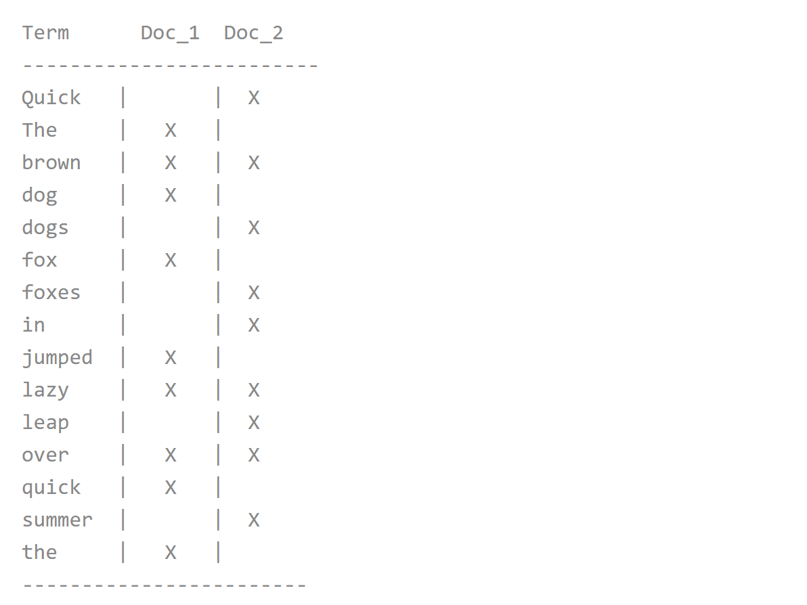

## 3. 搜索引擎

#### 3.1 说说ElasticSearch put的全过程

**参考答案**

put过程主要分为三个阶段：

1. 协调阶段：

   Client 客户端选择一个 node 发送 put 请求，此时当前节点就是协调节点（coordinating node）。协调节点根据 document 的 id 进行路由，将请求转发给对应的 node。这个 node 上的是 primary shard 。

2. 主要阶段：

   对应的 primary shard 处理请求，写入数据 ，然后将数据同步到 replica shard。

   - primary shard 会验证传入的数据结构；
   - 本地执行相关操作；
   - 将操作转发给 replica shard。

   当数据写入 primary shard 和 replica shard 成功后，路由节点返回响应给 Client。

3. 副本阶段：

   每个 replica shard 在转发后，会进行本地操作。

在写操作时，默认情况下，只需要 primary shard 处于活跃状态即可进行操作。在索引设置时可以设置这个属性：`index.write.wait_for_active_shards`。默认是 1，即 primary shard 写入成功即可返回。 如果设置为 all 则相当于 number_of_replicas+1 就是 primary shard 数量 + replica shard 数量。就是需要等待 primary shard 和 replica shard 都写入成功才算成功。可以通过索引设置动态覆盖此默认设置。

#### 3.2 说说ElasticSearch的倒排索引

**参考答案**

Elasticsearch 使用一种称为倒排索引的结构，它适用于快速的全文搜索。一个倒排索引由文档中所有不重复词的列表构成，对于其中每个词，有一个包含它的文档列表。

例如，假设我们有两个文档，每个文档的 `content` 域包含如下内容：

1. The quick brown fox jumped over the lazy dog
2. Quick brown foxes leap over lazy dogs in summer

为了创建倒排索引，我们首先将每个文档的 `content` 域拆分成单独的 词（我们称它为 `词条` 或 `tokens` ），创建一个包含所有不重复词条的排序列表，然后列出每个词条出现在哪个文档。结果如下所示：

现在，如果我们想搜索 `quick brown` ，我们只需要查找包含每个词条的文档：

两个文档都匹配，但是第一个文档比第二个匹配度更高。如果我们使用仅计算匹配词条数量的简单相似性算法 ，那么，我们可以说，对于我们查询的相关性来讲，第一个文档比第二个文档更佳。

但是，我们目前的倒排索引有一些问题：

- `Quick` 和 `quick` 以独立的词条出现，然而用户可能认为它们是相同的词。
- `fox` 和 `foxes` 非常相似, 就像 `dog` 和 `dogs` ；他们有相同的词根。
- `jumped` 和 `leap`, 尽管没有相同的词根，但他们的意思很相近。他们是同义词。

使用前面的索引搜索 `+Quick +fox` 不会得到任何匹配文档。（记住，`+` 前缀表明这个词必须存在。）只有同时出现 `Quick` 和 `fox` 的文档才满足这个查询条件，但是第一个文档包含 `quick fox` ，第二个文档包含 `Quick foxes` 。

我们的用户可以合理的期望两个文档与查询匹配。我们可以做的更好。如果我们将词条规范为标准模式，那么我们可以找到与用户搜索的词条不完全一致，但具有足够相关性的文档。例如：

- `Quick` 可以小写化为 `quick` 。
- `foxes` 可以 *词干提取* --变为词根的格式-- 为 `fox` 。类似的， `dogs` 可以为提取为 `dog` 。
- `jumped` 和 `leap` 是同义词，可以索引为相同的单词 `jump` 。

现在索引看上去像这样：

这还远远不够。我们搜索 `+Quick +fox` *仍然* 会失败，因为在我们的索引中，已经没有 `Quick` 了。但是，如果我们对搜索的字符串使用与 `content` 域相同的标准化规则，会变成查询 `+quick +fox` ，这样两个文档都会匹配！

#### 3.3 说一说你对solr的了解

**参考答案**

Solr是一个高性能，采用Java开发，基于Lucene的全文搜索服务器。同时对其进行了扩展，提供了比Lucene更为丰富的查询语言，同时实现了可配置、可扩展并对查询性能进行了优化，并且提供了一个完善的功能管理界面，是一款非常优秀的全文搜索引擎。